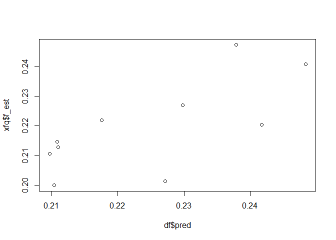

**This example illustrates a leave-one-out cross validation procedure to
validate ALFA-K if no ground truth data is available.**

``` r
source("utils/ALFA-K.R")
```

Below are copy number calls for hTERTa data set already formatted for
alfa-k. Note the units of “time” are passage numbers (we do not know how
long the passages were). We assumed passage length of 5 days, hence dt
is set to 5 so fitness will be in units of day^(-1).

``` r
x <- readRDS("example_data/hTERTa.Rds")
head(x$x)
```

    ##                                              10  15  25  30 40 50  57
    ## 2.2.2.2.2.2.2.2.2.2.2.2.2.2.2.2.2.2.2.2.2.2 870 789 189 209 97 95 161
    ## 2.2.2.2.2.2.2.2.2.2.2.2.2.2.2.2.2.2.1.2.2.2   0   7  86 197 70  9  12
    ## 2.2.2.2.2.2.2.2.2.2.2.2.3.2.2.2.2.2.2.3.2.2   0   0   1  54 76 46  37
    ## 4.3.4.4.4.3.4.4.3.4.4.4.4.3.4.4.4.3.3.4.4.4   0   0   0   0 11 52  95
    ## 4.3.4.4.4.3.4.4.3.4.4.4.4.3.4.4.4.3.4.4.4.4   0   0   0   0  9 30 113
    ## 4.3.4.4.4.4.4.4.3.4.4.4.4.3.4.4.4.3.3.4.4.4   0   0   0  11 32 60  30

``` r
print(x$dt)
```

    ## [1] 5

Run alfa-k on data

``` r
opt <- alfak(x,min_obs = 25)
```

    ## [1] 2
    ## [1] 3
    ## [1] 4
    ## [1] 5
    ## [1] 6
    ## [1] 7
    ## [1] 8
    ## [1] 9
    ## [1] 10
    ## Warning: 
    ## Grid searches over lambda (nugget and sill variances) with  minima at the endpoints: 
    ##   (REML) Restricted maximum likelihood 
    ##    minimum at  right endpoint  lambda  =  0.03599893 (eff. df= 406.6 )

Validation

``` r
## recover frequent clones
xfq <- opt$xo[opt$xo$id=="fq",]
##leave one out cross validation - use ALFA-K to predict fitness of frequent clones left out of the training data.
df <- do.call(rbind,lapply(1:nrow(xfq),function(i) optim_loo(i,x,xfq)))
```

    ## [1] "2.2.2.2.2.2.2.2.2.2.2.2.2.2.2.2.2.2.2.2.2.2"
    ## Warning: 
    ## Grid searches over lambda (nugget and sill variances) with  minima at the endpoints: 
    ##   (REML) Restricted maximum likelihood 
    ##    minimum at  right endpoint  lambda  =  0.0366467 (eff. df= 367.65 )
    ## [1] "2.2.2.2.2.2.2.2.2.2.2.2.2.2.2.2.2.2.1.2.2.2"
    ## Warning: 
    ## Grid searches over lambda (nugget and sill variances) with  minima at the endpoints: 
    ##   (REML) Restricted maximum likelihood 
    ##    minimum at  right endpoint  lambda  =  0.03614209 (eff. df= 367.6506 )
    ## [1] "2.2.2.2.2.2.2.2.2.2.2.2.3.2.2.2.2.2.2.3.2.2"
    ## Warning: 
    ## Grid searches over lambda (nugget and sill variances) with  minima at the endpoints: 
    ##   (REML) Restricted maximum likelihood 
    ##    minimum at  right endpoint  lambda  =  0.03613162 (eff. df= 365.7499 )
    ## [1] "4.3.4.4.4.3.4.4.3.4.4.4.4.3.4.4.4.3.3.4.4.4"
    ## Warning: 
    ## Grid searches over lambda (nugget and sill variances) with  minima at the endpoints: 
    ##   (REML) Restricted maximum likelihood 
    ##    minimum at  right endpoint  lambda  =  0.03641042 (eff. df= 365.7501 )
    ## [1] "4.3.4.4.4.3.4.4.3.4.4.4.4.3.4.4.4.3.4.4.4.4"
    ## Warning: 
    ## Grid searches over lambda (nugget and sill variances) with  minima at the endpoints: 
    ##   (REML) Restricted maximum likelihood 
    ##    minimum at  right endpoint  lambda  =  0.03641437 (eff. df= 365.75 )
    ## [1] "4.3.4.4.4.4.4.4.3.4.4.4.4.3.4.4.4.3.3.4.4.4"
    ## Warning: 
    ## Grid searches over lambda (nugget and sill variances) with  minima at the endpoints: 
    ##   (REML) Restricted maximum likelihood 
    ##    minimum at  right endpoint  lambda  =  0.03641437 (eff. df= 365.75 )
    ## [1] "2.2.2.2.2.2.2.2.2.2.2.2.2.2.2.2.2.2.2.3.2.2"
    ## Warning: 
    ## Grid searches over lambda (nugget and sill variances) with  minima at the endpoints: 
    ##   (REML) Restricted maximum likelihood 
    ##    minimum at  right endpoint  lambda  =  0.03642474 (eff. df= 367.65 )
    ## [1] "4.4.4.4.4.4.4.4.4.4.4.4.4.4.4.4.4.4.4.4.4.4"
    ## Warning: 
    ## Grid searches over lambda (nugget and sill variances) with  minima at the endpoints: 
    ##   (REML) Restricted maximum likelihood 
    ##    minimum at  right endpoint  lambda  =  0.03569486 (eff. df= 363.85 )
    ## [1] "4.3.4.4.4.4.4.4.3.4.4.4.4.3.4.4.4.3.4.4.4.4"
    ## Warning: 
    ## Grid searches over lambda (nugget and sill variances) with  minima at the endpoints: 
    ##   (REML) Restricted maximum likelihood 
    ##    minimum at  right endpoint  lambda  =  0.03643252 (eff. df= 365.7501 )
    ## [1] "2.2.2.2.2.2.2.2.2.2.2.2.2.2.2.2.2.2.2.2.2.1"
    ## Warning: 
    ## Grid searches over lambda (nugget and sill variances) with  minima at the endpoints: 
    ##   (REML) Restricted maximum likelihood 
    ##    minimum at  right endpoint  lambda  =  0.03614209 (eff. df= 367.6506 )

``` r
##positive correlation indicates predictive value
plot(df$pred,xfq$f_est)
```



``` r
cor(df$pred,xfq$f_est)
```

    ## [1] 0.7071852
