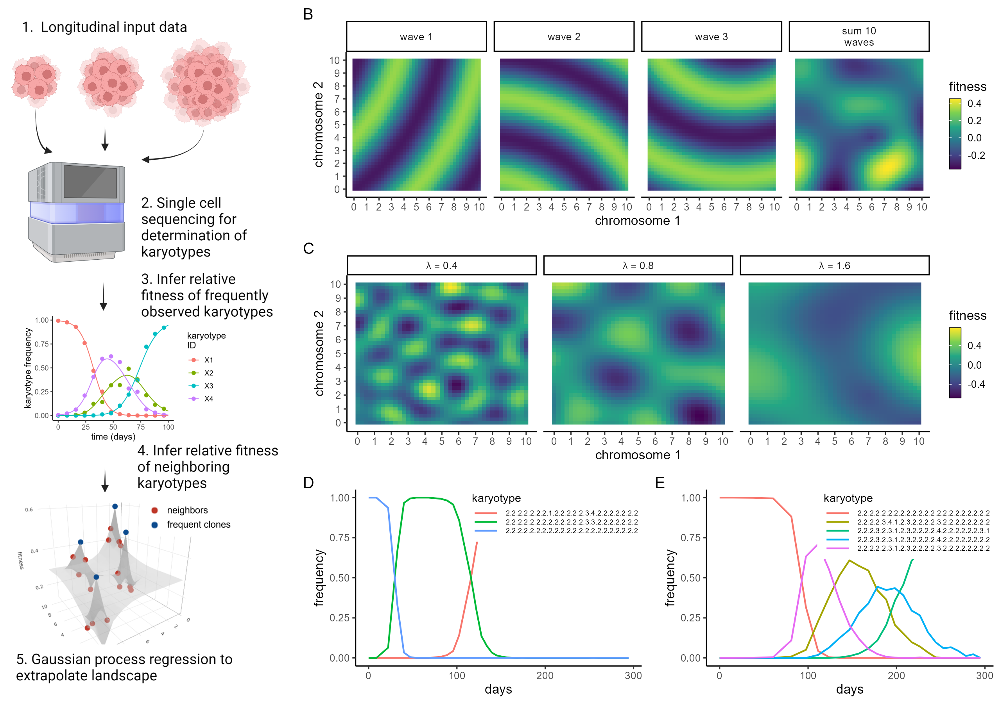

Validating ALFA-K against output of ABM simulations  

```{r setup, include=FALSE}
knitr::opts_knit$set(root.dir = "~/projects/008_birthrateLandscape/ALFA-K/")
```

```{r,echo=FALSE,eval=FALSE}
library(ggplot2)
source("utils/comparison_functions.R")
```

# Results

## Clonal evolution on random fitness landscapes

The ALFA-K methodology predicts single-cell karyotype evolution using longitudinal data as input. Sequencing data from individual cells is used to identify temporal changes in karyotype frequency. The method estimates the fitness of common karyotypes from changes in their observed frequencies and extends these estimates to rarer ones, constructing a local fitness landscape via Gaussian process regression (Fig. 1A). To test the ability of ALFA-K to infer fitness landscapes, we developed ABM simulations of karyotype diversification and selection on randomly generated fitness landscapes. We used Gaussian random fields (GRF) as fitness landscapes, which were generated via summation of multiple spherical waves (Fig. 1B). Varying the wavelength parameter ($\lambda$) allows control of the complexity of the resulting landscape (Fig. 1C). ABM simulations of cell populations evolving on the GRF landscapes are characterized by expansion and contraction of karyotype-defined subclones (Fig. 1D,E) as fitter clones are generated and the fitness of the population increases (Fig. 2A). In these test simulations, populations on landscapes with low $\lambda$ (Fig.1D) tended to experience punctuated evolution, whereas populations evolving on landscapes with high $\lambda$ exhibited gradual increases in fitness over time (Fig.1E).



A) Schematic flowchart of steps in ALFA-K pipeline. B) GRF are generated by summing multiple spherical waves. The interference patterns generated by the waves result in complex unpredictable landscapes. C) Increasing the wavelength ($\lambda$) results in GRF with decreasing complexity. D-E) Example simulation output for ABM cell populations evolving on GRF fitness landscape with D) $\lambda=0.1$ or E) $\lambda=1.6$. Each coloured line represents the longitudinal frequency of a different karyotype. 


```{r,echo=FALSE,eval=FALSE}
source("utils/landscape_functions.R")
set.seed(42)
nchrom <- 2
Nwaves <- 10
wavelength <- 1
pk <- gen_rf_landscape(founder = sample(1:10,nchrom,replace = T),Nwaves = Nwaves,wavelength = wavelength)

df <- do.call(rbind,lapply(1:3, function(i){
  pki <- pk[i]
  dfi <- expand.grid(x=seq(0,10,0.25),y=seq(0,10,0.25))
  dfi$f <- apply(dfi,1,function(xi) get_rf_fitness(k=xi,pk=pki,wavelength=wavelength))
  dfi$waveid <- i
  dfi
}))

dfi <- expand.grid(x=seq(0,10,0.25),y=seq(0,10,0.25))
dfi$f <- apply(dfi,1,function(xi) get_rf_fitness(k=xi,pk=pk,wavelength=wavelength))
dfi$waveid <- 10

df <- rbind(df,dfi)

wvnm <- c(" wave 1 ", " wave 2 ", " wave 3 ",rep(), "sum 10\nwaves")
names(wvnm) <- c("1","2","3","10")
df$id <- wvnm[as.character(df$waveid)]
p_grf_demo <- ggplot(df,aes(x=x,y=y,fill=f))+
  facet_grid(cols=vars(id))+
  geom_raster()+
  scale_fill_viridis_c("fitness")+
  scale_x_continuous("chromosome 1",breaks=0:10)+
  scale_y_continuous("chromosome 2",breaks=0:10)+
  theme_classic(base_size = 8)+
  labs(tag="B")+
  guides(fill = guide_colorbar(title = "fitness",
                               frame.colour = "black",
                               barwidth = 0.5,
                               barheight = 3)) 
p_grf_demo
ggsave("figures/alfak_ABM_tests/figs/grf_demo.png",width=6,height=2,units="in")
```
```{r,echo=FALSE,eval=FALSE}
set.seed(42)
nchrom <- 2
Nwaves <- 10


gen_rand_land <- function(wavelength){
  pk <- gen_rf_landscape(founder = sample(1:10,nchrom,replace = T),Nwaves = Nwaves,wavelength = wavelength)
dfi <- expand.grid(x=seq(0,10,0.25),y=seq(0,10,0.25))
dfi$f <- apply(dfi,1,function(xi) get_rf_fitness(k=xi,pk=pk,wavelength=wavelength))
dfi$wavelength<-wavelength
dfi
}

wls <- c(0.4,0.8,1.6)
df <- do.call(rbind,lapply(wls,gen_rand_land))


df$wavelength <- paste0("lambda==",df$wavelength)
p_grf_complexity <- ggplot(df,aes(x=x,y=y,fill=f))+
  facet_grid(cols=vars(wavelength),labeller="label_parsed")+
  geom_raster()+
  scale_fill_viridis_c("fitness")+
  scale_x_continuous("chromosome 1",breaks=0:10)+
  scale_y_continuous("chromosome 2",breaks=0:10)+
  theme_classic(base_size = 8)+
    labs(tag="C")+
  guides(fill = guide_colorbar(title = "fitness",
                               frame.colour = "black",
                               barwidth = 0.5,
                               barheight = 3)) 
p_grf_complexity
ggsave("figures/alfak_ABM_tests/figs/grf_complexity.png",width=6,height=2,units="in")
```

```{r,echo=FALSE,eval=FALSE}

wrap_vis <- function(dir,nclones){
  ff <- list.files(dir)
  ff <- ff[!ff%in%c("log.txt","summary.txt")]
  tt <- as.numeric(sapply(ff,function(fi) head(unlist(strsplit(fi,split=".csv")),1)))

  x <- proc_sim(dir,times=tt)

  z <- melt_for_plotting(x,nclones=nclones)$data
  return(z)
}

source("utils/visualisation_functions.R")
source("utils/ALFA-K.R")
dir1 <- "../karyotype_evolution_old/ABM/output/nchrom_22_v0/N_22_w_0p2_rep_02/train/00000/"
dir2 <- "../karyotype_evolution_old/ABM/output/nchrom_22_v0/N_22_w_1p6_rep_01/train/00000/"

z1 <- wrap_vis(dir1,3)
z2 <- wrap_vis(dir2,5)


px <- ggplot(z1,aes(x=time,y=frequency,color=karyotype))+
  geom_line()+
  theme_classic(base_size=8)+
  labs(tag="D")+
  theme(legend.position = c(1.01,1.02),
        legend.justification = c(1, 1),
        legend.box.margin = margin(t=0,b=0,l=0,r=0, unit = "mm"),
        legend.key.height = unit(0.075,"in"),
        legend.title = element_text(size=7),
        legend.text = element_text(size=4.5))+
  scale_x_continuous("days")
px

ggsave("figures/alfak_ABM_tests/figs/lo_lambda_clones.png",plot=px,width=3,height=2,units="in")

py <- ggplot(z2,aes(x=time,y=frequency,color=karyotype))+
  geom_line()+
  theme_classic(base_size=8)+
  labs(tag="E")+
  theme(legend.position = c(1.01,1.02),
        legend.justification = c(1, 1),
        legend.box.margin = margin(t=0,b=0,l=0,r=0, unit = "mm"),
        legend.key.height = unit(0.075,"in"),
        legend.title = element_text(size=7),
        legend.text = element_text(size=4.5))+
  scale_x_continuous("days")
py
ggsave("figures/alfak_ABM_tests/figs/hi_lambda_clones.png",plot=py,width=3,height=2,units="in")


```


 Data from the first 200 days of each simulated population was used to train ALFA-K. We trained ALFA-K varying both the number of longitudinal samples and the hyperparameter N, then evaluated the results using a cross validation procedure (Fig.2B) which tests the ability of ALFA-K to infer the fitness of karyotypes withheld from the input data (see Methods). ALFA-K performance was not sensitive to the value of the hyperparameter N within the tested range. It was however sensitive to landscape complexity and the number of longitudinal samples in the input, with at least 4 samples needed to obtain satisfactory results. We next tested the ability of ALFA-K to predict population evolution for the time period from 200-300 days that was withheld from the training data. We used the angle metric (SX Fig.) to evaluate predictive performance, in which values below 90 degrees are taken as good predictions. Landscapes with good cross-validation scores ($R^2>0.3$) predicted future population evolution well (Fig. 2C). The results from the forward prediction tests agreed with the cross validation test in terms of sensitivity to landscape complexity, number of sampled timepoints, and the value of the hyperparameter N (Fig. 2D). Finally, we evaluated the robustness of ALFA-K to different values of missegregation rate (Fig. 2E). The procedure was robust to a wide range of missegregation rates up to a threshold value, which occurred when karyotype became too unstable to estimate the fitness of subpopulations across multiple longitudinal timepoints. Up to this threshold however, increasing missegregation rate benefits ALFA-K by allowing a larger region of the fitness landscape to be charted. 


 A) Mean fitness of ABM cell populations evolving on artificial fitness landscapes of varying complexity (as determined by $\lambda$). Data from the first 200 days of each simulation was demarcated by the red vertical lines was used to train ALFA-K. B) Cross validation results of ALFA-K for varying numbers of sampled timepoints and values of the hyperparameter N. c) Evolutionary prediction results of ALFA-K agggregated across all landscapes at various times in the validation period. Results are grouped by performance on the cross validation test and summarized by the angle metric. D) Evolutionary prediction results of ALFA-K for varying numbers of sampled timepoints and values of the hyperparameter N. Prediction results are summarized by the angle metric. E) 


```{r,echo=FALSE,eval=FALSE}
library(gridExtra)
library(grid)

##assuming all input plots are rectangle (no L shapes etc)
construct_layout <- function(simple_layout,widths,heights){
  width <- sum(widths[unique(simple_layout[1,])])
  height <- sum(heights[unique(simple_layout[,1])])
  layout <- matrix(0,nrow=height,ncol=width)
  for(i in 1:length(widths)){
    print(i)
    xco <- min(which(apply(simple_layout,1,function(s) i%in%s)))
    yco <- min(which(apply(simple_layout,2,function(s) i%in%s)))
    if(xco==1) xstart <- 1
    if(xco>1){
      xprev <- simple_layout[xco-1,yco]
      xstart <- 1+max(which(apply(layout,1,function(s) xprev%in%s)))
    }
    if(yco==1) ystart <- 1
    if(yco>1){
      yprev <- simple_layout[xco,yco-1]
      ystart <- 1+max(which(apply(layout,2,function(s) yprev%in%s)))
    }
    
    xend <- xstart + heights[i]-1
    yend <- ystart + widths[i]-1
    layout[xstart:xend,ystart:yend] <- i
  }
  return(layout)
}

ff <- c("ALFA-K_overview.png",
        "grf_demo.png",
        "grf_complexity.png",
        "lo_lambda_clones.png",
        "hi_lambda_clones.png")
dir <- c("figures/alfak_ABM_tests/figs/")

gs <- lapply(ff,function(fi) png::readPNG(paste0(dir,fi)))
widths <- sapply(gs,ncol)
heights <- sapply(gs,nrow)
gs <- lapply(gs,rasterGrob)

simple_layout <- rbind(c(1,2,2),
             c(1,3,3),
             c(1,4,5))


lay <- construct_layout(simple_layout,widths,heights)
fig1 <- grid.arrange(grobs=gs,layout_matrix=lay)

ggsave("figures/alfak_ABM_tests/figs/fig1.png",plot = fig1,width=ncol(lay)/300,height=nrow(lay)/300,units="in")

```

Notes:

**TO DO** 
Add details on how to reproduce ABM sweep outputs. Might be wise to have most of the code below tucked in scripts which are called from this RMD document? Some info about hwo to run sweeps is in the (silenced) comments of this markdown file (see esp. the misseg sweep for instructions on how to run a sweep). Tidy away pieces of code & data in the subdirectory that houses this RMD document

```{r,echo=FALSE,eval=FALSE}

source("figures/alfak_ABM_tests/extract_sim_summary_info.R") ## ran on workstation
```

```{r,echo=FALSE,eval=FALSE}
x <- readRDS("figures/alfak_ABM_tests/sim_summary_info.Rds")
ids <- data.frame(do.call(rbind,lapply(x$cond_id, function(i) unlist(strsplit(i,split="_"))[c(4,6,8)])))
colnames(ids) <- c("wavelength","misrate","rep")
x <- cbind(x,ids)
x <- x[x$misrate=="0.00005",]
p <- ggplot(x,aes(x=time/10,y=fitness,group=interaction(rep_id,cond_id)))+
  facet_grid(cols=vars(paste0("lambda==",gsub("p",".",wavelength))),labeller = label_parsed)+
  geom_line(alpha=0.1)+
  scale_x_continuous("days")+
  scale_y_continuous("mean fitness")+
  theme_classic(base_size=8)+
    labs(tag="A")+
  geom_vline(xintercept=200,color="red",linetype=2)
p

ggsave("figures/alfak_ABM_tests/figs/simulation_fitness.png",width=5,height=2,units="in")
#ggsave("figures/alfak_ABM_tests/figs/simulation_fitness.png",width=1.8,height=6,units="in")

```

```{r,echo=FALSE,eval=FALSE}
x <- readRDS("figures/alfak_ABM_tests/loo_summaries.Rds")
ids <- data.frame(do.call(rbind,lapply(x$rep, function(i) unlist(strsplit(i,split="_"))[c(4,6,8)])))
colnames(ids) <- c("wavelength","misrate","rep")
x <- cbind(x,ids)
x <- x[!x$wavelength=="0p1",]
x <- split(x,f=interaction(x$ntp,x$minobs,x$rep))

df <- do.call(rbind,lapply(x,function(xi){
  
  dfi <- xi[,c("ntp","minobs","wavelength","misrate")]
  
dfi$cor <- tryCatch(R2(xi$f_est[!is.na(xi$pred)],xi$pred[!is.na(xi$pred)]),
                    error=function(e) return(NaN))
return(dfi)
}))
df$cor[df$cor<(-1)]<- -1
p <- ggplot(df,aes(x=gsub("p",".",wavelength),y=cor))+
  facet_grid(rows=vars(paste0("N=",stringr::str_pad(minobs,width = 2))),cols=vars(paste0(ntp," longitudinal samples")))+
  geom_violin()+
  labs(tag="B")+
  scale_y_continuous(expression(cross~validation~R^2))+
  scale_x_discrete(expression(GRF~wavelength~(lambda)))+
  theme_classic(base_size=8)
p

#ggsave("figures/alfak_ABM_tests/figs/validation_r2.svg",width=5,height=3,units="in")
ggsave("figures/alfak_ABM_tests/figs/validation_r2.png",width=5,height=3,units="in")

```


```{r,echo=FALSE,eval=FALSE}

x <- readRDS("figures/alfak_ABM_tests/fitted_abm_run_angles.Rds")
ids <- data.frame(do.call(rbind,lapply(x$id, function(i) unlist(strsplit(i,split="_"))[c(4,6,8)])))
colnames(ids) <- c("wavelength","misrate","rep2")
x <- cbind(x,ids)
x <- x[!x$wavelength=="0p1",]
ids <- data.frame(do.call(rbind,lapply(x$condition, function(i) unlist(strsplit(i,split="_"))[c(2,4)])))
colnames(ids) <- c("min_obs","ntp")
x <- cbind(x,ids)
x$ntp <- paste(x$ntp,"longitudinal samples")
x$min_obs <- paste0("N=",stringr::str_pad(x$min_obs,width = 2))

z <- reshape2::melt(x,measure.vars=paste0("t",seq(2100,2900,100)))
#z <- z[z$min_obs == "min.samples=10", ]


p3 <- ggplot(z[z$variable=="t2500",],aes(x=gsub("p",".",wavelength),
                   y=value))+
  facet_grid(rows=vars(min_obs),cols=vars(ntp))+
  geom_violin()+
  geom_hline(yintercept=90,color="red")+
  scale_fill_discrete(expression(lambda))+
  labs(tag="D")+
  scale_y_continuous("angle metric")+
  scale_x_discrete(expression(GRF~landscape~wavelength~(lambda)))+
  theme_classic(base_size=8)
p3
#ggsave("figures/alfak_ABM_tests/figs/validation_angles.svg",width=5,height=4,units="in")
ggsave("figures/alfak_ABM_tests/figs/validation_angles.png",width=5,height=4,units="in")
zf <- z[z$wavelength=="0p8"&z$min_obs=="N=10"&z$ntp=="4 sampled timepoints",]
p3b <- ggplot(zf,aes(x=as.numeric(gsub("t","",variable))/10,y=value,group=variable))+
  geom_violin()+
  scale_x_continuous(breaks=seq(200,300,20))+
  scale_y_continuous("angle metric")
p3b


```

```{r,echo=FALSE,eval=FALSE}
#Agreement between R^2 and angle metric scores.
xv <- readRDS("figures/alfak_ABM_tests/loo_summaries.Rds")
xv <- split(xv,f=interaction(xv$ntp,xv$minobs,xv$rep))
xv <- do.call(rbind,lapply(xv,function(xi){
  dfi <- xi[1,c("rep","ntp","minobs")]
dfi$cor <- tryCatch(R2(xi$pred[!is.na(xi$pred)],xi$f_est[!is.na(xi$pred)]),
                   error=function(e) return(NaN))
return(dfi)
}))
xv$cor[xv$cor<(-1)]<- -1
xv$cor[!is.finite(xv$cor)] <- -1
xv$condition <- paste0("minobs_",xv$minobs,"_ntp_",xv$ntp,"_00000")
rownames(xv) <- interaction(xv$condition,xv$rep)


x <- readRDS("figures/alfak_ABM_tests/fitted_abm_run_angles.Rds")
ids <- data.frame(do.call(rbind,lapply(x$id, function(i) unlist(strsplit(i,split="_"))[c(4,6,8)])))
colnames(ids) <- c("wavelength","misrate","rep2")
x <- cbind(x,ids)
x <- x[!x$wavelength=="0p1",]
ids <- data.frame(do.call(rbind,lapply(x$condition, function(i) unlist(strsplit(i,split="_"))[c(2,4)])))
colnames(ids) <- c("min_obs","ntp")
x <- cbind(x,ids)
x$ntp <- paste(x$ntp,"samples")
x$min_obs <- paste0("min.samples=",stringr::str_pad(x$min_obs,width = 2))

x$predictor <- xv$cor[interaction(x$condition,x$id)]

x <- split(x,f=interaction(x$min_obs,x$ntp))
x <- do.call(rbind,lapply(x,function(yi){
  pp <- rep("low",nrow(yi))
  pp[yi$predictor>0.0] <- "high"
  yi$predictor <- pp
  return(yi)
}))


plookup <- seq(2100,2900,100)
names(plookup) <- paste0("t",seq(2100,2900,100))
x <- reshape2::melt(x,measure.vars=paste0("t",seq(2100,2900,100)))


p <- ggplot(x,aes(x=as.character(as.numeric(gsub("t","",variable))/10),y=value,fill=predictor))+
  geom_violin()+
  scale_fill_viridis_d(expression(R^2),labels=c(">0","\u2264 0"))+
  scale_x_discrete("time (days)")+
  labs(tag="C")+
  scale_y_continuous("angle metric",breaks=seq(0,180,45))+
  theme_classic(base_size=8)
p

#ggsave("figures/alfak_ABM_tests/figs/r2_angles.svg",width=5,height=2,units="in")
ggsave("figures/alfak_ABM_tests/figs/r2_angles.png",width=5,height=2,units="in")
```


```{r,echo=FALSE,eval=FALSE}
#Test how missegregation rate affects fitted results:

#Input data for this sweep was generated using the following command:
#Rscript generate_ABM_sweep.R -n data/misrate -r 100 -w 0.8 -m 0.00001,0.00003,0.0001,0.0003,0.001 
#Rscript process_abm_sweep.R -n data/misrate 
#Rscript sweep_summary_stats -n data/misrate -o data/misrate_stats.Rds
x <- readRDS("data/misrate_stats.Rds")
x$ll_fq <- -x$ll_fq
x$ll_nn <- -x$ll_nn
df <- reshape2::melt(x[,c("m","nfq","r_fq","r_nn","r_d2n")],id.vars=c("m","nfq"))
ids <- c(" frequent","d1","d2")
names(ids)<-c("r_fq","r_nn","r_d2n")
df$variable <- ids[df$variable]
df$value[df$value<(-1)] <- -1
p0 <- ggplot(df,aes(x=factor(m),y=value))+
  facet_grid(rows=vars(variable))+
  geom_violin()+
  geom_jitter(height=0,width=0.2)+
  scale_y_continuous(expression(predicted~fitness~R^2))+
  scale_x_discrete("missegregation rate")
p0

df <- reshape2::melt(x[,c("m","r_fq","nfq","nnn","nd2n")],id.vars=c("m","r_fq"))
ids <- c(" frequent","d1","d2")
names(ids)<-c("nfq","nnn","nd2n")
df$variable <- ids[df$variable]
df$r_fq[df$r_fq<(-1)] <- -1
p1 <- ggplot(df,aes(x=factor(m),y=value,color=r_fq))+
  facet_grid(rows=vars(gsub("d","distance ",variable)),scales="free")+
  geom_violin()+
  geom_jitter(height=0,width=0.2,alpha=0.2)+
  scale_y_log10("num. karyotypes in landscape")+
  labs(tag="E")+
  scale_x_discrete("missegregation rate")+
  scale_color_viridis_c("Pearson\ncoef.")+
  theme_classic(base_size=8)
p1
#ggsave("figures/alfak_ABM_tests/figs/misseg_sweep.svg",width=5,height=3,units="in")
ggsave("figures/alfak_ABM_tests/figs/misseg_sweep.png",width=5,height=3,units="in")
```


```{r,echo=FALSE,eval=FALSE}
library(gridExtra)
library(grid)

##assuming all input plots are rectangle (no L shapes etc)
construct_layout <- function(simple_layout,widths,heights){
  width <- sum(widths[unique(simple_layout[1,])])
  height <- sum(heights[unique(simple_layout[,1])])
  layout <- matrix(0,nrow=height,ncol=width)
  for(i in 1:length(widths)){
    print(i)
    xco <- min(which(apply(simple_layout,1,function(s) i%in%s)))
    yco <- min(which(apply(simple_layout,2,function(s) i%in%s)))
    if(xco==1) xstart <- 1
    if(xco>1){
      xprev <- simple_layout[xco-1,yco]
      xstart <- 1+max(which(apply(layout,1,function(s) xprev%in%s)))
    }
    if(yco==1) ystart <- 1
    if(yco>1){
      yprev <- simple_layout[xco,yco-1]
      ystart <- 1+max(which(apply(layout,2,function(s) yprev%in%s)))
    }
    
    xend <- xstart + heights[i]-1
    yend <- ystart + widths[i]-1
    layout[xstart:xend,ystart:yend] <- i
  }
  return(layout)
}


ff <- c("simulation_fitness.png",
        "validation_r2.png",
        "r2_angles.png",
        "validation_angles.png",
        "misseg_sweep.png")
dir <- c("figures/alfak_ABM_tests/figs/")

gs <- lapply(ff,function(fi) png::readPNG(paste0(dir,fi)))
widths <- sapply(gs,ncol)
heights <- sapply(gs,nrow)
gs <- lapply(gs,rasterGrob)

simple_layout <- rbind(c(1,4),
             c(2,4),
             c(2,5),
             c(3,5))


lay <- construct_layout(simple_layout,widths,heights)
fig2 <- grid.arrange(grobs=gs,layout_matrix=lay)

ggsave("figures/alfak_ABM_tests/figs/fig2.png",plot = fig2,width=ncol(lay)/300,height=nrow(lay)/300,units="in")

```
