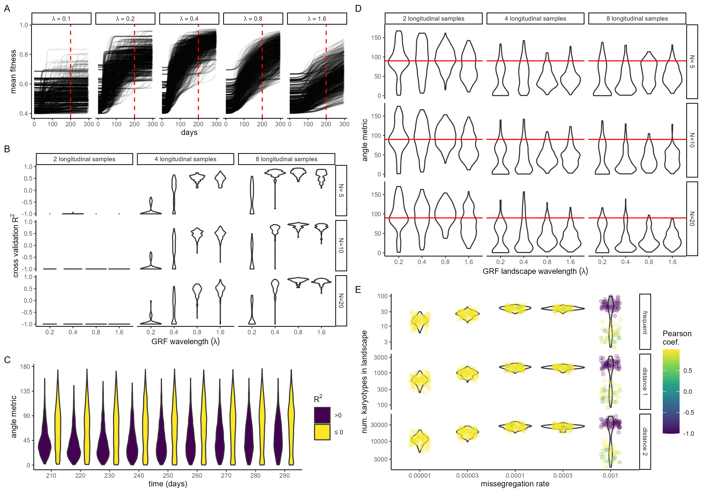

README
================
Richard J Beck
2024-06-07

Code in this folder covers

1)  Generating random fitness landscapes
2)  Running the ABM with random landscapes
3)  Training ALFA-K on ABM output
4)  Running ABM on ALFA-K trained landscapes
5)  Generating the following figures in the manuscript.

Code chunks are not shown in this version of the README. See README.Rmd
for more detail.

1)  Schematic flowchart of steps in ALFA-K pipeline. B) GRF are
    generated by summing multiple spherical waves. The interference
    patterns generated by the waves result in complex unpredictable
    landscapes. C) Increasing the wavelength
    ()
    results in GRF with decreasing complexity. D-E) Example simulation
    output for ABM cell populations evolving on GRF fitness landscape
    with D)
    
    or E)
    .
    Each coloured line represents the longitudinal frequency of a
    different karyotype.

1)  Mean fitness of ABM cell populations evolving on artificial fitness
    landscapes of varying complexity (as determined by
    ).
    Data from the first 200 days of each simulation was demarcated by
    the red vertical lines was used to train ALFA-K. B) Cross validation
    results of ALFA-K for varying numbers of sampled timepoints and
    values of the hyperparameter N. c) Evolutionary prediction results
    of ALFA-K agggregated across all landscapes at various times in the
    validation period. Results are grouped by performance on the cross
    validation test and summarized by the angle metric. D) Evolutionary
    prediction results of ALFA-K for varying numbers of sampled
    timepoints and values of the hyperparameter N. Prediction results
    are summarized by the angle metric. E)

Input data for this sweep was generated using the following commands and
scripts: Rscript utils/generate_ABM_sweep.R -n data/main -r 100 -w 0.2
0.4 0.8 1.6 -m 0.00005 Rscript utils/process_abm_sweep.R -n data/main
Rscript utils/sweep_summary_stats -n data/main -o data/main_stats.Rds

After the initial sweep, ALFA-K is fitted, cross validation procedure
performed, and ABM ran again with fitted landscapes as follows:

Rscript figures/alfak_ABM_tests/fit_ALFA-K.R Rscript
figures/alfak_ABM_tests/xval_ALFA-K.R Rscript
figures/alfak_ABM_tests/run_abm_with_fits.R
