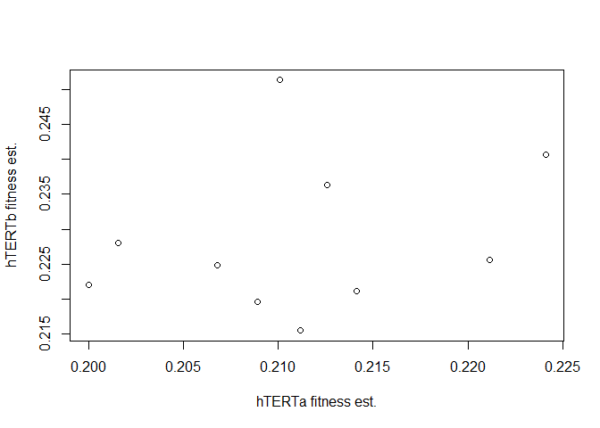
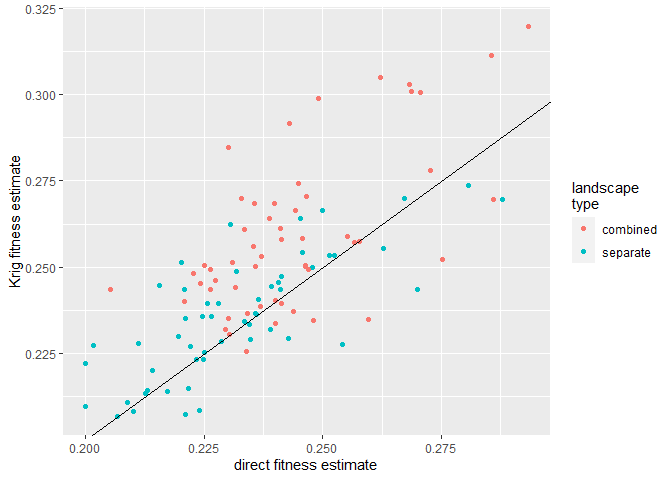
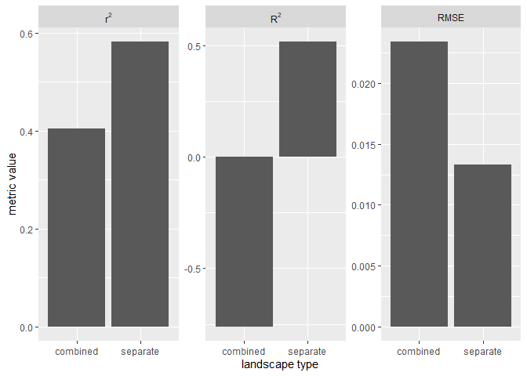
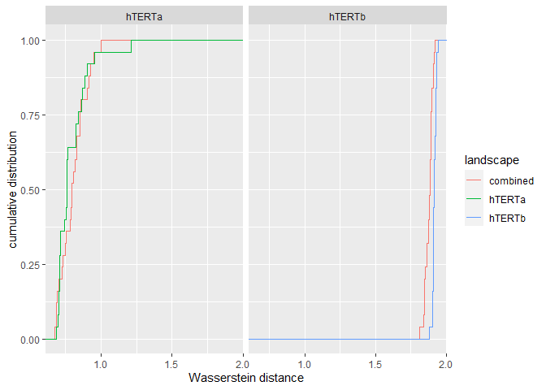
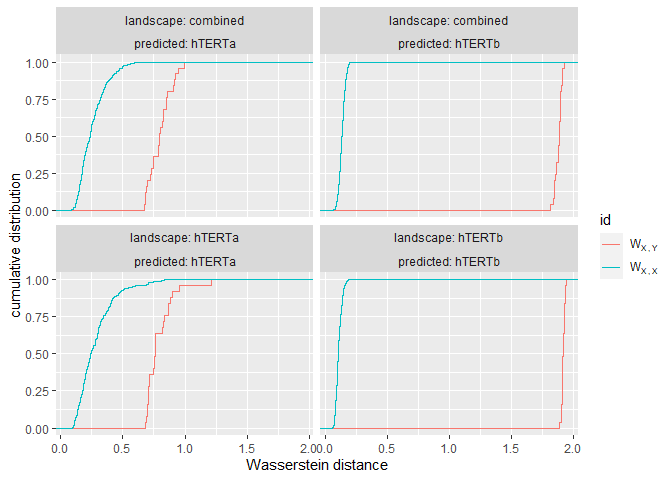
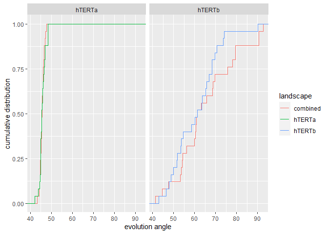
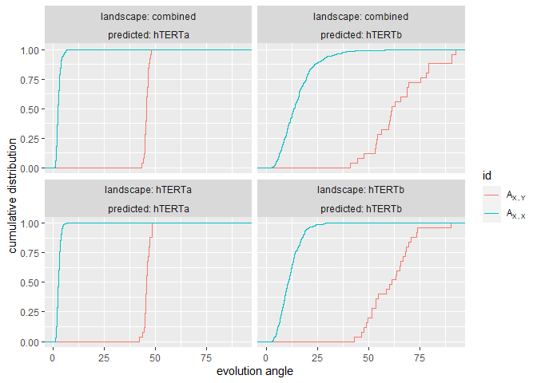

**Here, we aim to evaluate whether fitting hTERTa and hTERTb is best
done using different fitness landscapes, or using a single combined
landscape**

``` r
library(ggplot2)
source("utils/comparison_functions.R")
source("utils/ALFA-K.R")
```

Before diving into the analysis, it is useful to know that there are
several “frequent clones” shared between hTERTa and hTERTb, and there is
some (but not an overwhelming amount of) correlation between our fitness
estimates on them.



    ## [1] "correlation coefficient between independent fitness estimates is: 0.27"

**1. Cross validation**

The first thing we try is the leave-one-out cross validation procedure.
This is done using the following script (which takes a while, so the
intermediate results are saved):

``` r
source("figures/comparing_fit_quality/loo_xv.R")
```



    ## [1] "combined fit has 1673.90013122828 degrees of freedom, separate fit has 2072.90000715716 degrees of freedom."

Interpretation of the above results is as follows:

1.  separate landscapes scores better on all metrics.
2.  Combined landscape scores *extremely* poorly on the *r*<sup>2</sup>
    metric.
3.  The reason that the combined landscape scores so poorly on the
    *r*<sup>2</sup> metric is largely due to a bias i.e. tendency to
    always overestimate fitness values by a constant factor. It is not
    clear to me why this would happen. Notably, the separate landscape
    also seems to feel this effect although it is not clear exactly why.
4.  The separately fit landscapes have about 400 degrees of freedom more
    than the combined fit. I am not entirely clear what *degrees of
    freedom* means in this context (there are varying definitions), but
    the separately fit models should be penalized somehow to account for
    this. I do not know how to do so.

**2. Ability to predict evolution**

Here we fit ALFA-K to the hTERTa and hTERTb datasets (either separately
or combined), whilst excluding the final timepoints from the fit. If we
denote *X*<sub>*n* − 1, *a*</sub> and *X*<sub>*n*, *a*</sub> the
karyotype distributions from the final two timepoints of hTERTa, then
*W*<sub>*X*, *a*</sub> is the Wasserstein distance between
*X*<sub>*n* − 1, *a*</sub> and *X*<sub>*n*, *a*</sub>. We start the ABM
simulations (N=25 repeats) with an input karyotype distribution
*X*<sub>*n* − 1, *a*</sub> and simulate until
*W*<sub>*X*, *a*</sub> = *W*<sub>*Y*, *a*</sub>, where
*W*<sub>*Y*, *a*</sub> is the Wasserstein distance between
*X*<sub>*n* − 1, *a*</sub> and the simulated karyotype distribution
*Y*<sub>*n*, *a*</sub>. In other words, we simulate the ABMs until the
population travels a distance from the penultimate sampled timepoint,
which is equal to the distance between the final two timepoints of the
experimental data. We then do the same for hTERTb.

The code for running these ABM sims is here:

``` r
source("figures/comparing_fit_quality/evo_pred.R")
```

To evaluate how good our simulated predictions were, we compute the
Wasserstein distances between *X*<sub>*n*, *a*</sub> and
*Y*<sub>*n*, *a*</sub>. Here we find the Wasserstein distances to be
very similar whether populations evolve on separately trained or
combined landscapes (perhaps even the combined landscape has a slight
edge). Given the additional degrees of freedom for the separate fits, we
would have to conclude that the combined landscape has done better on
this test.



Although in the above test the combined landscape performed better, if
instead the separately fit landscapes had performed better we would have
been left with the same problem as with the leave-one-out comparison -
namely how to penalize for the additional degrees of freedom. This
problem could be solved by using the ABM simulations to generate a
*reference distribution*. For this we calculate the Wasserstein
distances *W*<sub>*X*, *X*</sub> between all pairs of simulation output.
We can then ask what is the *likelihood* that we obtain a distance equal
to *W*<sub>*X*, *Y*</sub> (which is the distance between a simulation
and our data). Having a likelihood would allow using model selection
techniques e.g. AIC to quantify the effect of additional degrees of
freedom (although I didn’t code this yet). Notably with the Wasserstein
metric in particular for hTERTb it appears essentially impossible that
we would get *W*<sub>*X*, *Y*</sub> (the ABM outputs are all very
similar and quite different to the data), which raises the question of
whether our simulation output was predictive at all.


Alternatively to using the Wasserstein metric we can use the evolution
angle metric which compares the angle through karyotype space taken by
the ABM simulations to the angle taken by the experimental population
(lower = better). Here again we see similar predictive ability comparing
combined v.s. separate landscapes.

 Again
the angles between different simulation replicates
*A*<sub>*X*, *X*</sub> are way smaller than the angle between data and
sims *A*<sub>*X*, *Y*</sub>, implying that our sims are all quite
similar and we are unlikely to generate a simulated population that
looks like the experimental data. However, since the angles
*A*<sub>*X*, *Y*</sub> are (almost all) below 90 degrees, at least we
know that our landscape predicts better than random chance.



**Conclusions**

1.  I still don’t know whether it is better to fit hTERTa and hTERTb
    together or separate.
2.  With a little extra work we can do model selection using either the
    Wasserstein or angle metrics and come to a conclusion.
3.  It is weird that the predictions from the leave one out procedure
    are biased and it seems wise to investigate why this is the case.
