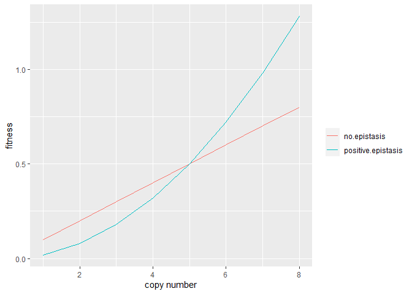
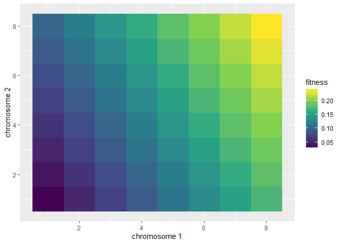
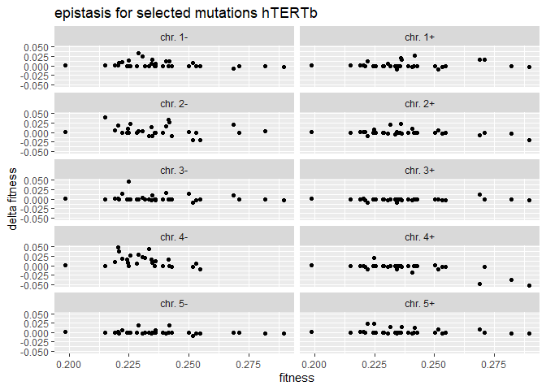
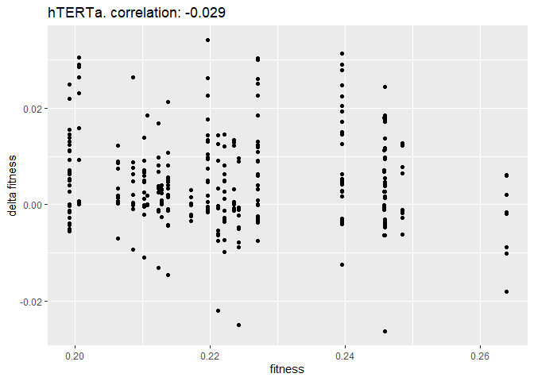
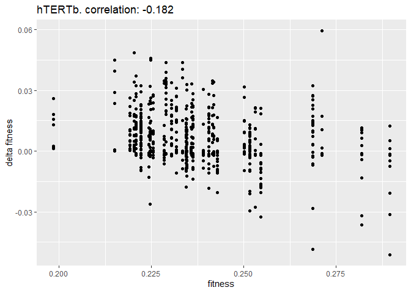
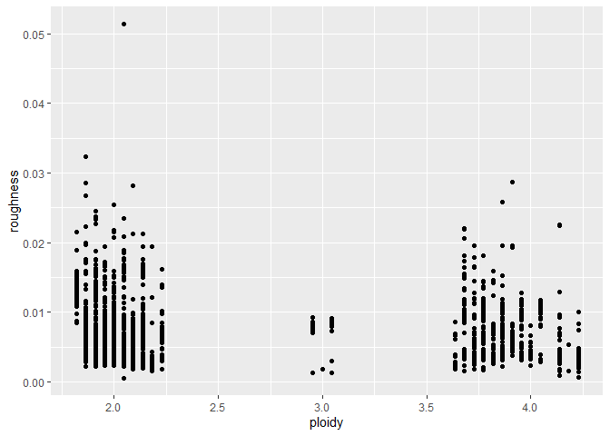
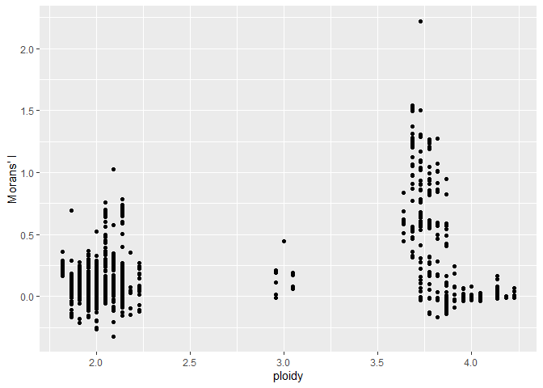

**Characterization of fitness landscapes**

**1.** Is there evidence for (diminishing returns) epistasis?

Epistasis is defined as a “deviation from additivity in the effect of
alleles at different loci with respect to their contribution to a
quantitative phenotype”(Fisher, 1918 - see *Epistasis: what it means,
what it doesn’t mean, and statistical methods to detect it in humans.
Heather J. Cordell.*). The logical extension of this definition to
karyotype space implies that a chromosome can exhibit epistasis *with
itself*.

 In
karyotype space, a mutation can be considered as a vector from one
karyotype to another. If there is no epistasis, then any translation of
that vector inside karyotype space should always be associated with the
same delta fitness. It should be obvious then that for karyotype space
the only fitness landscape that exhibits no epistasis is one in which
fitness increases or decreases linearly as copy number of any chromosome
changes. 

**Epistasis for hTERTa and hTERTb.** There are only 44 possible
mutations in karyotype space (Chr1 gain, Chr1 loss, Chr2 gain…etc). Our
approach will be ask what delta fitness is associated with each of the
44 mutations using each of the *frequent clones* as a starting point. We
will then see if the distribution of delta fitnesses is dependent on
starting fitness.

The results show some diminishing returns epistasis for hTERTb and
little to no evidence of epistasis for hTERTa. An interpretation of this
could be that hTERTb is nearing or has reached a peak in the fitness
landscape whereas hTERTa is still climbing (??).

**2.** Characterizing landscape topology using Morans’ I and “roughness”
metric.

Roughness metric as defines as the mean absolute difference in fitness
between a karyotype and all it’s distance 1 neighbours:

    ## [1] "mean roughness by ploidy (rounded to nearest integer)"

    ##   ploidy   roughness
    ## 1      2 0.007415116
    ## 2      3 0.007646715
    ## 3      4 0.006706259

Moran metric characterization:

