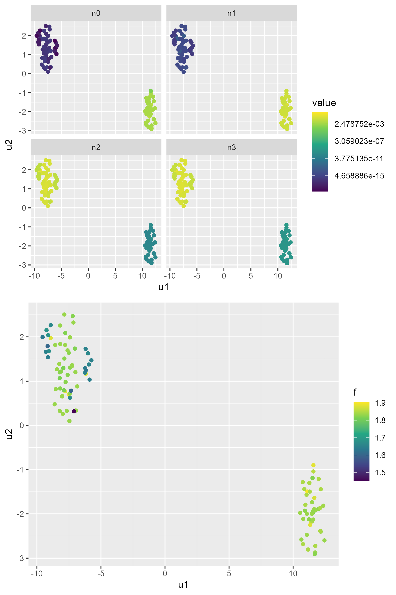
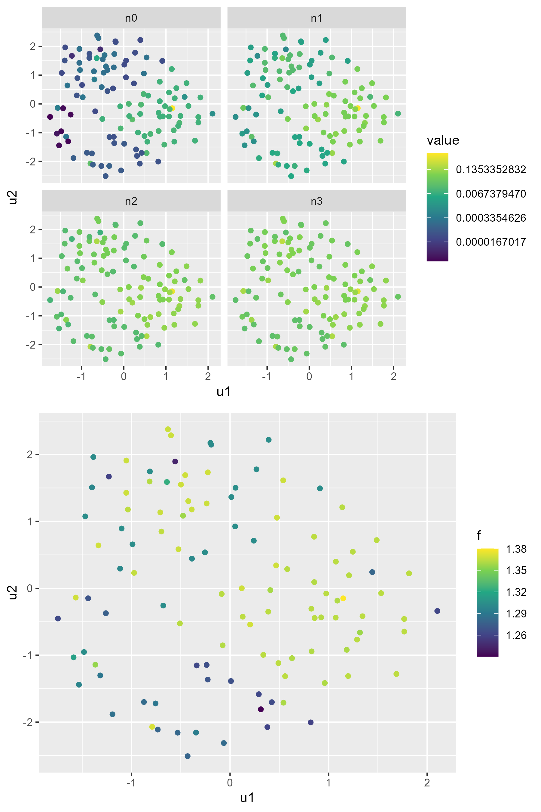

How does missegregation rate modify effective population fitness?
```{r setup, include=FALSE}
knitr::opts_knit$set(root.dir = "~/projects/008_birthrateLandscape/ALFA-K/")
```

```{r}
source("utils/ALFA-K.R")
source("utils/ode_functions.R")
library(ggplot2)
library(deSolve)
library(rootSolve)
```

In most circumstances the fittest karyotype is expected to eventually become dominant within a population. We asked whether this status quo could be altered simply by changing the missegregation rate. We envisage two ways this could occur: 1) karyotypes with more high-fitness neighbors should have an advantage when missegregation rate is high, since their numbers are bolstered by a continuous (albeit small) influx from their neighbors. 2) Low ploidy cells should have an advantange when missegregation rate is high, since their reduced total number of chromosomes mean a reduced per-cell risk of missegregation, so their populations should be more stable. Overall if the fittest karyotype has few neighbors or has high ploidy, it may not be dominant when the missegregation rate is high.  
```{r}

## ODE Model equation
chrmod <- function(time,state,parms){
  with(as.list(parms),{
    ds <- state%*%A
    ds <- ds-sum(ds)*state
    return(list(ds))
  })
}
reverse_state_index <- function(index,maxchrom,minchrom=1,ndim){
  ## reset maxchrom to behave as if minchrom was 1,1,...
  mc <- maxchrom-minchrom+1
  if(length(mc)==1 & ndim>1) mc <- rep(mc,ndim)
  ## how many elements does each part of the state represent?
  ## works as prod(numeric(0)) evaluates to 1:
  Nsites <- cumprod(mc)
  cp <- c(1,cumprod(mc)[-length(mc)])
  state <- c()
  for(j in ndim:1){
    ni <- floor((index-1)/cp[j])
    state <- c(ni+1,state)
    index <- index-cp[j]*ni
  }
  state + minchrom-1
}
pij<-function(i, j, beta){
  qij <- 0
  if(abs(i-j)>i){ ## not enough copies for i->j
    return(qij)
  }
  # code fails for j = 0, but we can get this result by noting i->0 always
  ## accompanies i->2i
  if(j==0) j <- 2*i
  s <- seq(abs(i-j), i, by=2 )
  for(z in s){
    qij <- qij + choose(i,z) * beta^z*(1-beta)^(i-z) * 0.5^z*choose(z, (z+i-j)/2)
  }
  ## if there is a mis-segregation: ploidy conservation implies that both daughter cells will emerge simultaneously
  #if(i!=j) qij <- 2*qij
  
  return(qij)
}

get_A <- function(maxchrom,beta){
 
  Ndim <- length(maxchrom)
  Nstates <- prod(maxchrom) 
  A<- matrix(0,nrow=Nstates,ncol=Nstates)
  for(i in 1:nrow(A)){
    state_i <- reverse_state_index(i,maxchrom,minchrom=1,ndim=Ndim)
    for(j in 1:nrow(A)){
      state_j <- reverse_state_index(j,maxchrom,minchrom=1,ndim=Ndim)
      qij <- sapply(1:Ndim, function(k) pij(state_i[k], state_j[k], beta))
      ## joint probability (i1,i2,...)->(j1,j2,...)
      qij <- prod(qij)
      A[i,j] <- 2*qij
      
      # ## case when there is no mis-segregation:
      if(i==j) A[i,j] <- (2*qij-1)
      
    }
  }
  A
}
get_fitness <- function(k,pk1,pk2){
  f1 <- as.numeric(sqrt(sum((k-pk1$centre)^2))<=pk1$rad)*pk1$fitness
  f2 <- as.numeric(sqrt(sum((k-pk2$centre)^2))<=pk2$rad)*pk2$fitness
  max(f1,f2)
}
mean_kary <- function(pm,pk1,pk2,return_df=FALSE){
  A <- get_A(maxchrom=c(8,8),beta=pm)
  state_ids <- do.call(rbind,lapply(1:nrow(A), reverse_state_index,maxchrom=c(8,8),ndim=2))
  f <- apply(state_ids,1,get_fitness,pk1=pk1,pk2=pk2)
  #f <- f/max(f)
  A <- A*f
  parms <- list(A=A)
  out <- runsteady(y=rep(1,length(f))/length(f),func=chrmod,parms=parms)
  df <- data.frame(state_ids)
  colnames(df) <- c("c1","c2")
  df$f <- f
  df$x <- out$y
  df$pm <- pm
  df$deltaf <- abs(pk1$fitness-pk2$fitness)
  if(!return_df) return(sum((df$c1)*df$x))
  if(!return_df) return(sum((df$c1+df$c2)*df$x/2))
  return(df)
  #data.frame(cn=1:8,f=f,pm=pm,deltaf=deltaf,x=out[nrow(out),-1])
}

```

```{r}
pk1 <- list(centre=c(6,6),rad=1,fitness=1)
pk2 <- list(centre=c(3,3),rad=1,fitness=0.9)

df1 <- rbind(mean_kary(0.1,pk1,pk2,return_df = T),
            mean_kary(0.0001,pk1,pk2,return_df = T))
df1$id <- "scenario A"

pk3 <- list(centre=c(3,6),rad=0,fitness=1)
pk4 <- list(centre=c(6,3),rad=1.99,fitness=0.9)
df2 <- rbind(mean_kary(0.1,pk3,pk4,return_df = T),
            mean_kary(0.0001,pk3,pk4,return_df = T))
df2$id <-"scenario B"

df <- rbind(df1,df2)

p1 <- ggplot(df,aes(x=c1,y=c2))+
  facet_grid(cols=vars(paste("misrate:",pm)),rows=vars(id))+
  geom_raster(aes(fill=f))+
  geom_point(aes(size=x))+
  scale_color_manual("",values=c("black"))+
  scale_size("karyotype \nfrequency")+
  scale_fill_viridis_c("fitness")+
  scale_x_discrete("chromosome 1 copy number")+
  scale_y_discrete("chromosome 2 copy number")
p1


ggsave("figures/misseg_landscape_exploration/figures/example.png",width = 4,height=3,units="in")


```


To identify possible missegregation dependendent switches in karyotype distribution, we generated approximate transisition matrices connecting all karyotypes in the charted region of each ALFA-K fitted landscape. We then determined the dominant eigenvectors of these transition matrices at varying missegregation rates to find the steady state karyotype distributions. For a subset of fitted landscapes we indeed found a missegregation rate dependentent switch in karyotype distribution. 

We will restrict our analysis to fitted lineages with no parents or descendents, and that had a cross validation score r^2 above 0.3. 

```{r,eval=FALSE}
## first generate the nonzero elements of the sparse transition matrices:
source("figures/misseg_landscape_exploration/sparseMatrixCoords.R")
## then find dominant eigenvalues at various missegregation rates:
source("figures/misseg_landscape_exploration/eigenScreen.R")

```






```{r,eval=F}
source("figures/misseg_landscape_exploration/sweep_abm_with_fits2.R")
```

```{r,eval=FALSE}

proc_res <- function(fi){
  print(fi)
  df <- screenR(paste0(fi,".Rds"))
  
  mr <- list.files(paste0(dir,fi))
  z <- do.call(rbind,lapply(mr,function(mri){
    reps <- list.files(paste0(dir,fi,"/",mri,"/output/"))
   # print(reps)
    do.call(rbind,lapply(reps,function(ri){
      x <- proc_sim(paste0(dir,fi,"/",mri,"/output/",ri,"/"),times=c(seq(0,10000,500)))
      x <- x$x
      x <- x[order(rowSums(x),decreasing=T),]
      x <- data.frame(x,check.names = F)
      
      id <- rep("none",nrow(x))
      id[rownames(x)%in%rownames(df[df$id,])] <- "winlo"
      id[rownames(x)%in%rownames(df[!df$id,])] <- "winhi"
      
      z <- split(x,f=id)
      z <- do.call(rbind,lapply(z,colSums))
      z <- reshape2::melt(z)
      colnames(z) <- c("id","time","n")
      z$rep <- ri
      z$misrate <- mri
      z
    }))
  }))
  z$cellLine <- fi
  return(z)
}

dir <- "data/salehi/misseg_landscape_exploration/minobs_5/"
ff <- list.files(dir)

z <- do.call(rbind,lapply(ff,proc_res))

saveRDS(z,file = "figures/misseg_landscape_exploration/screen_validation.Rds")

```

```{r}
options(scipen=999)
z <- readRDS("figures/misseg_landscape_exploration/screen_validation.Rds")
cellLines <- c("SA535_CISPLATIN_CombinedH_X7_l_3_d1_0_d2_0",
               "SA906a_X57_l_7_d1_0_d2_0")
z2 <- z[!z$id=="none"&z$cellLine%in%cellLines,]

transp <- function(p) as.numeric(gsub("p",".",p))

m <- readRDS("figures/salehi_data_fitting/labelled_metadata.Rds")
xx <- readRDS("figures/salehi_data_fitting/fit_summaries.Rds")

uids <- sapply(cellLines, function(ci) xx$uid[xx$filenames==paste0(ci,".Rds")][1])
linlabs <- sapply(uids, function(ui){
  paste(m$PDX_id,m$timepoint,m$linlab)[m$uid==ui]
})
names(linlabs) <- cellLines

z3 <- aggregate(list(n=z2$n),by=list(id=z2$id,
                                     time=z2$time,
                                     misrate=z2$misrate,
                                     cellLine=z2$cellLine),
                mean)

#lut <- c(winhi=)

p <- ggplot(z3,aes(x=time/10,y=n,color=id))+
  facet_grid(cols=vars(paste0("p=",transp(misrate))),rows=vars(linlabs[cellLine]))+
  geom_point()+
  scale_y_log10("num. cells")+
  scale_x_continuous("days",breaks=c(0,500,1000))+
  scale_color_discrete("group",labels=c("A","B"))
p

ggsave("figures/misseg_landscape_exploration/figures/abm_test.png",width=5,height=3,units="in")

```

```{r}
options(scipen=0)
fi <- "SA906a_X57_l_7_d1_0_d2_0.Rds"
 y <- readRDS(paste0("figures/misseg_landscape_exploration/coords/",fi))
  
  dims <- rep(length(y$kary),2)
  
  p <- c(0.0001,0.001,0.003,0.005)
  res <- do.call(cbind,lapply(p,function(p0){
    tm <- tmbuild(p0,y$coords,dims)
    func <- function(x, extra=NULL) { as.vector(tm %*% x) } 
    res <- tryCatch(expr = {
      res <- arpack(func, options=list(n=dims[1], nev=1, ncv=3, which="LM",maxiter=5000), 
                    sym=FALSE, complex = FALSE)
      res <- abs(res$vectors)
    },error=function(e) return(rep(0,nrow(tm))))
    
    names(res) <- y$kary
    res
  }))
  
  res <- res[order(rowSums(res),decreasing=T),]
  z <- res[apply(res,1,max)>0.02,]
  n0 <- z[,1]
  n1 <- z[,4]
  
  
  fit <- readRDS(paste0("data/salehi/alfak_fits/minobs_5/",fi))$fit
  pts <- do.call(rbind,lapply(rownames(z),s2v))
  f <- predict(fit,pts)
  ump <- umap::umap(pts)
  
  df <- data.frame(n0,n1,f)
  df <- cbind(ump$layout,df)
  colnames(df)[1:2] <- c("u1","u2")
  
  df$ploidy <- sapply(rownames(df), function(k) mean(s2v(k)))
  df$id <- df$n0>df$n1
  
  relablr <- c(n0='p=0.0001',n1='p=0.005')
  
  z1 <- reshape2::melt(df,measure.vars=c("n0","n1"))
  
  p1 <- ggplot(z1,aes(x=u1,y=u2,color=value,shape=id))+
    facet_wrap(~relablr[variable],nrow=2)+
    geom_point(size=0.4)+
    scale_color_viridis_c("steady-state\nfrequency",trans="log",breaks=c(1e-1,1e-5,1e-9,1e-13,1e-17))+
    scale_x_continuous("umap1")+
    scale_y_continuous("umap2")+
    scale_shape_discrete("group",labels=c("A","B"))+
    theme(legend.key.size = unit(0.1,"in"))
  p1
  
  p2 <- ggplot(df,aes(x=u1,y=u2,color=f,shape=id))+
    geom_point(size=0.4)+
    scale_color_viridis_c("fitness")+
    scale_x_continuous("umap1")+
    scale_y_continuous("umap2")+
    scale_shape_discrete("group",labels=c("A","B"))+
    theme(legend.key.size = unit(0.1,"in"))
  p2
  p3 <- ggplot(df,aes(x=ploidy,fill=id))+
    geom_histogram(position="dodge")+
    scale_fill_discrete("group",labels=c("A","B"))+
    scale_x_continuous("ploidy")+
    theme(legend.key.size = unit(0.1,"in"))
  p3
  
  p4 <- ggplot(df,aes(x=f,fill=id))+
    geom_histogram(position="dodge")+
    scale_fill_discrete("group",labels=c("A","B"))+
    scale_x_continuous("fitness")+
    theme(legend.key.size = unit(0.1,"in"))
  p4
  
ggsave("figures/misseg_landscape_exploration/figures/SA609_distr_umap.png",plot=p1,width=2.5,height=2.5,units="in")

ggsave("figures/misseg_landscape_exploration/figures/SA609_f_umap.png",plot=p2,width=2.5,height=2,units="in")

ggsave("figures/misseg_landscape_exploration/figures/SA609_f_hist.png",plot=p4,width=2.5,height=2,units="in")

ggsave("figures/misseg_landscape_exploration/figures/SA609_ploidy_hist.png",plot=p3,width=2.5,height=2,units="in")
```


```{r}
options(scipen=0)
fi <- "SA535_CISPLATIN_CombinedH_X7_l_3_d1_0_d2_0.Rds"
#fi <- "SA535_CISPLATIN_CombinedH_X9_l_5_d1_0_d2_0.Rds"
 y <- readRDS(paste0("figures/misseg_landscape_exploration/coords/",fi))
  
  dims <- rep(length(y$kary),2)
  
  p <- c(0.0001,0.001,0.003,0.005)
  res <- do.call(cbind,lapply(p,function(p0){
    tm <- tmbuild(p0,y$coords,dims)
    func <- function(x, extra=NULL) { as.vector(tm %*% x) } 
    res <- tryCatch(expr = {
      res <- arpack(func, options=list(n=dims[1], nev=1, ncv=3, which="LM",maxiter=5000), 
                    sym=FALSE, complex = FALSE)
      res <- abs(res$vectors)
    },error=function(e) return(rep(0,nrow(tm))))
    
    names(res) <- y$kary
    res
  }))
  
  res <- res[order(rowSums(res),decreasing=T),]
  z <- res[apply(res,1,max)>0.02,]
  n0 <- z[,1]
  n1 <- z[,4]
  
  
  fit <- readRDS(paste0("data/salehi/alfak_fits/minobs_5/",fi))$fit
  pts <- do.call(rbind,lapply(rownames(z),s2v))
  f <- predict(fit,pts)
  ump <- umap::umap(pts)
  
  df <- data.frame(n0,n1,f)
  df <- cbind(ump$layout,df)
  colnames(df)[1:2] <- c("u1","u2")
  
  df$ploidy <- sapply(rownames(df), function(k) mean(s2v(k)))
  df$id <- df$n0>df$n1
  
  relablr <- c(n0='p=0.001',n1='p=0.003')
  
  z1 <- reshape2::melt(df,measure.vars=c("n0","n1"))
  
  p1 <- ggplot(z1,aes(x=u1,y=u2,color=value,shape=id))+
    facet_wrap(~relablr[variable],nrow=2)+
    geom_point(size=0.4)+
    scale_color_viridis_c("steady-state\nfrequency",trans="log",breaks=c(1e-1,1e-5,1e-9,1e-13,1e-17))+
    scale_x_continuous("umap1")+
    scale_y_continuous("umap2")+
    scale_shape_discrete("group",labels=c("A","B"))+
    theme(legend.key.size = unit(0.1,"in"))
  p1
  
  p2 <- ggplot(df,aes(x=u1,y=u2,color=f,shape=id))+
    geom_point(size=0.4)+
    scale_color_viridis_c("fitness")+
    scale_x_continuous("umap1")+
    scale_y_continuous("umap2")+
    scale_shape_discrete("group",labels=c("A","B"))+
    theme(legend.key.size = unit(0.1,"in"))
  p2
  p3 <- ggplot(df,aes(x=ploidy,fill=id))+
    geom_histogram(position="dodge")+
    scale_fill_discrete("group",labels=c("A","B"))+
    scale_x_continuous("ploidy")+
    theme(legend.key.size = unit(0.1,"in"))
  p3
  
  p4 <- ggplot(df,aes(x=f,fill=id))+
    geom_histogram(position="dodge")+
    scale_fill_discrete("group",labels=c("A","B"))+
    scale_x_continuous("fitness")+
    theme(legend.key.size = unit(0.1,"in"))
  p4
  
ggsave("figures/misseg_landscape_exploration/figures/SA535_distr_umap.png",plot=p1,width=2.5,height=2.5,units="in")

ggsave("figures/misseg_landscape_exploration/figures/SA535_f_umap.png",plot=p2,width=2.5,height=2,units="in")

ggsave("figures/misseg_landscape_exploration/figures/SA535_f_hist.png",plot=p4,width=2.5,height=2,units="in")

ggsave("figures/misseg_landscape_exploration/figures/SA535_ploidy_hist.png",plot=p3,width=2.5,height=2,units="in")

head(df[order(df$f,decreasing=T),])
```