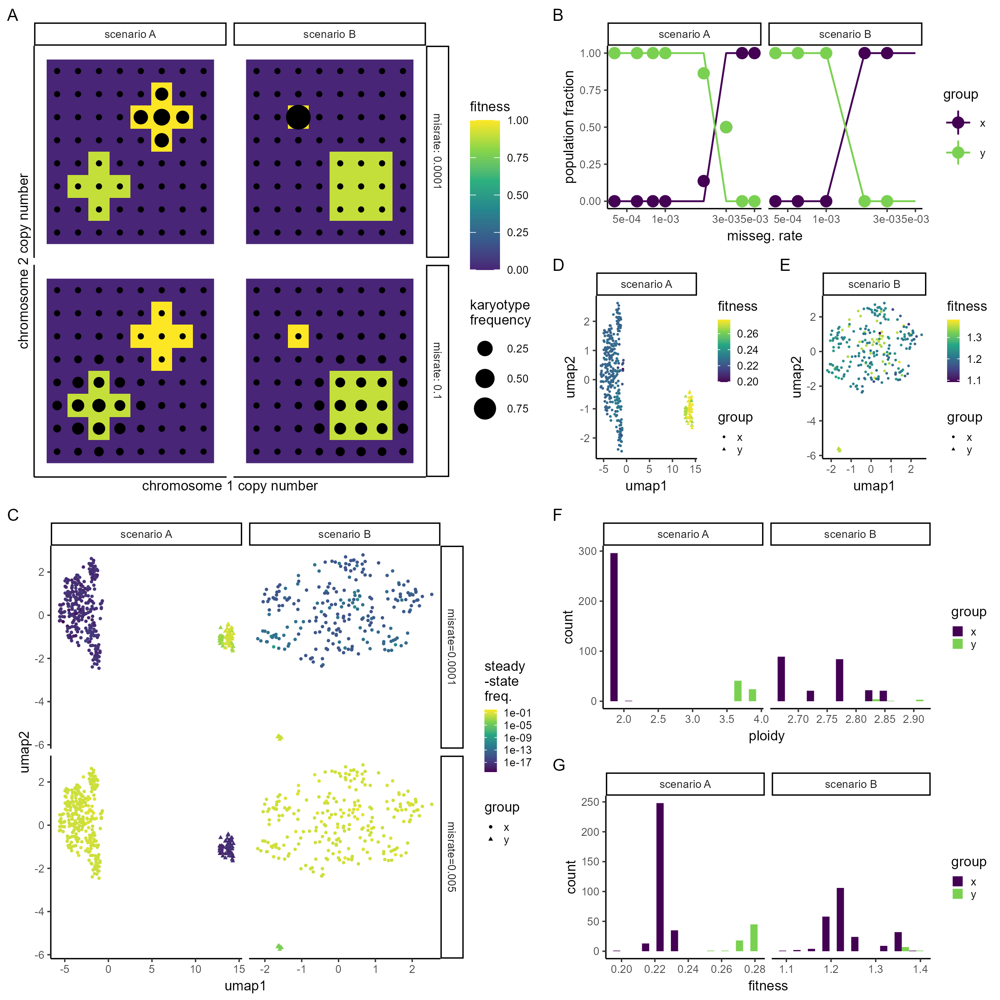

Missegregation rate influences karyotype dominance
================

Code in this folder analyses the effect of missegregation rate on
karyotype evolution and generates the figure below. See .Rmd file for
more details.

Compare theory to prediction
