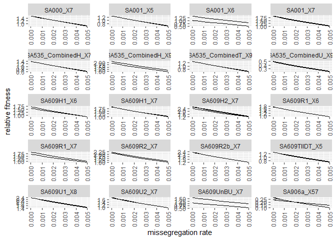
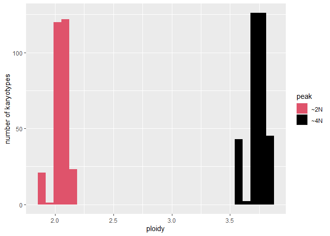
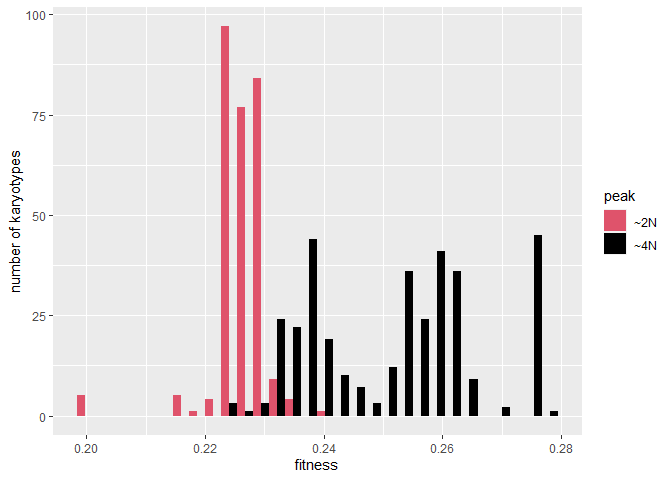
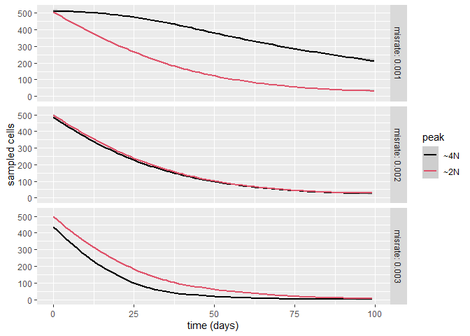

How does missegregation rate modify effective population fitness?

``` r
source("utils/ALFA-K.R")
```

    ## Warning: package 'lhs' was built under R version 4.1.3

    ## Warning: package 'fields' was built under R version 4.1.3

    ## Loading required package: spam

    ## Warning: package 'spam' was built under R version 4.1.3

    ## Spam version 2.9-0 (2022-07-11) is loaded.
    ## Type 'help( Spam)' or 'demo( spam)' for a short introduction 
    ## and overview of this package.
    ## Help for individual functions is also obtained by adding the
    ## suffix '.spam' to the function name, e.g. 'help( chol.spam)'.

    ## 
    ## Attaching package: 'spam'

    ## The following objects are masked from 'package:base':
    ## 
    ##     backsolve, forwardsolve

    ## Loading required package: viridis

    ## Warning: package 'viridis' was built under R version 4.1.2

    ## Loading required package: viridisLite

    ## 
    ## Try help(fields) to get started.

``` r
library(ggplot2)
```

    ## Warning: package 'ggplot2' was built under R version 4.1.3

``` r
library(deSolve)
```

    ## Warning: package 'deSolve' was built under R version 4.1.3

``` r
library(rootSolve)
```

    ## Warning: package 'rootSolve' was built under R version 4.1.1

Example of the principles of how mis-segregation rate can shape
landscape exploration:

``` r
## ODE Model equation
chrmod <- function(time,state,parms){
  with(as.list(parms),{
    ds <- state%*%A
    ds <- ds-sum(ds)*state
    return(list(ds))
  })
}
reverse_state_index <- function(index,maxchrom,minchrom=1,ndim){
  ## reset maxchrom to behave as if minchrom was 1,1,...
  mc <- maxchrom-minchrom+1
  if(length(mc)==1 & ndim>1) mc <- rep(mc,ndim)
  ## how many elements does each part of the state represent?
  ## works as prod(numeric(0)) evaluates to 1:
  Nsites <- cumprod(mc)
  cp <- c(1,cumprod(mc)[-length(mc)])
  state <- c()
  for(j in ndim:1){
    ni <- floor((index-1)/cp[j])
    state <- c(ni+1,state)
    index <- index-cp[j]*ni
  }
  state + minchrom-1
}
pij<-function(i, j, beta){
  qij <- 0
  if(abs(i-j)>i){ ## not enough copies for i->j
    return(qij)
  }
  # code fails for j = 0, but we can get this result by noting i->0 always
  ## accompanies i->2i
  if(j==0) j <- 2*i
  s <- seq(abs(i-j), i, by=2 )
  for(z in s){
    qij <- qij + choose(i,z) * beta^z*(1-beta)^(i-z) * 0.5^z*choose(z, (z+i-j)/2)
  }
  ## if there is a mis-segregation: ploidy conservation implies that both daughter cells will emerge simultaneously
  #if(i!=j) qij <- 2*qij
  
  return(qij)
}

get_A <- function(maxchrom,beta){
 
  Ndim <- length(maxchrom)
  Nstates <- prod(maxchrom) 
  A<- matrix(0,nrow=Nstates,ncol=Nstates)
  for(i in 1:nrow(A)){
    state_i <- reverse_state_index(i,maxchrom,minchrom=1,ndim=Ndim)
    for(j in 1:nrow(A)){
      state_j <- reverse_state_index(j,maxchrom,minchrom=1,ndim=Ndim)
      qij <- sapply(1:Ndim, function(k) pij(state_i[k], state_j[k], beta))
      ## joint probability (i1,i2,...)->(j1,j2,...)
      qij <- prod(qij)
      A[i,j] <- 2*qij
      
      # ## case when there is no mis-segregation:
      if(i==j) A[i,j] <- (2*qij-1)
      
    }
  }
  A
}
get_fitness <- function(k,pk1,pk2){
  f1 <- as.numeric(sqrt(sum((k-pk1$centre)^2))<=pk1$rad)*pk1$fitness
  f2 <- as.numeric(sqrt(sum((k-pk2$centre)^2))<=pk2$rad)*pk2$fitness
  max(f1,f2)
}
mean_kary <- function(pm,pk1,pk2,return_df=FALSE){
  A <- get_A(maxchrom=c(8,8),beta=pm)
  state_ids <- do.call(rbind,lapply(1:nrow(A), reverse_state_index,maxchrom=c(8,8),ndim=2))
  f <- apply(state_ids,1,get_fitness,pk1=pk1,pk2=pk2)
  #f <- f/max(f)
  A <- A*f
  parms <- list(A=A)
  out <- runsteady(y=rep(1,length(f))/length(f),func=chrmod,parms=parms)
  df <- data.frame(state_ids)
  colnames(df) <- c("c1","c2")
  df$f <- f
  df$x <- out$y
  df$pm <- pm
  df$deltaf <- abs(pk1$fitness-pk2$fitness)
  if(!return_df) return(sum((df$c1)*df$x))
  if(!return_df) return(sum((df$c1+df$c2)*df$x/2))
  return(df)
  #data.frame(cn=1:8,f=f,pm=pm,deltaf=deltaf,x=out[nrow(out),-1])
}
pk1 <- list(centre=c(6,6),rad=1,fitness=1)
pk2 <- list(centre=c(3,3),rad=1,fitness=0.9)

df1 <- rbind(mean_kary(0.1,pk1,pk2,return_df = T),
            mean_kary(0.0001,pk1,pk2,return_df = T))
df1$id <- "scenario A"

pk3 <- list(centre=c(3,6),rad=0,fitness=1)
pk4 <- list(centre=c(6,3),rad=1.99,fitness=0.9)
df2 <- rbind(mean_kary(0.1,pk3,pk4,return_df = T),
            mean_kary(0.0001,pk3,pk4,return_df = T))
df2$id <-"scenario B"

df <- rbind(df1,df2)

p1 <- ggplot(df,aes(x=c1,y=c2))+
  facet_grid(cols=vars(paste("misrate:",pm)),rows=vars(id))+
  geom_raster(aes(fill=f))+
  geom_point(aes(size=x))+
  scale_color_manual("",values=c("black"))+
  scale_size("karyotype \nfrequency")+
  scale_fill_viridis_c("fitness")+
  scale_x_discrete("chromosome 1 copy number")+
  scale_y_discrete("chromosome 2 copy number")
p1
```


``` r
ggsave("figures/misseg_landscape_exploration/figures/example.png",width = 4,height=3,units="in")
```

We will restrict our analysis to fitted lineages with no parents or
descendents, and that had a cross validation score r^2 above 0.3.

``` r
x <- readRDS("figures/salehi_data_fitting/fit_summaries.Rds")
xcore <- x[!x$has_descendents&!x$has_parents&x$min_obs==5,]
```

Our approach to determining peaks was to find all karyotypes that had
fitness greater than any of their 1MS neighbours. These peaks were
subsquently merged if they shared any distance 1 neighbours.

``` r
## this chunk takes about 1 hour to run
get_A <- function(x,beta){
  Ndim <- ncol(x)
  Nstates <- nrow(x)
  A<- matrix(0,nrow=Nstates,ncol=Nstates)
  for(i in 1:nrow(A)){
    state_i <- x[i,]
    for(j in 1:nrow(A)){
      state_j <- x[j,]
      qij <- sapply(1:Ndim, function(k) pij(state_i[k], state_j[k], beta))
      ## joint probability (i1,i2,...)->(j1,j2,...)
      qij <- prod(qij)
      A[i,j] <- 2*qij
      
      # ## case when there is no mis-segregation:
      if(i==j) A[i,j] <- (2*qij-1)
      
    }
  }
  A
}


peak_growth <- function(pm,pk,fit){
  n <- do.call(rbind,lapply(pk,gen_all_neighbours))
  n <- n[duplicated(n),]
  n <- rbind(do.call(rbind,lapply(pk,s2v)),n)
  n <- unique(n)
  f <- predict(fit,n)

  A <- get_A(n,pm)*c(f)
  xinf <- abs(eigen(A)$vectors[,1])
  xinf <- xinf/sum(xinf)
  g <- sum(c(xinf%*%A))
  return(g)
}


id_peaks <- function(ff){
  x <- readRDS(paste0("data/salehi/alfak_fits/minobs_5/",ff))
  
  
  is_peak <- pbapply::pbsapply(1:nrow(x$xo), function(i){
    nn <- gen_all_neighbours(rownames(x$xo)[i])
    fn <- c(predict(x$fit,nn))
    x$xo$f_est[i]>max(fn)
  })
  
  xpk <- x$xo[is_peak,]
  xpk <- xpk[order(xpk$f_est,decreasing=T),]
  
  v <- do.call(rbind,lapply(rownames(xpk),s2v))
  
  d <- as.matrix(dist(v,method="manhattan"))
  
  
  
  pks <- lapply(1:nrow(d), function(i){
    grp <- c(i)
    which(d[i,]<3)
  })
  
  lpks <- 1
  lpks2 <- 2
  
  while(mean(lpks==lpks2)<1){
    lpks <- sapply(pks,length)
    pks <- lapply(pks, function(pki){
      pki <- unique(unlist(lapply(pki,function(i){
        which(d[i,]<3)
      })))
      pki <- pki[order(pki)]
    })
    lpks2 <- sapply(pks,length)
  }
  
  pks <- unique(pks)
  pks <- lapply(pks,function(pki){
    k <- rownames(xpk)[pki]
    f <- xpk$f_est[pki]
    names(f) <- k
    f
  })
}

id_candidate <- function(ff){
  pks <- id_peaks(ff)
  is_candidate <- which.max(sapply(pks,max))!=which.max(sapply(pks,length))
  if(is_candidate) print(ff)
  return(is_candidate)
}

ff <- xcore$filenames[xcore$r2>0.3]

pks <- lapply(ff,id_peaks)
names(pks) <- ff
saveRDS(pks,file="figures/misseg_landscape_exploration/peaks.Rds")

bounds <- c(0.00001,0.005)
lb <- log(bounds)
lseq <- seq(lb[1],lb[2],length.out=10)
pm <- exp(lseq)
gpks <- lapply(1:length(ff), function(i){
  fit <- readRDS(paste0("data/salehi/alfak_fits/minobs_5/",ff[i]))$fit
  pki <- pks[[i]]
  lapply(pki,function(pk){
    pbapply::pbsapply(pm, peak_growth,pk=names(pk),fit=fit)
  })
})
names(gpks) <- ff
saveRDS(gpks,file="figures/misseg_landscape_exploration/gpeaks.Rds")
```

The following shows the net growth rate of populations on the previously
identified peaks as a function of mis-segregation rate.

``` r
pks <- readRDS("figures/misseg_landscape_exploration/peaks.Rds")
gpks <- readRDS("figures/misseg_landscape_exploration/gpeaks.Rds")
bounds <- c(0.00001,0.005)
lb <- log(bounds)
lseq <- seq(lb[1],lb[2],length.out=10)
pm <- exp(lseq)
df <- do.call(rbind,lapply(1:length(pks), function(i){
  id <- names(pks)[i]
  df <- data.frame(do.call(cbind,gpks[[i]]))
  df <- df[,unique(apply(df,1,order,decreasing=T)[1:2,])]
  df$pm <- pm
  df <- reshape2::melt(df,id.vars="pm")
  df$id <- id
  return(df)
}))

df$id2 <- sapply(df$id, function(i){
  i <- unlist(strsplit(i,split="_"))
  i <- paste(i[1:(length(i)-6)],collapse="_")
  i
})
df$id2 <- gsub("CISPLATIN_","",df$id2)
p <- ggplot(df,aes(x=pm,y=value,group=variable))+
  facet_wrap(~id2,scales="free",ncol=4)+
  geom_line()+ 
  theme(axis.text.x = element_text(angle = 90, vjust = 0.5, hjust=1))+
  scale_x_continuous("missegregation rate")+
  scale_y_continuous("relative fitness")
p
```



``` r
ggsave("figures/misseg_landscape_exploration/figures/sweep.png",width=6,height=7.5,units="in")
```

Only one peak showed a significant shift in relative fitness. It is
explored here:

``` r
pks <- readRDS("figures/misseg_landscape_exploration/peaks.Rds")
dir <- "data/salehi/misseg_landscape_exploration/minobs_5/SA906a_X57_l_7_d1_0_d2_0/"
fit <- readRDS("data/salehi/alfak_fits/minobs_5/SA906a_X57_l_7_d1_0_d2_0.Rds")$fit
ff <- list.files(dir)
ff <- ff[!ff%in%c("log.txt","summary.txt")]

pk1 <- names(pks[[6]][[1]])
pk1 <- unique(c(pk1,apply(gen_all_neighbours(pk1),1,paste,collapse=".")))

pk2 <- names(pks[[6]][[6]])
pk2 <- unique(c(pk2,apply(gen_all_neighbours(pk2),1,paste,collapse=".")))

v1 <- do.call(rbind,lapply(pk1,s2v))
f1 <- c(predict(fit,v1))
df1 <- data.frame(fitness=f1,ploidy=rowMeans(v1),id="~4N")
v2 <- do.call(rbind,lapply(pk2,s2v))
f2 <- c(predict(fit,v2))
df2 <- data.frame(fitness=f2,ploidy=rowMeans(v2),id="~2N")

df12 <- rbind(df1,df2)

p <- ggplot(df12,aes(x=ploidy,group=id,fill=id))+
  geom_histogram()+
  scale_fill_manual("peak",labels=c("~2N","~4N"),values = c(2,1))+
  scale_y_continuous("number of karyotypes")
p
```

    ## `stat_bin()` using `bins = 30`. Pick better value with `binwidth`.



``` r
ggsave("figures/misseg_landscape_exploration/figures/peak_ploidy.png",width=3,height=2,units="in")
```

    ## `stat_bin()` using `bins = 30`. Pick better value with `binwidth`.

``` r
p <- ggplot(df12,aes(x=fitness,group=id,fill=id))+
  geom_histogram(position="dodge")+
  scale_fill_manual("peak",labels=c("~2N","~4N"),values = c(2,1))+
  scale_y_continuous("number of karyotypes")
p
```

    ## `stat_bin()` using `bins = 30`. Pick better value with `binwidth`.



``` r
ggsave("figures/misseg_landscape_exploration/figures/peak_fitness.png",width=3,height=2,units="in")
```

    ## `stat_bin()` using `bins = 30`. Pick better value with `binwidth`.

``` r
pm <- list.files(dir)[1:3]

df <- do.call(rbind,lapply(pm, function(pmi){
  dd <- paste0(dir,pmi,"/output/")
  fo <- list.files(dd)
  do.call(rbind,lapply(fo, function(foi){
    ff <- list.files(paste0(dd,foi))
    ff <- ff[!ff%in%c("log.txt","summary.txt")]
    membership <- do.call(rbind,lapply(ff, function(fi){
      xi <- read.table(paste0(dd,foi,"/",fi),sep=",")
      n <- xi$V23
      k <- apply(xi[,1:22],1,paste,collapse=".")
      n1 <- sum(n[k%in%pk1])#/sum(n)
      n2 <- sum(n[k%in%pk2])#/sum(n)
      s12 <- 1#n1+n2
      k <- apply(xi[,1:22],2,function(i) i*n)
      ploidy <- sum(k)/sum(n)/22
      tt <- head(unlist(strsplit(fi,split=".csv")),1)
      data.frame(time=tt,n1=n1/s12,n2=n2/s12,ploidy=ploidy)
    }))
    membership$rep <- foi
    membership$pm <- pmi
    membership
  }))
}))

df <- reshape2::melt(df,measure.vars=c("n1","n2"))


p <- ggplot(df,aes(x=as.numeric(time)/10,y=value,color=variable))+
  facet_grid(rows=vars(paste0("misrate: ",gsub("p",".",pm))))+
  geom_smooth()+
  scale_color_manual("peak",labels=c("~4N","~2N"),values = c(1,2))+
  scale_x_continuous("time (days)")+
  scale_y_continuous("sampled cells")
p
```

    ## `geom_smooth()` using method = 'loess' and formula 'y ~ x'



``` r
ggsave("figures/misseg_landscape_exploration/figures/validation.png",width=3,height=4,units="in")
```

    ## `geom_smooth()` using method = 'loess' and formula 'y ~ x'
