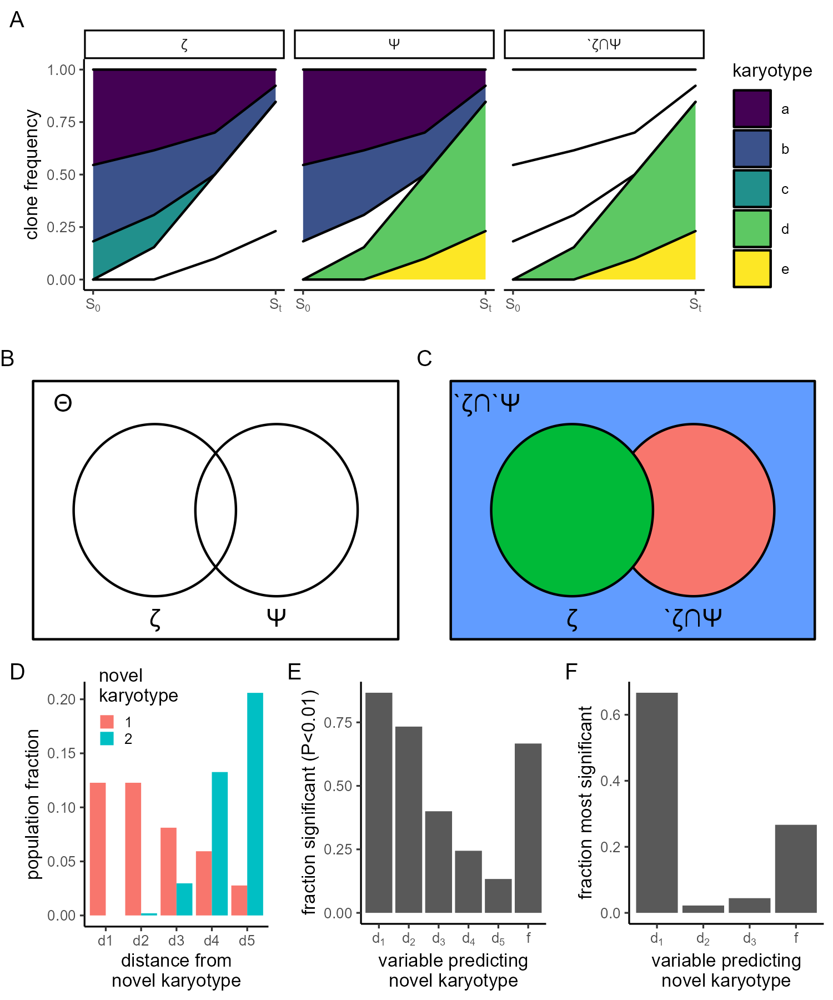

Experimental data is available here https://osf.io/tvzw9/?view_only=0c216deb154b4625a3bbb7db280882ca

Code chunks are not shown in this version of the README. See README.Rmd for more detail. 

Code in this folder covers

1) Processing experimental data
2) Training ALFA-K on experimental data
3) Predicting karyotype evolution with experimental data
4) Generating the following figures:

```{r setup, include=FALSE, echo=FALSE}
knitr::opts_knit$set(root.dir = "~/projects/008_birthrateLandscape/ALFA-K/")
```

![Figure 3. Fits to cell passaging data A) Maps showing the relationship cell passages that were sequenced and used as inputs to ALFA-K. Each filled circle represents a sequenced sample. Lines connect parental passages to children, with line type indicating the presence or absence of cisplatin treatment in the intervening period. Circles are colored according to the $R^2$ metric value for fitted landscapes including that sample and all its ancestors.  B) $R^2$ metric scores for all sublineages in the dataset, grouped according to the number of samples used in the fitting. C) Angle metric scores for all lineages with at least one descendent, grouped according to the number of samples used in the fitting and the $R^2$ metric score. Red horizontal line indicates the expected value of the angle under the null hypothesis (i.e. that the fitted and true landscape are different).](fit_salehi.png)


```{r,echo=FALSE,eval=FALSE,include=FALSE}
#First we will pull all the lineages from the metadata. A lineage is defined as any sequence of two or more consecutive samples. 
source("figures/salehi_data_fitting/scripts/lineage_processing.R")

m <- read.csv("data/salehi/metadata.csv")
lineages <- process_lineages(m)
saveRDS(lineages,"figures/salehi_data_fitting/data/lineages.Rds")

```


```{r,echo=FALSE,eval=FALSE,include=FALSE}
#Run the following scripts (in order) to preprocess & fit the Salehi data.The third script will take several hours on a regular PC. 
source("figures/salehi_data_fitting/scripts/extract_cn_profiles.R")
source("figures/salehi_data_fitting/scripts/extract_lineage_v2.R") 
source("figures/salehi_data_fitting/scripts/fit_alfak_v2.R")
```

```{r,echo=FALSE,eval=FALSE,include=FALSE}
library(gtable)
library(ape)
library(ggtree)
library(treeio)
library(ggplot2)
library(xlsx)
source("utils/ALFA-K.R")
source("utils/comparison_functions.R")

```


```{r,echo=FALSE,eval=FALSE,include=FALSE}

source("figures/salehi_data_fitting/scripts/extract_fit_summaries.R")
source("figures/salehi_data_fitting/scripts/extract_validation_summaries.R")


```


```{r,echo=FALSE,eval=FALSE,include=FALSE}

m <- read.csv("data/salehi/metadata.csv")
x <- readRDS("figures/salehi_data_fitting/data/fit_summaries.Rds")
x <- x[!x$has_parents&x$min_obs==5,]

m$r2 <- sapply(m$uid, function(i){
  if(!i%in%x$uid) return(NaN)
  x$r2[x$uid==i]
  })

m <- wrap_assign_labels(m)
saveRDS(m,"data/salehi/metadata.Rds")

x906 <- adder(wrap_tree("SA906",m),0,0)
x1035 <- adder(wrap_tree("SA1035",m),0,2)
x532 <- adder(wrap_tree("SA532",m),0,5)
x535 <- adder(wrap_tree("SA535",m),0,7)
x609 <- adder(wrap_tree("SA609",m),9,3)

linlabs <- data.frame(x=c(1,4,2,5,11),y=c(1,3.5,4.5,8,4),
                      labs=c("SA906","SA1035","SA532","SA535","SA609"))

x <- rbind(x906$x,x1035$x,x532$x,x535$x,x609$x)
xseg <- rbind(x906$xseg,x1035$xseg,x532$xseg,x535$xseg,x609$xseg)

pa <- ggplot(x,aes(x=x,y=y))+
  geom_segment(data=xseg,aes(xend=xstart,yend=ystart,linetype=on_treatment),alpha=0.5)+
  geom_point(aes(color=r2))+
  geom_text(aes(label=linlab),nudge_y = 0.3,color="red",size=2)+
  geom_text(data=linlabs,aes(label=labs),size=3)+
  scale_color_viridis_c(expression(R^2),limits=c(-1,1))+
  scale_linetype_discrete("treatment",labels=c("on","off"))+
  theme_classic(base_size=8)+
  labs(tag="A")+
  theme(axis.text = element_blank(),axis.title = element_blank(),
        axis.line = element_blank(),axis.ticks = element_blank(),legend.position = c(0.95,0.7),legend.key.size = unit(0.2,"in"))

rownames(x) <- NULL
saveRDS(x,"figures/salehi_data_fitting/data/labelled_metadata.Rds")
```


```{r,echo=FALSE,eval=FALSE,include=FALSE}

label_proc <- function(id){
  id <- unlist(strsplit(id,split="_"))
  label<-id[1]
  label <- m$label[gsub(" ","",m$label)==label]
  label <- unlist(strsplit(label,split=" "))
  pdx <- label[1]
  details <- label[2]
  paste(pdx,details,collapse="")
}

get_pdx_id <- function(id){
  pdx_ids <- c("SA609","HER2+","p53-/-a","p53-/-b","SA535","SA1035")
  names(unlist(sapply(pdx_ids,grep,id)))
}


m <- read.csv("data/salehi/metadata.csv")
x <- readRDS("figures/salehi_data_fitting/data/fit_summaries.Rds")
x <- x[x$min_obs==5,]
x$pdx_id <- as.character(sapply(x$id,get_pdx_id))

pb <- ggplot(x,aes(x=stringr::str_pad(samples,width = 2),y=r2))+
  geom_violin()+
  coord_flip()+
  theme_bw(base_size=8)+
  labs(tag="B")+
  scale_y_continuous(expression(cross~val.~R^2))+
  scale_x_discrete("samples in fit")


p <- ggplot(x,aes(x=stringr::str_pad(samples,width = 2),y=r2))+
  facet_wrap(~pdx_id)+
  geom_violin()+
  geom_jitter(height=0,width=0.1)+
  coord_flip()+
  scale_y_continuous(expression(cross~val.~R^2))+
  scale_x_discrete("samples in fit")

#ggsave("figures/salehi_data_fitting/figures/xval_scores_by_pdx.png",width=4.5,height=3.5,units="in")
```

```{r,echo=FALSE,eval=FALSE,include=FALSE}

wrap_res <- function(df){
  angle_data <- df[,paste0("a",seq(0,300,150))]
  df <- df[,!colnames(df)%in%paste0("a",seq(0,300,150))]
  df$angle <- angle_data$a150
  df$angle[df$declevel==2] <- angle_data$a300[df$declevel==2]
  df$pos_r2 <- df$r2>0
  df$good_r2 <- df$r2>0.3
  return(df)
  
}

wrap_res <- function(df){
  angle_data <- df[,paste0("a",seq(100,500,100))]
  df <- df[,!colnames(df)%in%colnames(angle_data)]
  df$angle <- apply(angle_data,1,min)
  #df$angle[df$declevel==2] <- angle_data$a300[df$declevel==2]
  df$pos_r2 <- df$r2>0
  df$good_r2 <- df$r2>0.3
  return(df)
  
}

 
df <- wrap_res(readRDS("figures/salehi_data_fitting/data/validation_summaries.Rds"))
df$lab1 <- "R^2<0"
df$lab1[df$pos_r2] <- "R^2>0"
df$lab2 <- paste0("passage~",df$declevel)

m <- readRDS("figures/salehi_data_fitting/data/labelled_metadata.Rds")
lut <- m$on_treatment
names(lut) <- paste0("u",m$uid)


#lut2 <- m$PDX_id
#names(lut2) <- paste0("u",m$uid)

df$Tvar <- ifelse(lut[paste0("u",df$uid)]==lut[paste0("u",df$descendent)],"constant","switch")
#df$pdx_id <- lut2[paste0("u",df$uid)]

tst <- df[!is.na(df$Tvar),]

tst <- aggregate(list(angle=tst$angle),by=list(Tvar=tst$Tvar,
                                               lab1=tst$lab1),
                 function(x) c(low=mean(x)-sd(x),
                               mid=mean(x),
                               hi=mean(x)+sd(x)))

tst <- cbind(tst[,1:2],tst[,3])

dfagg <- aggregate(list(angle=df$angle),by=list(declevel=df$declevel,
                                                filenames=df$filenames,id=df$id,
                                                descendent=df$descendent,
                                                uid=df$uid,
                                                Tvar=df$Tvar,
                                                pos_r2=df$pos_r2),median)

pc <- ggplot(dfagg[dfagg$declevel==1&dfagg$pos_r2,],aes(x=angle))+
  stat_ecdf(aes(color=Tvar=="switch"))+
  scale_color_viridis_d("treatment\nswitch",
                        end=0.8,option="A")+
  scale_y_continuous("ecdf")+
  scale_x_continuous("angle metric\n(ALFA-K, ABM)",breaks=seq(0,180,45),limits=c(0,180))+      labs(tag="C")+
  theme_classic(base_size=8)+
  theme(legend.position = c(0.8,0.3))+
  theme(legend.key.size = unit(0.1,"in"))

```

```{r,echo=FALSE,eval=FALSE,include=FALSE}

source("utils/comparison_functions.R")
x <- readRDS("data/salehi/chrom_level_cn.Rds")
m <- read.csv("data/salehi/metadata.csv")
#m <- m[m$PDX_id=="SA609",]

nm <- table(m$parent)
nm <- names(nm)[nm>1]

l <- do.call(rbind,lapply(nm, function(ni) {
  children <- m$uid[m$parent==ni & !is.na(m$parent)]
  combos <- combn(1:length(children),2)
  cond_match <- apply(combos,2,function(ci){
    m$on_treatment[m$uid==children[ci[1]]]==m$on_treatment[m$uid==children[ci[2]]]
  })
  pdx_id <- m$PDX_id[m$uid==ni]
  data.frame(parent=ni,child1=children[combos[1,]],
             child2=children[combos[2,]],cond_match,pdx_id)
}))

l <- cbind(l,data.frame(t(apply(l[,1:3],1,function(li){
  sapply(li, function(lij) m$library_ids[m$uid==lij])
}))))
colnames(l)[1:3] <- paste0("uid_",colnames(l)[1:3])


l$angles <- sapply(1:nrow(l), function(i){
  #print(i)
  idpar <- unlist(strsplit(l$parent[i],split=";"))
  idc1 <- unlist(strsplit(l$child1[i],split=";"))
  idc2 <- unlist(strsplit(l$child2[i],split=";"))
  
  if(mean(sapply(idpar,function(id) id%in%names(x)))<1) return(NaN)
  if(mean(sapply(idc1,function(id) id%in%names(x)))<1) return(NaN)
  if(mean(sapply(idc2,function(id) id%in%names(x)))<1) return(NaN)
  
  vpar <- colMeans(do.call(rbind,lapply(idpar,function(id) x[[id]])))
  vc1 <- colMeans(do.call(rbind,lapply(idc1,function(id) x[[id]])))-vpar
  vc2 <- colMeans(do.call(rbind,lapply(idc2,function(id) x[[id]])))-vpar
  
  getangle(vc1,vc2)
})

aggregate(l$angles,by=list(l$cond_match,l$pdx_id),mean,na.rm=T)
aggregate(l$angles,by=list(l$cond_match),mean,na.rm=T)
pd <- ggplot(l,aes(x=angles))+
  stat_ecdf(aes(color=!cond_match))+
  scale_color_viridis_d("treatment\nswitch",end=0.8,option="A")+
  scale_y_continuous("ecdf")+
  scale_x_continuous("angle metric\n(branch points)",breaks=seq(0,180,45),limits=c(0,180))+      labs(tag="D")+
  theme_classic(base_size=8)+
  theme(legend.position = c(0.8,0.3),legend.key.size = unit(0.1,"in"))
pd

```

```{r,echo=FALSE,eval=FALSE,include=FALSE}
library(gridExtra)
bot <- grid.arrange(pb,pc,pd,nrow=1)
plt <- grid.arrange(pa,bot,heights=c(2,1))
ggsave("figures/salehi_data_fitting/fit_salehi.png",plot=plt,width=5,height=5,units="in")
```


```{r,echo=FALSE,eval=FALSE,include=FALSE}
source("figures/salehi_predictions/multireg.R")

```

Example Muller plot
```{r}
# Load necessary libraries
library(ggplot2)
library(reshape2)
library(dplyr)
library(viridis)

# Define the data manually
data <- data.frame(
  Time = rep(c(1, 2, 3, 4), times = 5),
  Clone = rep(c("Clone1", "Clone2", "Clone3", "Clone4", "Clone5"), each = 4),
  Frequency = c(10, 5, 3, 1,
                8, 4, 2, 1,
                4, 2, 0, 0,
                0, 2, 4, 8,
                0, 0, 1, 3)
)

# Normalize frequencies at each timepoint to sum to 1
data <- data %>%
  group_by(Time) %>%
  mutate(Frequency = Frequency / sum(Frequency))

# Add group information
data <- data %>%
  mutate(Group = case_when(
    Clone %in% c("Clone1", "Clone2") ~ "Group A",
    Clone == "Clone3" ~ "Group B",
    Clone %in% c("Clone4", "Clone5") ~ "Group C"
  ))

clone_names <- c("Clone1", "Clone2", "Clone3", "Clone4", "Clone5")
zeta <- clone_names[1:3]
psi <- clone_names[c(1:2,4:5)]
psiNzeta <- clone_names[c(4:5)]

groups <- list(zeta=zeta,
               psi=psi,
               psiNzeta=psiNzeta)
tmp <- do.call(rbind,lapply(unique(data$Group),function(di) {
  tmp <- data
  tmp$Group2 <- di
  tmp
  }))

tmp$Clone2 <- FALSE
tmp$Clone2[tmp$Group2=="Group A" & tmp$Clone%in%groups[[1]]] <- TRUE
tmp$Clone2[tmp$Group2=="Group B" & tmp$Clone%in%groups[[2]]] <- TRUE
tmp$Clone2[tmp$Group2=="Group C" & tmp$Clone%in%groups[[3]]] <- TRUE

lablr <- c('Group B' = " \u03A8 ",
           'Group A' = "  \u03B6  ",
           'Group C' = "\u0060\u03B6\u2229\u03A8")

tmp$Group2 <- lablr[tmp$Group2]

# Create a Muller plot using ggplot2
p0 <- ggplot(tmp, aes(x = Time, y = Frequency, group=Clone,fill = Clone,alpha=Clone2)) +
  geom_area(color="black") +
  scale_fill_viridis_d("karyotype",labels=letters[1:5])+
  guides(alpha="none")+
  scale_alpha_manual(values=c(0,1))+
  facet_wrap(~ Group2, ncol = 3) +
  theme_classic(base_size=8)+
  labs(tag="A")+
  scale_x_continuous("",breaks=c(1,4),labels=c(expression(S[0],S[t])))+
  scale_y_continuous("clone frequency")
```


```{r,echo=FALSE,eval=FALSE,include=FALSE}

library(ggforce)
circles <- data.frame(
  x0 = c(1,4),
  y0 = c(0,0),
  r = c(2,2),
  id = c("\u03B6","\u03A8")
)

circles$id <- factor(circles$id,levels=c("\u03A8","\u03B6"))

anndf <- data.frame(x=c(1,4,-1.25),y=c(-2.5,-2.5,2.5),anno=c("\u03B6","\u03A8","\u0398"))
anndf2 <- data.frame(x=c(1,4,-1.1),y=c(-2.5,-2.5,2.5),
                     anno=c("\u03B6","\u0060\u03B6\u2229\u03A8","\u0060\u03B6\u2229\u0060\u03A8"))

noaxistheme <- theme(axis.text = element_blank(),axis.title = element_blank(),
        axis.line = element_blank(),axis.ticks = element_blank())

# Behold some circles
pa <- ggplot() +
  geom_rect(aes(xmin = -2, xmax = 7, ymin = -3, ymax = 3),alpha=0,color="black")+
  geom_circle(aes(x0 = x0, y0 = y0, r = r), data = circles)+
  geom_text(data=anndf,aes(x=x,y=y,label=anno))+
  labs(tag="B")+
  theme_void(base_size=8)
pa

pb <- ggplot() +
  geom_rect(aes(xmin = -2, xmax = 7, ymin = -3, ymax = 3,fill="\u0398"),
            color="black", show.legend = F)+
  geom_circle(aes(x0 = x0, y0 = y0, r = r,fill=id), 
              data = circles,show.legend = F)+
  geom_text(data=anndf2,aes(x=x,y=y,label=anno),parse=F)+
  labs(tag="C")+
  theme_void(base_size=8)
pb
```


```{r,echo=FALSE,eval=FALSE,include=FALSE}
#generate the features to perform the multiple regression:
source("figures/salehi_data_fitting/scripts/multireg_landscape.R")

```

```{r,echo=FALSE,eval=FALSE,include=FALSE}
## 
proc_data <- function(i,x,fit){
  
  nn <- rownames(fit$xv_res)
  nn <- c(nn,apply(gen_all_neighbours(nn),1,paste,collapse="."))
  nn <- c(nn,apply(gen_all_neighbours(nn),1,paste,collapse="."))
  
  newk <- rownames(x)[x[,i+1]>0 & x[,i]==0]
  oldk <- rownames(x)[x[,i]>0]
  oldv <- do.call(rbind,lapply(oldk,s2v)) 
 
  vn <- do.call(rbind,lapply(nn,s2v))
  
  
  df <- apply(vn,1,function(ni){
    d <- apply(oldv,1,function(oi){
      sum(abs(oi-ni))
    })
    sapply(0:5,function(di){
      sum(x[oldk[d==di],i])
    })
  })
  df <- t(df)
  df <- df/sum(x[,i])
  df <- data.frame(df,row.names=NULL)
  colnames(df) <- paste0("d",0:5)
  df$f <- predict(fit$fit,vn)
  df$y <- nn%in%newk
  df <- df[df[,1]==0,-1]
  
  return(df)

}

fit <- readRDS("data/salehi/alfak_fits/minobs_5/SA609_X9_l_9_d1_1_d2_0.Rds")
x <- readRDS("data/salehi/alfak_inputs_v2/SA609_X10_l_10_d1_0_d2_0.Rds")$x
test <- proc_data(ncol(x)-1,x=x,fit=fit)

i1 <- unlist(test[which.max(test$d1),1:5])
i2 <- unlist(test[which.min(test$d1),1:5])

df <- data.frame(frac=c(i1,i2),d=c(names(i1),names(i2)),
                 id=c(rep("1",length(i1)),rep("2",length(i2))))

pc <- ggplot(df,aes(x=d,y=frac,fill=id))+
  geom_col(position="dodge")+
  scale_fill_discrete("novel\nkaryotype")+
  theme_classic(base_size=8)+
  labs(tag="D")+
  scale_x_discrete("distance from\nnovel karyotype")+
  scale_y_continuous("population fraction")+
  theme(legend.position = c(0.3,0.9),legend.key.size = unit(0.1,"in"))
pc

```

```{r,echo=FALSE,eval=FALSE,include=FALSE}

df <- readRDS("figures/salehi_data_fitting/data/multireg_landscape.Rds")
df$rep <- ceiling((1:nrow(df))/7)
w <- split(df,f=df$rep)


w <- do.call(rbind,lapply(w,function(wi){
  wi <- wi[-1,]
  wi <- wi[wi$Estimate>0,]
  data.frame(rep=wi$rep[1],w=wi$ids[which.min(wi$Pr...z..)])
}))
z <- split(df,f=df$ids)

z <- do.call(rbind,lapply(z,function(zi){
  data.frame(var=zi$ids[1],frac=mean(zi$Estimate>0 & zi$Pr...z..<0.01))
}))

renamr <- c(d1="d[1]",d2="d[2]",d3="d[3]",d4="d[4]",d5="d[5]",f="f")
z <- z[!z$var=="(Intercept)",]
z$var <- renamr[z$var]
w$w <- renamr[w$w]
pd <- ggplot(z,aes(x=var,y=frac))+
  geom_col()+
  theme_classic(base_size=8)+
  labs(tag="E")+
  scale_x_discrete("variable predicting\nnovel karyotype",labels = scales::parse_format())+
  scale_y_continuous("fraction significant (P<0.01)")
pd


pe <- ggplot(w,aes(x=w))+ 
  stat_count(aes(y=..count../sum(..count..)))+
  theme_classic(base_size=8)+
  labs(tag="F")+
  scale_x_discrete("variable predicting\nnovel karyotype",labels = scales::parse_format())+
  scale_y_continuous("fraction most significant")
pe


```
```{r,echo=FALSE,eval=FALSE,include=FALSE}

library(gridExtra)

plt <- grid.arrange(p0,grid.arrange(pa,pb,ncol=2),
                    grid.arrange(pc,pd,pe,ncol=3),
                    nrow=3,heights=c(4,3.5,4))
ggsave("figures/salehi_data_fitting/prednovel.png",plot=plt,width=5,height=6,units="in")
```

