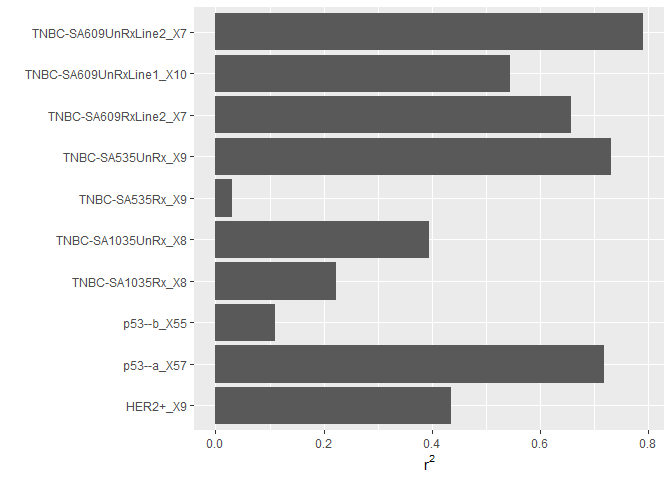
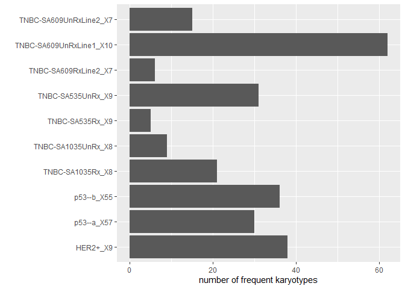

Fitting ALFA-K model to Salehi data

``` r
library(ggplot2)
```

    ## Warning: package 'ggplot2' was built under R version 4.1.3

``` r
library(xlsx)
```

First source the following to prepare the sample data (the third one
takes a few hours)

``` r
source("figures/salehi_data_fitting/extract_cn_profiles.R")
source("figures/salehi_data_fitting/extract_lineage.R")
source("figures/salehi_data_fitting/fit_alfak.R")
```

Fit alfa-k and test performance across all lineages. It turned out that
for these cell lines the results of the cross validation procedure could
be quite sensitive to the value of min_obs. Therefore alfa-k was fit
using all possible values for min_obs\>5 on each cell line and the
“best” value of min_obs was used. The criterion for best was the value
that maximised the product of *r*<sup>2</sup> with the number of unique
karyotypes considered as frequent clones. This was done instead of
simply taking the highest *r*<sup>2</sup> value, to prevent choosing
values for min_obs that would result in high *r*<sup>2</sup> values
across only a couple of karyotypes.

``` r
dir <- "data/salehi/alfak_fits_minobs_adaptive/"
ff <- list.files(dir)

x <- do.call(rbind,lapply(ff, function(fi) {
  print(fi)
xi <- readRDS(paste0(dir,fi))
xi <- xi[!sapply(xi,is.null)]
if(length(xi)==0) return(NULL)
cor<-sapply(xi, function(xij) xij$vx_cor)
n <-sapply(xi, function(xij) nrow(xij$xv_res))

goodness <- cor*n

j <- which.max(goodness)

df <- data.frame(cor=cor[j],
                 n=n[j],
                 id=unlist(strsplit(fi,split=".Rds"))[1])
}))
```

    ## [1] "HER2+_X9.Rds"
    ## [1] "p53--a_X57.Rds"
    ## [1] "p53--b_X55.Rds"
    ## [1] "TNBC-SA1035Rx_X8.Rds"
    ## [1] "TNBC-SA1035UnRx_X8.Rds"
    ## [1] "TNBC-SA535Rx_X9.Rds"
    ## [1] "TNBC-SA535UnRx_X9.Rds"
    ## [1] "TNBC-SA609RxLine1_X7.Rds"
    ## [1] "TNBC-SA609RxLine2_X7.Rds"
    ## [1] "TNBC-SA609UnRxLine1_X10.Rds"
    ## [1] "TNBC-SA609UnRxLine2_X7.Rds"

``` r
p <- ggplot(x,aes(x=id,y=cor^2))+
  geom_col()+
  coord_flip()+
  scale_x_discrete("")+
  scale_y_continuous(expression(r^2))
p
```



``` r
p <- ggplot(x,aes(x=id,y=n))+
  geom_col()+
  coord_flip()+
  scale_x_discrete("")+
  scale_y_continuous("number of frequent karyotypes")
p
```



``` r
library("treeio")
library("ggtree")

nwk <- system.file("extdata", "sample.nwk", package="treeio")
tree <- read.tree(nwk)

ggplot(tree, aes(x, y)) + geom_tree() + theme_tree()
```

``` r
library(ggtree)


m <- read.csv("data/salehi/metadata.csv")

m <- split(m,f=m$PDX_id)[[2]]
```

``` r
dir <- "data/salehi/alfak_fits_minobs_adaptive/"
ff <- list.files(dir)

x <- do.call(rbind,lapply(ff, function(fi) {
  df <- readRDS(paste0(dir,fi))$xv
  id <- unlist(strsplit(fi,split=".Rds"))[1]
  print(id)
  cc <- tryCatch({cor(df$f_est,df$f_xv,use="complete.obs")},
                 error=function(e) return(NaN))
  data.frame(cor=cc,id)
  }))

p <- ggplot(x,aes(x=id,y=cor))+
  geom_col()+
  coord_flip()
p


x <- do.call(rbind,lapply(ff, function(fi) {
  df <- readRDS(paste0(dir,fi))$xv
  id <- unlist(strsplit(fi,split=".Rds"))[1]
  df$id <- id
  df
  }))

p <- ggplot(x,aes(x=f_est,y=f_xv))+
  facet_wrap(~id,scales="free")+
  geom_point()
p
```

``` r
dir <- "data/salehi/alfak_fits_minobs_adaptive/"
ff <- list.files(dir)

x <- do.call(rbind,lapply(ff, function(fi) {
  print(fi)
xi <- readRDS(paste0(dir,fi))
xi <- xi[!sapply(xi,is.null)]
if(length(xi)==0) return(NULL)
df <- data.frame(cor=sapply(xi, function(xij) xij$vx_cor),
                 n=sapply(xi, function(xij) nrow(xij$xv_res)),
                 id=unlist(strsplit(fi,split=".Rds"))[1])
}))


p <- ggplot(x,aes(x=n,y=cor))+
  facet_wrap(~id,scales="free")+
  geom_point()
p

fi <- ff[3]
xi <- readRDS(paste0(dir,fi))

df <- do.call(rbind,lapply(1:length(xi), function(j) {
  dfj <- xi[[j]]$xv_res
  dfj$id2 <- j
  dfj
}))

p <- ggplot(df,aes(x=f_est,y=f_xv))+
  facet_wrap(~id2,scales="free")+
  geom_point()
p
```

``` r
dir <- "data/salehi/alfak_fits_minobs_adaptive/"
ff <- list.files(dir)

x <- do.call(rbind,lapply(ff, function(fi) {
  print(fi)
xi <- readRDS(paste0(dir,fi))
xi <- xi[!sapply(xi,is.null)]
if(length(xi)==0) return(NULL)
cor<-sapply(xi, function(xij) xij$vx_cor)
n <-sapply(xi, function(xij) nrow(xij$xv_res))

goodness <- cor*n

j <- which.max(goodness)

df <- data.frame(cor=cor[j],
                 n=n[j],
                 id=unlist(strsplit(fi,split=".Rds"))[1])
}))


p <- ggplot(x,aes(x=id,y=cor^2))+
  geom_col()+
  coord_flip()+
  scale_x_discrete("")+
  scale_y_continuous(expression(r^2))
p
```
