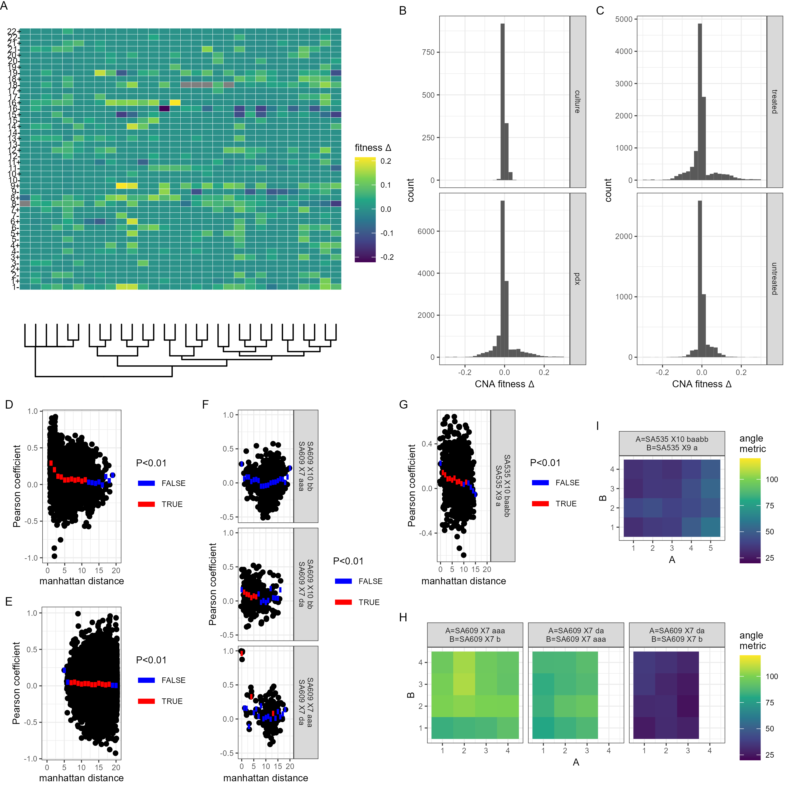

Code in this folder compares similarity of various fitness landscapes and generates the figure below. See .Rmd file for more details. 

```{r setup, include=FALSE}
knitr::opts_knit$set(root.dir = "~/projects/008_birthrateLandscape/ALFA-K/")
```

```{r,echo=FALSE,eval=FALSE,include=FALSE}
source("utils/comparison_functions.R")
source("utils/ALFA-K.R")
source("figures/salehi_data_fitting/scripts/lineage_processing.R")
library(ggtree)
library(ape)
library(ggplot2)
m <- read.csv("data/salehi/metadata.csv")
xx <- readRDS("figures/salehi_data_fitting/data/fit_summaries.Rds")
```




```{r,include=F}
## adds custom grobs instead of normal facet labels
## labels is a vector c("uppertext\nlowertext",...)
## indents control how far text is from border.
custom_grob <- function(labels,indent_x=0.2,indent_y=0.4) {
  grobs <- list()
  
  for (i in seq_along(labels)) {
    panel_labels <- strsplit(labels[[i]], "\n")[[1]]
    grobs[[i]] <- gTree(children = gList(
      rectGrob(gp = gpar(fill = "white", col = NA)), # Solid white background
      polygonGrob(
        x = unit(c(0, 1, 0), "npc"),
        y = unit(c(1, 1, 0), "npc"),
        gp = gpar(fill = "white", col = "black")
      ),
      textGrob(panel_labels[1], x = unit(indent_x, "npc"), y = unit(1-indent_y, "npc"), gp = gpar(col = "black")),
      polygonGrob(
        x = unit(c(1, 1, 0), "npc"),
        y = unit(c(0, 1, 0), "npc"),
        gp = gpar(fill = "white", col = "black")
      ),
      textGrob(panel_labels[2], x = unit(1-indent_x, "npc"), y = unit(indent_y, "npc"), gp = gpar(col = "black"))
    ))
  }
  
  return(grobs)
}

grobwrapper <- function(p,labels){
  # Generate the custom grobs for each panel
custom_grobs <- custom_grob(labels)

# Add custom grobs to the plot
g <- ggplotGrob(p)
strip_positions <- which(grepl("strip-t", g$layout$name))

for (i in seq_along(strip_positions)) {
  g$grobs[[strip_positions[i]]] <- custom_grobs[[i]]
}
return(g)
}

```

```{r,echo=FALSE,include=FALSE,eval=FALSE}

## this function generates a matrix of fitness changes associated with each possible CNA for all (frequent) karyotypes in the input file, according to the fitted landscape. 
cna_mat <- function(fi,remove_negs =F){
  xi <- readRDS(paste0("data/salehi/alfak_fits/minobs_5/",fi))

  fi <- do.call(rbind,lapply(row.names(xi$xv_res), function(i){
    yi <- gen_all_neighbours(i,remove_nullisomes = FALSE)
    nll <- apply(yi,1,function(yij) sum(yij<1)==0)
    #if(nrow(yi)<44) return(NULL)
    fi <- predict(xi$fit,yi)-xi$xv_res[i,"f_est"]
    fi <- c(fi)
    fi[!nll] <- NaN
    if(remove_negs) fi[fi<0] <- 0
    chrom <- stringr::str_pad(ceiling((1:length(fi))/2),width=2)
    mod <- rep(c("-","+"),22)
  
    names(fi) <- paste0(chrom,mod)
    fi
  }))
  rownames(fi) <- rownames(xi$xv_res)
  return(fi)
}

## similar to cna_mat, consider merging
assess_cna <- function(fi){
  uid <- x$uid[x$filenames==fi]
  pdx <- m$PDX_id[m$uid==uid]
  lab <- m$label[m$uid==uid]
  tp <- m$timepoint[m$uid==uid]
  xi <- readRDS(paste0("data/salehi/alfak_fits_post_jump/minobs_5/",fi))

  fi <- do.call(rbind,lapply(row.names(xi$xv_res), function(i){
   yi <- gen_all_neighbours(i,remove_nullisomes = FALSE)
    nll <- apply(yi,1,function(yij) sum(yij<1)==0)
  #if(nrow(yi)<44) return(NULL)
  fi <- predict(xi$fit,yi)-xi$xv_res[i,"f_est"]
  fi <- c(fi)
  fi[!nll] <- NaN
  chrom <- stringr::str_pad(ceiling((1:length(fi))/2),width=2)
  mod <- rep(c("-","+"),22)
  
  names(fi) <- paste0(chrom,mod)
  fi
}))

fi <- reshape2::melt(fi)
fi$pdx <- pdx
fi$tp <- tp
fi$lab <- lab
fi$uid <- uid
colnames(fi)[1:3] <- c("k","cna","deltaf")
return(fi)
}

##this function generates a correlation matrix given an input matrix of CNA profiles
dvscor <- function(fi,method="manhattan",cormeth="pearson",remove_negs =F ){
  x <- cna_mat(fi)
  if(remove_negs) x[x<0] <- 0 
  cormat <- cor(t(x),use = "complete",method = cormeth)
  d <- as.matrix(dist(do.call(rbind,lapply(rownames(x),s2v)),method=method))
  df <- data.frame(d=c(d[upper.tri(d)]),cor=c(cormat[upper.tri(cormat)]))
  return(df)
}

## this function obstains additional metadata for data frame df.
proc_id <- function(df,m){
  ids <- do.call(rbind,strsplit(df$ids,split="[.]"))
  ids0 <- ids
  are_equal <- ids[,1]==ids[,2]
  pdxlut <- m$PDX_id
  names(pdxlut) <- paste0("x",m$uid)
  ids[,1] <- pdxlut[paste0("x",ids[,1])]
  ids[,2] <- pdxlut[paste0("x",ids[,2])]
  pdx_equal <- ids[,1]==ids[,2]
  colnames(ids0) <- c("id1","id2")
  cbind(df,data.frame(pdx_equal,are_equal),ids0)
}

## this function changes filename id to lineage based id
relablr <- function(id,meta,lid=NULL){
  id <- paste0("x",id)
  lut <- paste(meta$PDX_id,meta$timepoint,meta$linlab)
  names(lut) <- paste0("x",meta$uid)
  if(!is.null(lid)) lut <- paste0(lut,"[",lid,"]")
  lut[id]
}


## calculates angle metrics at different timepoints between two different lineages and returns the result ready for plotting. Note function doesn't automatically check if the lineages start at the same point (which they should!)
angle_heatmap <- function(ids){
  x <- lapply(ids, function(id) {
    xi <- readRDS(paste0("data/salehi/alfak_inputs_v2/",id))$x
    xi <- xi[order(xi[,1],xi[,2],xi[,3],decreasing=T),]
  })

na <- ncol(x[[1]])
nb <- ncol(x[[2]])

v <- lapply(x,function(xi){
  vxi <- do.call(rbind,lapply(rownames(xi),s2v))
  xij <- t(xi)%*%vxi
  ni <- colSums(xi)
  for(i in 1:length(ni)) xij[i,]<- xij[i,]/ni[i]
  return(xij)
})

conds <- expand.grid(a=2:na,b=2:nb)

v0 <- v[[1]][1,]

conds$am <- sapply(1:nrow(conds), function(i){
  va <- v[[1]][conds$a[i],]-v0
  vb <- v[[2]][conds$b[i],]-v0
  getangle(va,vb)
})
conds$a <- paste0("X",colnames(x[[1]])[conds$a])
conds$b <- paste0("X",colnames(x[[2]])[conds$b])
ids <- as.character(sapply(ids,function(id) head(unlist(strsplit(id,split=".Rds")),1)))
id_lut <- c(a=ids[1],b=ids[2])
res <- list(conds=conds,ids=id_lut)

return(res)
}

##wrapper function for angle_heatmap()
wrapamap <- function(ids){
  res <- angle_heatmap(ids)$conds
  uids <- sapply(ids, function(i){
   uid <- xx$uid[xx$filenames==i]
   paste(meta[meta$uid==uid,c("PDX_id","timepoint","linlab")],collapse=" ")
  })
  #uids[1] <- paste0("A=",uids[1])
  #uids[2] <- paste0("B=",uids[2])
  res$uid <- paste(uids,collapse="\n")
  #res$a <- res$a-min(res$a)+1
  #res$b <- res$b-min(res$b)+1
  return(res)
}


```


```{r,echo=FALSE,include=FALSE,eval=FALSE}
x <- xx[xx$min_obs==5&xx$r2>0,]
fi <- x$filenames[12]#"SA609_X8_l_4_d1_1_d2_1.Rds", SA609_X10_l_8_d1_0_d2_0.Rds...
x <- cna_mat(fi)
colnames(x) <- paste0(colnames(x)," ")
v <- do.call(rbind,lapply(rownames(x),s2v))
tree <- as.phylo(hclust(dist(v,method="euc")))
tree$tip.label <- rownames(x)
p <- ggtree(tree)
pa <- gheatmap(p,x, offset=0, width=5, font.size=2.5, 
         hjust=0.5,colnames_offset_y = -.5)+
  scale_fill_viridis_c(expression(fitness~Delta))+
  coord_flip()+
  labs(tag="A")+
  theme_void(base_size=8)+
  theme(plot.margin = margin(0,0,0,0))+
  annotate(geom="text",x=-.5,y=16,label="")+
  annotate(geom="text",x=6,y=-2,label="",angle=90)
pa

```

```{r}

library(pheatmap)
library(ggtree)
library(viridis)

# Sample data preparation
x <- xx[xx$min_obs == 5 & xx$r2 > 0, ]
fi <- x$filenames[12] # Example filename
x <- cna_mat(fi)
v <- do.call(rbind, lapply(rownames(x), s2v))
tree <- as.phylo(hclust(dist(v, method = "euc")))
tree$tip.label <- rownames(x)
x <- t(x)
pheatmap(x)
# Generate heatmap with pheatmap
pheatmap(x, 
         cluster_rows = TRUE, 
         cluster_cols = TRUE, 
         show_rownames = TRUE, 
         show_colnames = FALSE, 
         annotation_legend = TRUE, 
         fontsize = 8, 
         treeheight_row = 50, 
         treeheight_col = 50, 
         color = viridis(100))

# Customizing the plot
grid.text("karyotype", x = unit(0.5, "npc"), y = unit(-0.05, "npc"), gp = gpar(fontsize = 8))
grid.text("CNA", x = unit(-0.05, "npc"), y = unit(0.5, "npc"), gp = gpar(fontsize = 8), rot = 90)


```

```{r}

x <- xx[xx$min_obs==5&xx$r2>0&!xx$has_descendents,]
ff <- longest_cons(x$filenames)
x <- x[x$filenames%in%ff,]
x$lab <- paste(x$pdx[1],x$tp[1],x$uid[1])
#ff <- x$filenames
df <- do.call(rbind,pbapply::pblapply(ff,assess_cna))
#y <- df[!grepl("SA535",df$pdx),]
#y$deltaf[is.na(y$deltaf)] <- (-1)
y <- df
y <- split(y,f=y$uid)

y <- do.call(rbind,lapply(y,function(yi){
  dfi <- aggregate(list(deltaf=yi$deltaf),by=list(cna=yi$cna),
            function(z) mean(z>0,na.rm=T))
  dfi$uid <- yi$uid[1]
  dfi$lab <- paste(yi$pdx[1],yi$tp[1],yi$uid[1])
  return(dfi)
}))


lut <- unique(y$uid)
names(lut) <- unique(y$lab)
lu_treatment <- function(lab){
  uid <- lut[lab]
  x$treatment_status[x$uid==uid]
}

lut2 <- sapply(unique(y$lab),lu_treatment)
lut2 <- as.character(lut2[])

# Assuming your dataframe is named df
# Convert dataframe to matrix, with rows as one categorical variable and columns as the other
data_matrix <- as.matrix(reshape2::acast(y, lab ~ cna, value.var="deltaf"))

# Create heatmap with hierarchical clustering
hmp <- pheatmap::pheatmap(data_matrix, clustering_distance_rows = "euclidean", clustering_distance_cols = "euclidean", clustering_method = "complete")

colors <- rep("blue",length(lut2))
colors[lut2!="off"] <- "red"


# Extract the gtable from the pheatmap object
g <- hmp$gtable

g$grobs[[which(g$layout$name == "row_names")]]$gp$col <- colors[hmp$tree_row$order]


hmp$gtable <- g

get_lineage_from_lab <- function(lab){
  m$PDX_id[m$uid==lut[lab]]
}
get_trt_from_lab <- function(lab){
  m$on_treatment[m$uid==lut[lab]]
}

pvals <- do.call(rbind,lapply(2:7, function(ki){
  clusters <- cutree(hmp$tree_row,k = ki)
  lineage <- sapply(names(clusters),get_lineage_from_lab)
  treatment <- sapply(names(clusters),get_trt_from_lab)
  comb <- interaction(lineage,treatment)
  cl_df <- data.frame(clusters,lineage)
  ctabl_lin <- table(lineage,clusters)
  ctabl_trt <- table(treatment,clusters)
  ctabl_comb <- table(comb,clusters)
  data.frame(clusters=ki,
             combined=fisher.test(ctabl_comb,simulate.p.value = T)$p.value,
             lineage=fisher.test(ctabl_lin)$p.value,
             treatment=fisher.test(ctabl_trt)$p.value)
}))


```

```{r}

# Load necessary libraries
library(cluster)
library(datasets)

data(iris)
set.seed(42)

# Perform hierarchical clustering on the numeric data
dist_matrix <- dist(iris[, -5])
hclust_result <- hclust(dist_matrix, method = "ward.D2")

# Cut the dendrogram into a certain number of clusters
clusters <- cutree(hclust_result, k = 3)

# Add the clusters as a new column in the dataset
iris$Cluster <- as.factor(clusters)
# Create a contingency table for GrowthLocation and Cluster, controlling for Species
library(dplyr)
iris$GrowthLocation <- sample(c('indoors', 'outdoors'), nrow(iris), replace = TRUE)
# Create a new variable combining Species and GrowthLocation
iris$Species_Growth <- interaction(iris$Species, iris$GrowthLocation)

# Create contingency tables
contingency_table_species <- table(iris$Species, iris$Cluster)
contingency_table_growth <- table(iris$GrowthLocation, iris$Cluster)
contingency_table_combined <- table(iris$Species_Growth, iris$Cluster)

# Perform chi-square tests
chi_square_test_species <- chisq.test(contingency_table_species)
chi_square_test_growth <- chisq.test(contingency_table_growth)
chi_square_test_combined <- chisq.test(contingency_table_combined)

# Display the test results
print(chi_square_test_species)
print(chi_square_test_growth)
print(chi_square_test_combined)


```

```{r}

p <- ggplot(y,aes(x=cna,y=lab,fill=deltaf))+
  geom_raster()+
  scale_fill_viridis_c()
p

df <- split(df,f=df$cna)
y <- do.call(rbind,lapply(df,function(dfi){
  data.frame(cna=dfi$cna[1],
             f=mean(dfi$deltaf>0,na.rm=T),
             f2=mean(dfi$deltaf,na.rm=T))
}))


p1 <- ggplot(y,aes(x=cna,y=f1))+
  geom_point()
p1
p2 <- ggplot(y,aes(x=cna,y=f2))+
  geom_point()
p2
```


```{r}
library(grid)
library(pheatmap)
# Example data
set.seed(123)
data_matrix <- matrix(rnorm(100), nrow = 10)
rownames(data_matrix) <- paste0("Row", 1:10)
colnames(data_matrix) <- paste0("Col", 1:10)

# Create the heatmap
p <- pheatmap(data_matrix)

# Get the order of the clustered rows and columns
row_order <- p$tree_row$order
col_order <- p$tree_col$order

# Define custom colors for row and column labels
row_colors <- rep(c("red", "blue"), length.out = nrow(data_matrix))
col_colors <- rep(c("green", "purple"), length.out = ncol(data_matrix))

# Extract the gtable from the pheatmap object
g <- p$gtable

g$grobs[[which(g$layout$name == "row_names")]]$gp$col <- row_colors[row_order]


# Modify column label colors based on the clustering order
for (i in seq_along(col_order)) {
  g$grobs[[which(g$layout$name == "col_names")]]$gp$col[col_order[i]] <- col_colors[i]
}

# Draw the modified heatmap
grid::grid.newpage()
grid::grid.draw(g)


```

```{r,echo=FALSE,include=FALSE,eval=FALSE}

x <- xx[xx$min_obs==5&!xx$has_descendents&!xx$has_parents&xx$r2>0,]
ff <- x$filenames

df <- do.call(rbind,lapply(ff,assess_cna))
df$treatment_status <- sapply(df$uid, function(id){
  x$treatment_status[x$uid==id]
})

df$type <- "pdx"
df$type[df$pdx=="SA906"] <- "culture"
df$treatment_status[df$treatment_status=="mixed"] <- "on"

df_agg <- aggregate(list(sd=df$deltaf),by=list(type=df$type,treatment=df$treatment_status),sd,na.rm=T)
df_agg$mean <- aggregate(list(mean=df$deltaf),by=list(type=df$type,treatment=df$treatment_status),mean,na.rm=T)$mean
df_agg$labs <- c("in-vitro","PDX","PDX+C")

pb <- ggplot(df_agg,aes(y=mean,x=labs))+
  geom_point()+
  geom_errorbar(aes(ymin=mean-sd,ymax=mean+sd))+
  scale_y_continuous(expression(fitness~Delta))+
  scale_x_discrete("")+
  labs(tag="B")+
  theme_bw(base_size=8)
pb

pb_old <- ggplot(df,aes(x=deltaf))+
  facet_grid(rows=vars(type),scales="free_y")+
  geom_histogram(binwidth=0.02,boundary=0)+
  scale_x_continuous(expression(CNA~fitness~Delta),limits=c(-0.3,0.3))+
  scale_y_continuous()+
  labs(tag="B")+
  theme_bw(base_size=8)
pb_old

#ggsave("figures/salehi_landscape_similarity/figs/deltaf_pdx_vitro.png",width=4,height=3,units="in")
```


 
 
```{r,echo=FALSE,include=FALSE,eval=FALSE}
rotate_matrix <- function(matrix, angle) {
  # Convert angle from degrees to radians
  angle_rad <- angle * pi / 180
  
  # Create the rotation matrix
  rotation_matrix <- matrix(c(cos(angle_rad), -sin(angle_rad), 
                              sin(angle_rad), cos(angle_rad)), nrow = 2)
  
  # Perform the matrix multiplication to rotate the coordinates
  rotated_matrix <- matrix %*% rotation_matrix
  
  return(rotated_matrix)
}
library(RColorBrewer)

x <- xx[xx$min_obs==5&xx$r2>0.0&xx$treatment_status!="off",]


ff <- c("SA609UnBU_X7_l_6_d1_0_d2_0.Rds",
        "SA609R2_X7_l_4_d1_0_d2_0.Rds",
        "SA609_X10_l_8_d1_0_d2_0.Rds",
        "SA535_CISPLATIN_CombinedU_X9_l_5_d1_0_d2_0.Rds",
        "SA535_CISPLATIN_CombinedT_X10_l_6_d1_0_d2_0.Rds",
        "SA609_X7_l_5_d1_2_d2_1.Rds")
ids <- gsub(".Rds","",ff)
m <- readRDS("data/salehi/metadata.Rds")
lineages <- readRDS("figures/salehi_data_fitting/data/lineages.Rds")
lineages <- lineages[ids]

x535 <- adder(wrap_tree("SA535",m),0,8)
x609 <- adder(wrap_tree("SA609",m),0,0)


x <- rbind(x535$x,x609$x)


xseg <- rbind(x535$xseg,x609$xseg)

labpoints <- sapply(lineages, function(li) tail(li$ids,1))
xlab <- x[x$uid%in%labpoints,]

colpoint <- do.call(rbind,lapply(1:length(lineages),function(i){
  li <- lineages[[i]]
  ids <- li$ids
  msel <- x[x$uid%in%ids,]
  msel$lid <- letters[i]
  msel
}))


linlabs <- data.frame(x=c(1,4),y=c(2,9),labs=c("SA609","SA535"))

colpoint$x[colpoint$lid=="a"] <- colpoint$x[colpoint$lid=="a"] + 0.1
colpoint$x[colpoint$lid=="b"] <- colpoint$x[colpoint$lid=="b"] -0.1/sqrt(2)
colpoint$x[colpoint$lid=="c"] <- colpoint$x[colpoint$lid=="c"] -0.1/sqrt(2) 
colpoint$y[colpoint$lid=="b"] <- colpoint$y[colpoint$lid=="b"] +0.1/sqrt(2)
colpoint$y[colpoint$lid=="c"] <- colpoint$y[colpoint$lid=="c"] -0.1/sqrt(2)
colpoint$y[colpoint$lid=="d"] <- colpoint$y[colpoint$lid=="d"] +0.1
colpoint$y[colpoint$lid=="e"] <- colpoint$y[colpoint$lid=="e"] -0.1

pe <- ggplot(x,aes(x=x,y=y))+
  geom_segment(data=xseg,aes(xend=xstart,yend=ystart,linetype=on_treatment),show.legend = F)+
  geom_point(size=3,color="grey80")+
  geom_point(data=colpoint,aes(color=lid),size=3,show.legend = F)+
  geom_text(data=xlab,aes(label=linlab),nudge_y = 0.3,nudge_x = 0.3,color="red")+
  geom_text(data=linlabs,aes(label=labs))+
 # scale_color_viridis_c(expression(R^2),limits=c(-1,1))+
  theme_void(base_size=8)+
  labs(tag="E")
pe

```

```{r,echo=FALSE,include=FALSE,eval=FALSE}

x <- xx[xx$min_obs==5&!xx$has_descendents&!xx$has_parents&xx$r2>0,]
ff <- x$filenames

x <- do.call(rbind,lapply(ff, function(fi){
  xi <- dvscor(fi,method="manh",cormeth = "pearson",remove_negs=F)
  xi$fi <- fi
  xi
  }))

adf <- aggregate(list(cor=x$cor),by=list(d=x$d),mean,na.rm=T)
cdf <- aggregate(list(sig=x$cor),by=list(d=x$d),function(i){
  if(length(i)<3) return(1)
  t.test(i)$p.value
})
adf$pval <- cdf$sig
adf$p.adj <- p.adjust(adf$pval,method="BH")
adf$sig <- adf$p.adj<0.05

pc <- ggplot(x,aes(x=d,y=cor))+
  geom_jitter(width=0.1,height=0,alpha=0.1)+
  geom_errorbar(data=adf,aes(ymax=cor,ymin=cor,color=sig),size=2)+
  scale_x_continuous("manhattan distance",limits=c(-0.5,20.5))+
  scale_color_manual("P<0.05",values=c("#0000CC","#FF6666"))+
  scale_y_continuous("Pearson coefficient")+
  labs(tag="C")+
  theme_bw(base_size=8)+
  theme(legend.position = c(.8,.85),legend.key.size = unit(0.1,"in"))
pc

```


```{r,echo=FALSE,include=FALSE,eval=FALSE}

x <- xx[xx$min_obs==5&!xx$has_descendents&!xx$has_parents&xx$r2>0,]
ff <- x$filenames

y <- lapply(ff,cna_mat,remove_negs=T)
ids <- unlist(lapply(1:length(y), function(i){
  uid <- x$uid[x$filenames==ff[i]]
  rep(uid,nrow(y[[i]]))
}))
y <- do.call(rbind,y)

cellLines <- sapply(ids, function(idi){
  m$PDX_id[m$uid==idi]
})

xc <- split(data.frame(y,check.names = F),f=cellLines)
xc <- do.call(rbind,lapply(xc,function(xci){
  data.frame(ids = colnames(xci),
             mn=apply(xci,2,mean,na.rm=T),
             md=apply(xci,2,median,na.rm=T),
             fpos=apply(xci,2,function(ii) mean(ii>0,na.rm=T)))
}))

x1 <- aggregate(list(fpos=xc$fpos),by=list(ids=xc$ids),function(ii) sum(ii>0.5))

cormat <- cor(t(y),use = "complete",method="pearson")
d <- as.matrix(dist(do.call(rbind,lapply(rownames(y),s2v)),method = "manhattan"))

mat <- do.call(rbind,lapply(1:length(ids), function(i) ids))
mat <- apply(mat,2,function(mi) paste0(mi,".",ids))

df <- data.frame(d=c(d[upper.tri(d)]),cor=c(cormat[upper.tri(cormat)]),ids=mat[upper.tri(mat)])


df <- proc_id(df,m)
df <- df[df$pdx_equal==FALSE,]
adf <- aggregate(list(cor=df$cor),by=list(d=df$d),mean,na.rm=T)
cdf <- aggregate(list(sig=df$cor),by=list(d=df$d),function(i){
  if(length(i)<3) return(1)
  t.test(i)$p.value
})
adf$pval <- cdf$sig
adf$p.adj <- p.adjust(adf$pval,method="BH")
adf$sig <- adf$p.adj<0.05

pd <- ggplot(df[df$pdx_equal==FALSE,],aes(x=d,y=cor))+
  geom_jitter(width=0.1,height=0,alpha=0.1)+
  geom_errorbar(data=adf,aes(ymax=cor,ymin=cor,color=sig),size=2)+
  scale_x_continuous("manhattan distance",limits=c(-0.5,20.5))+
  scale_color_manual("P<0.05",values=c("#0000CC","#FF6666"))+
  scale_y_continuous("Pearson coefficient")+
  labs(tag="D")+
  theme_bw(base_size=8)+
  theme(legend.position = c(.8,.85),legend.key.size = unit(0.1,"in"))
pd

#ggsave("figures/salehi_landscape_similarity/figs/cor_across_pdx.png",width=4.5,height=3,units="in")
```

 
```{r,echo=FALSE,include=FALSE,eval=FALSE}
meta <- readRDS("figures/salehi_data_fitting/data/labelled_metadata.Rds")
x <- xx[grepl("SA906",xx$filenames)&xx$r2>0&xx$min_obs==5,]

ff <- c("SA906a_X57_l_7_d1_0_d2_0.Rds",
        "SA906b_X55_l_8_d1_0_d2_0.Rds")

x <- lapply(ff,cna_mat,remove_negs=T)
ids <- unlist(lapply(1:length(x), function(i){
  uid <- unique(xx$uid[xx$filenames==ff[i]])
  rep(uid,nrow(x[[i]]))
}))
x <- do.call(rbind,x)

cormat <- cor(t(x),use = "complete",method="pearson")
d <- as.matrix(dist(do.call(rbind,lapply(rownames(x),s2v)),method = "manhattan"))

mat <- do.call(rbind,lapply(1:length(ids), function(i) ids))
mat <- apply(mat,2,function(mi) paste0(mi,".",ids))

df <- data.frame(d=c(d[upper.tri(d)]),cor=c(cormat[upper.tri(cormat)]),ids=mat[upper.tri(mat)])

df <- proc_id(df,m)
df <- df[!df$are_equal,]

df$id1 <- relablr(df$id1,meta)
df$id2 <- relablr(df$id2,meta)
df$ids <- paste0(df$id1,"\n",df$id2)

#df <- df[!df$ids=="SA609 X7 aaa\nSA609 X7 da",]

adf <- aggregate(list(cor=df$cor),by=list(d=df$d,ids=df$ids),mean,na.rm=T)
cdf <- aggregate(list(sig=df$cor),by=list(d=df$d,ids=df$ids),function(i){
  if(length(i)<3) return(1)
  t.test(i)$p.value
})
adf$pval <- cdf$sig
adf$p.adj <- p.adjust(adf$pval,method="BH")
adf$sig <- adf$p.adj<0.05

pxx <- ggplot(df[!df$are_equal,],aes(x=d,y=cor))+
  facet_grid(cols=vars(ids))+
  geom_jitter(width=0.1,height=0,alpha=0.1)+
  geom_errorbar(data=adf,aes(ymax=cor,ymin=cor,color=sig),size=2,
                show.legend = F)+
  scale_x_continuous("manhattan distance",limits=c(-0.5,20.5))+
  scale_color_manual("P<0.05",values=c("#0000CC","#FF6666"))+
  scale_y_continuous("Pearson coefficient")+
  labs(tag="F")+
  theme_bw(base_size=8)
pxx

#ggsave("figures/salehi_landscape_similarity/figs/cor_within_SA609.png",width=4.5,height=7.5,units="in")
```


```{r,echo=FALSE,include=FALSE,eval=FALSE}
meta <- readRDS("figures/salehi_data_fitting/data/labelled_metadata.Rds")

ff <- c("SA609UnBU_X7_l_6_d1_0_d2_0.Rds",
        "SA609R2_X7_l_4_d1_0_d2_0.Rds",
        "SA609_X10_l_8_d1_0_d2_0.Rds")

x <- lapply(ff,cna_mat,remove_negs=T)
ids <- unlist(lapply(1:length(x), function(i){
  uid <- unique(xx$uid[xx$filenames==ff[i]])
  rep(uid,nrow(x[[i]]))
}))
x <- do.call(rbind,x)

cormat <- cor(t(x),use = "complete",method="pearson")
d <- as.matrix(dist(do.call(rbind,lapply(rownames(x),s2v)),method = "manhattan"))

mat <- do.call(rbind,lapply(1:length(ids), function(i) ids))
mat <- apply(mat,2,function(mi) paste0(mi,".",ids))

df <- data.frame(d=c(d[upper.tri(d)]),cor=c(cormat[upper.tri(cormat)]),ids=mat[upper.tri(mat)])

df <- proc_id(df,m)
df <- df[!df$are_equal,]

df$id1 <- relablr(df$id1,meta)
df$id2 <- relablr(df$id2,meta)
df$ids <- paste0(df$id1,"\n",df$id2)

#df <- df[!df$ids=="SA609 X7 aaa\nSA609 X7 da",]

adf <- aggregate(list(cor=df$cor),by=list(d=df$d,ids=df$ids),mean,na.rm=T)
cdf <- aggregate(list(sig=df$cor),by=list(d=df$d,ids=df$ids),function(i){
  if(length(i)<3) return(1)
  t.test(i)$p.value
})
adf$pval <- cdf$sig

adf <- split(adf,f=adf$ids)

adf <- do.call(rbind,lapply(adf,function(ai){
  ai$p.adj <- p.adjust(ai$pval,method="BH")
  ai$sig <- ai$p.adj<0.05
  return(ai)
}))


pf <- ggplot(df[!df$are_equal,],aes(x=d,y=cor))+
  facet_grid(cols=vars(ids))+
  geom_jitter(width=0.1,height=0,alpha=0.1)+
  geom_errorbar(data=adf,aes(ymax=cor,ymin=cor,color=sig),size=2,
                show.legend = F)+
  scale_x_continuous("manhattan distance\nbetween karyotypes",limits=c(-0.5,20.5))+
  scale_color_manual("P<0.05",values=c("#0000CC","#FF6666"))+
  scale_y_continuous("Pearson coefficient")+
  labs(tag="F")+
  theme_bw(base_size=8)
pf
labels <- c("bb\naaa","bb\nda","aaa\nda")
pf <- grobwrapper(pf,labels)
#ggsave("figures/salehi_landscape_similarity/figs/cor_within_SA609.png",width=4.5,height=7.5,units="in")
```

```{r,echo=FALSE,include=FALSE,eval=FALSE}

meta <- readRDS("figures/salehi_data_fitting/data/labelled_metadata.Rds")
ff <- c("SA535_CISPLATIN_CombinedU_X9_l_5_d1_0_d2_0.Rds",
        "SA535_CISPLATIN_CombinedT_X10_l_6_d1_0_d2_0.Rds")


x <- lapply(ff,cna_mat)
ids <- unlist(lapply(1:length(x), function(i){
  uid <- unique(xx$uid[xx$filenames==ff[i]])
  rep(uid,nrow(x[[i]]))
}))
x <- do.call(rbind,x)

cormat <- cor(t(x),use = "complete",method="pearson")
d <- as.matrix(dist(do.call(rbind,lapply(rownames(x),s2v)),method = "manhattan"))

mat <- do.call(rbind,lapply(1:length(ids), function(i) ids))
mat <- apply(mat,2,function(mi) paste0(mi,".",ids))

df <- data.frame(d=c(d[upper.tri(d)]),cor=c(cormat[upper.tri(cormat)]),ids=mat[upper.tri(mat)])

df <- proc_id(df,m)
df <- df[!df$are_equal,]

df$id1 <- relablr(df$id1,meta)
df$id2 <- relablr(df$id2,meta)
df$ids <- paste0(df$id1,"\n",df$id2)

adf <- aggregate(list(cor=df$cor),by=list(d=df$d,ids=df$ids),mean,na.rm=T)
cdf <- aggregate(list(sig=df$cor),by=list(d=df$d,ids=df$ids),function(i){
  if(length(i)<3) return(1)
  t.test(i)$p.value
})
adf$pval <- cdf$sig
adf$p.adj <- p.adjust(adf$pval,method="BH")
adf$sig <- adf$p.adj<0.05


pg <- ggplot(df[!df$are_equal,],aes(x=d,y=cor))+
  facet_grid(cols=vars(ids))+
  geom_jitter(width=0.1,height=0,alpha=0.1)+
  geom_errorbar(data=adf,aes(ymax=cor,ymin=cor,color=sig),size=2)+
  scale_x_continuous("manhattan distance\nbetween karyotypes",limits=c(-0.5,20.5))+
  scale_color_manual("P<0.05",values=c("#0000CC","#FF6666"))+
  scale_y_continuous("Pearson coefficient")+
  labs(tag="G")+
  theme_bw(base_size=8)
pg

pg <- grobwrapper(pg,c("baabb\na"))
#ggsave("figures/salehi_landscape_similarity/figs/cor_within_SA535.png",width=4.5,height=3,units="in")
```


```{r,echo=FALSE,include=FALSE,eval=FALSE}

xx <- readRDS("figures/salehi_data_fitting/data/fit_summaries.Rds")
#xx <- xx[xx$min_obs==5&grepl("SA609",xx$id)&xx$r2>0.3,]

#ff <- c("SA609UnBU_X7_l_6_d1_0_d2_0.Rds",
 #       "SA609R2_X7_l_7_d1_0_d2_0.Rds",
     #   "SA609_X10_l_10_d1_0_d2_0.Rds")
  #     "SA609_X7_l_7_d1_2_d2_1.Rds")


ff <- c("SA609UnBU_X7_l_4_d1_0_d2_0.Rds",
        "SA609R2_X7_l_5_d1_0_d2_0.Rds",
       "SA609_X7_l_5_d1_2_d2_1.Rds")

"data/salehi/alfak_inputs_v2/SA000_X7_l_7_d1_0_d2_0.Rds"


res <- rbind(wrapamap(ids=c(ff[2],ff[1])),
             wrapamap(ids=c(ff[3],ff[1])),
             wrapamap(ids=c(ff[3],ff[2])))

res$uid <- gsub("b"," b",res$uid)

ph <- ggplot(res,aes(x=a,y=b,fill=am))+
  facet_grid(cols=vars(uid))+
  geom_raster(show.legend = F)+
  scale_x_discrete("")+
  scale_y_discrete("")+
  scale_fill_viridis_c("angle\nmetric",limits=c(20,120)) +
  coord_fixed()+
  labs(tag="H")+
  theme_classic(base_size=8)+
  theme(plot.margin = margin(0,0,0,0))
ph

labels <- c("bb\naaa","bb\nda","aaa\nda")
ph <- grobwrapper(ph,labels)
#ggsave("figures/salehi_landscape_similarity/figs/SA609_angles.png",plot=p,width=7,height=2.5,units="in")

```


```{r,echo=FALSE,include=FALSE,eval=FALSE}

li <- readRDS("figures/salehi_data_fitting/data/lineages.Rds")
ids <- c("SA535_CISPLATIN_CombinedU_X9_l_5_d1_0_d2_0.Rds","SA535_CISPLATIN_CombinedT_X10_l_6_d1_0_d2_0.Rds")

res <- wrapamap(ids[c(2,1)])
res$a <- stringr::str_pad(res$a,width=3)

ppi <- ggplot(res,aes(x=a,y=b,fill=am))+
  facet_grid(cols=vars(uid))+
  geom_raster()+
  scale_x_discrete("")+
  scale_y_discrete("")+
  scale_fill_viridis_c("angle\nmetric",limits=c(20,120)) +
  coord_fixed()+
  labs(tag="I")+
  theme_classic(base_size=8)+
  theme(plot.margin = margin(0,0,0,0))
ppi

ppi <- grobwrapper(ppi,c("baabb\na"))

#ggsave("figures/salehi_landscape_similarity/figs/SA535_angles.png",plot=p,width=3,height=2.5,units="in")


```


```{r,echo=FALSE,include=FALSE,eval=FALSE}

library(gridExtra)

topr1 <- cowplot::plot_grid(pb,pc,pd,nrow=1)
topr <- cowplot::plot_grid(topr1,pe,nrow=2,rel_heights =c(3,4))


botl <- cowplot::plot_grid(pf,ph,nrow=2)
botr <- cowplot::plot_grid(pg,ppi,nrow=2)

bot <- cowplot::plot_grid(botl,botr,nrow=1,rel_widths=c(2,1))
top <- cowplot::plot_grid(pa,topr,nrow=1,rel_widths=c(2,3))

  

#botb <- grid.arrange(grid.arrange(pg,ppi,nrow=1),ph,nrow=2)

#bot <- grid.arrange(bota,botb,nrow=1)

plot <- cowplot::plot_grid(top,bot,nrow=2)
ggsave("figures/salehi_landscape_similarity/fig5.png",plot = plot,width=9,height=9,units="in",bg="white")

```

