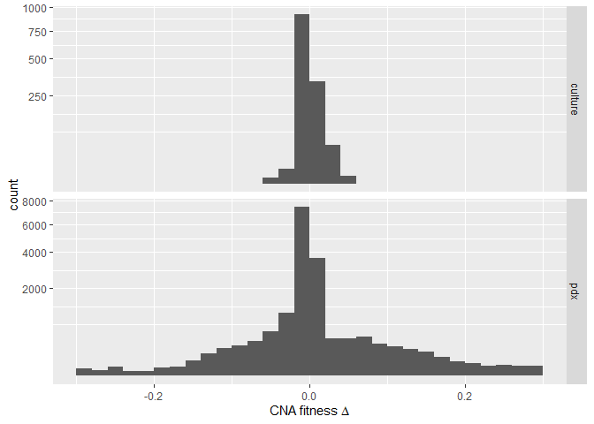
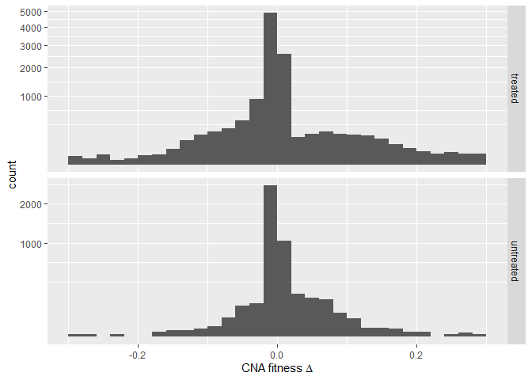
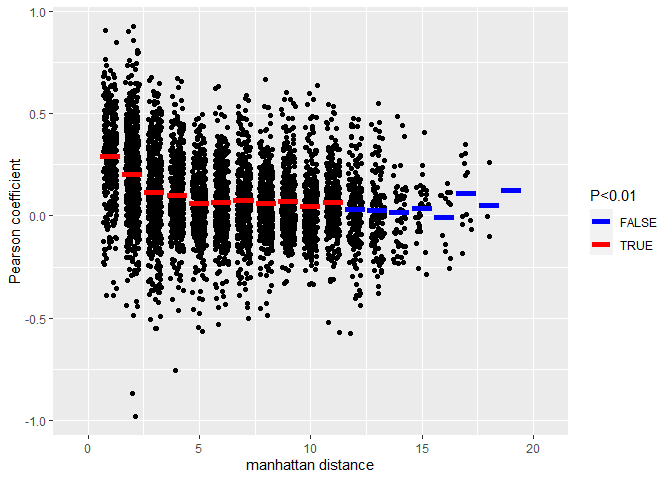
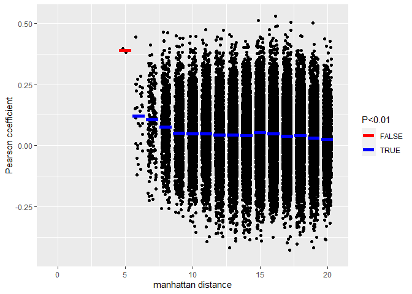
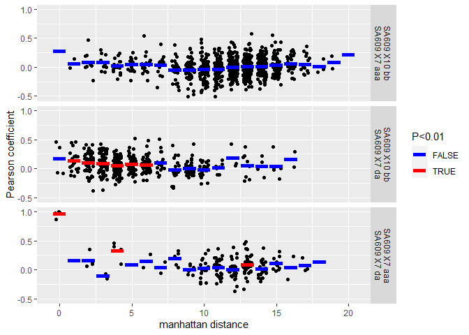
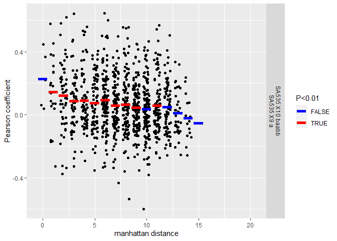
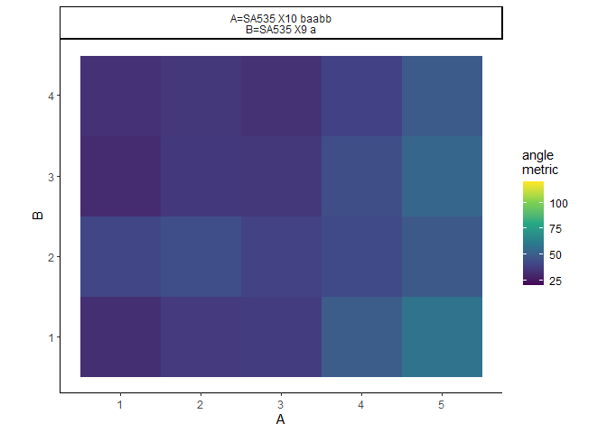
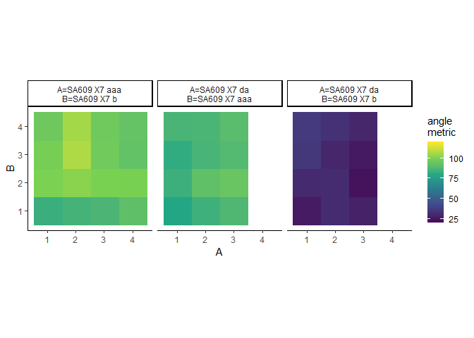

``` r
source("utils/ALFA-K.R")
```

    ## Warning: package 'lhs' was built under R version 4.1.3

    ## Warning: package 'fields' was built under R version 4.1.3

    ## Loading required package: spam

    ## Warning: package 'spam' was built under R version 4.1.3

    ## Spam version 2.9-1 (2022-08-07) is loaded.
    ## Type 'help( Spam)' or 'demo( spam)' for a short introduction 
    ## and overview of this package.
    ## Help for individual functions is also obtained by adding the
    ## suffix '.spam' to the function name, e.g. 'help( chol.spam)'.

    ## 
    ## Attaching package: 'spam'

    ## The following objects are masked from 'package:base':
    ## 
    ##     backsolve, forwardsolve

    ## Loading required package: viridis

    ## Warning: package 'viridis' was built under R version 4.1.2

    ## Loading required package: viridisLite

    ## 
    ## Try help(fields) to get started.

``` r
library(ggplot2)
```

    ## Warning: package 'ggplot2' was built under R version 4.1.3

``` r
source("utils/comparison_functions.R")
```

Fitting ALFA-K model to Salehi data

``` r
source("utils/ALFA-K.R")
library(ggtree)
```

    ## Registered S3 method overwritten by 'ggtree':
    ##   method      from 
    ##   identify.gg ggfun

    ## ggtree v3.0.4  For help: https://yulab-smu.top/treedata-book/
    ## 
    ## If you use ggtree in published research, please cite the most appropriate paper(s):
    ## 
    ## 1. Guangchuang Yu. Using ggtree to visualize data on tree-like structures. Current Protocols in Bioinformatics, 2020, 69:e96. doi:10.1002/cpbi.96
    ## 2. Guangchuang Yu, Tommy Tsan-Yuk Lam, Huachen Zhu, Yi Guan. Two methods for mapping and visualizing associated data on phylogeny using ggtree. Molecular Biology and Evolution 2018, 35(12):3041-3043. doi:10.1093/molbev/msy194
    ## 3. Guangchuang Yu, David Smith, Huachen Zhu, Yi Guan, Tommy Tsan-Yuk Lam. ggtree: an R package for visualization and annotation of phylogenetic trees with their covariates and other associated data. Methods in Ecology and Evolution 2017, 8(1):28-36. doi:10.1111/2041-210X.12628

``` r
library(ape)
```

    ## Warning: package 'ape' was built under R version 4.1.3

    ## 
    ## Attaching package: 'ape'

    ## The following object is masked from 'package:ggtree':
    ## 
    ##     rotate

``` r
library(ggplot2)
```

Do CNA’s have the same fitness effects despite different different
karyotype backgrounds?

``` r
## this function generates a matrix of fitness changes associated with each possible CNA for all (frequent) karyotypes in the input file, according to the fitted landscape. 
cna_mat <- function(fi){
  xi <- readRDS(paste0("data/salehi/alfak_fits/minobs_5/",fi))

  fi <- do.call(rbind,lapply(row.names(xi$xv_res), function(i){
    yi <- gen_all_neighbours(i,remove_nullisomes = FALSE)
    nll <- apply(yi,1,function(yij) sum(yij<1)==0)
    #if(nrow(yi)<44) return(NULL)
    fi <- predict(xi$fit,yi)-xi$xv_res[i,"f_est"]
    fi <- c(fi)
    fi[!nll] <- NaN
    chrom <- stringr::str_pad(ceiling((1:length(fi))/2),width=2)
    mod <- rep(c("-","+"),22)
  
    names(fi) <- paste0(chrom,mod)
    fi
  }))
  rownames(fi) <- rownames(xi$xv_res)
  return(fi)
}

## similar to cna_mat, consider merging
assess_cna <- function(fi){
  uid <- x$uid[x$filenames==fi]
  pdx <- m$PDX_id[m$uid==uid]
  lab <- m$label[m$uid==uid]
  tp <- m$timepoint[m$uid==uid]
  xi <- readRDS(paste0("data/salehi/alfak_fits_post_jump/minobs_5/",fi))

  fi <- do.call(rbind,lapply(row.names(xi$xv_res), function(i){
   yi <- gen_all_neighbours(i,remove_nullisomes = FALSE)
    nll <- apply(yi,1,function(yij) sum(yij<1)==0)
  #if(nrow(yi)<44) return(NULL)
  fi <- predict(xi$fit,yi)-xi$xv_res[i,"f_est"]
  fi <- c(fi)
  fi[!nll] <- NaN
  chrom <- stringr::str_pad(ceiling((1:length(fi))/2),width=2)
  mod <- rep(c("-","+"),22)
  
  names(fi) <- paste0(chrom,mod)
  fi
}))

fi <- reshape2::melt(fi)
fi$pdx <- pdx
fi$tp <- tp
fi$lab <- lab
fi$uid <- uid
colnames(fi)[1:3] <- c("k","cna","deltaf")
return(fi)
}

##this function generates a correlation matrix given an input matrix of CNA profiles
dvscor <- function(fi,method="manhattan",cormeth="pearson"){
  x <- cna_mat(fi)
  cormat <- cor(t(x),use = "complete",method = cormeth)
  d <- as.matrix(dist(do.call(rbind,lapply(rownames(x),s2v)),method=method))
  df <- data.frame(d=c(d[upper.tri(d)]),cor=c(cormat[upper.tri(cormat)]))
  return(df)
}

## this function obstains additional metadata for data frame df.
proc_id <- function(df,m){
  ids <- do.call(rbind,strsplit(df$ids,split="[.]"))
  ids0 <- ids
  are_equal <- ids[,1]==ids[,2]
  pdxlut <- m$PDX_id
  names(pdxlut) <- paste0("x",m$uid)
  ids[,1] <- pdxlut[paste0("x",ids[,1])]
  ids[,2] <- pdxlut[paste0("x",ids[,2])]
  pdx_equal <- ids[,1]==ids[,2]
  colnames(ids0) <- c("id1","id2")
  cbind(df,data.frame(pdx_equal,are_equal),ids0)
}

## this function changes filename id to lineage based id
relablr <- function(id,meta,lid=NULL){
  id <- paste0("x",id)
  lut <- paste(meta$PDX_id,meta$timepoint,meta$linlab)
  names(lut) <- paste0("x",meta$uid)
  if(!is.null(lid)) lut <- paste0(lut,"[",lid,"]")
  lut[id]
}


## calculates angle metrics at different timepoints between two different lineages and returns the result ready for plotting. Note function doesn't automatically check if the lineages start at the same point (which they should!)
angle_heatmap <- function(ids){
  x <- lapply(ids, function(id) {
    xi <- readRDS(paste0("data/salehi/alfak_inputs_v2/",id))$x
    xi <- xi[order(xi[,1],xi[,2],xi[,3],decreasing=T),]
  })

na <- ncol(x[[1]])
nb <- ncol(x[[2]])

v <- lapply(x,function(xi){
  vxi <- do.call(rbind,lapply(rownames(xi),s2v))
  xij <- t(xi)%*%vxi
  ni <- colSums(xi)
  for(i in 1:length(ni)) xij[i,]<- xij[i,]/ni[i]
  return(xij)
})

conds <- expand.grid(a=2:na,b=2:nb)

v0 <- v[[1]][1,]

conds$am <- sapply(1:nrow(conds), function(i){
  va <- v[[1]][conds$a[i],]-v0
  vb <- v[[2]][conds$b[i],]-v0
  getangle(va,vb)
})
ids <- as.character(sapply(ids,function(id) head(unlist(strsplit(id,split=".Rds")),1)))
id_lut <- c(a=ids[1],b=ids[2])
res <- list(conds=conds,ids=id_lut)

return(res)
}

##wrapper function for angle_heatmap()
wrapamap <- function(ids){
  res <- angle_heatmap(ids)$conds
  uids <- sapply(ids, function(i){
   uid <- xx$uid[xx$filenames==i]
   paste(meta[meta$uid==uid,c("PDX_id","timepoint","linlab")],collapse=" ")
  })
  uids[1] <- paste0("A=",uids[1])
  uids[2] <- paste0("B=",uids[2])
  res$uid <- paste(uids,collapse="\n")
  res$a <- res$a-min(res$a)+1
  res$b <- res$b-min(res$b)+1
  return(res)
}
```

``` r
m <- read.csv("data/salehi/metadata.csv")
xx <- readRDS("figures/salehi_data_fitting/fit_summaries.Rds")
```

``` r
x <- xx[xx$min_obs==5&!xx$has_descendents&!xx$has_parents&xx$r2>0.3,]
ff <- x$filenames

df <- do.call(rbind,lapply(ff,assess_cna))
df$treatment_status <- sapply(df$uid, function(id){
  x$treatment_status[x$uid==id]
})

df$type <- "pdx"
df$type[df$pdx=="SA906"] <- "culture"

df_agg <- aggregate(list(var=df$deltaf),by=list(type=df$type,treatment=df$treatment_status),var,na.rm=T)

p <- ggplot(df,aes(x=deltaf))+
  facet_grid(rows=vars(type),scales="free_y")+
  geom_histogram(binwidth=0.02,boundary=0)+
  scale_x_continuous(expression(CNA~fitness~Delta),limits=c(-0.3,0.3))+
  scale_y_sqrt()
p
```

    ## Warning: Removed 317 rows containing non-finite values (stat_bin).



``` r
ggsave("figures/salehi_landscape_similarity/figs/deltaf_pdx_vitro.png",width=4,height=3,units="in")
```

    ## Warning: Removed 317 rows containing non-finite values (stat_bin).

``` r
lablr <- c(off="untreated",mixed="treated")
p <- ggplot(df[df$type=="pdx",],aes(x=deltaf))+
  facet_grid(rows=vars(lablr[treatment_status]),scales="free_y")+
  geom_histogram(binwidth=0.02,boundary=0)+
  scale_x_continuous(expression(CNA~fitness~Delta),limits=c(-0.3,0.3))+
  scale_y_sqrt()
p
```

    ## Warning: Removed 306 rows containing non-finite values (stat_bin).



``` r
ggsave("figures/salehi_landscape_similarity/figs/deltaf_treat_un.png",width=4,height=3,units="in")
```

    ## Warning: Removed 306 rows containing non-finite values (stat_bin).

``` r
df_agg
```

    ##      type treatment          var
    ## 1     pdx     mixed 5.911926e-03
    ## 2 culture       off 5.237115e-05
    ## 3     pdx       off 1.113167e-03

Demonstrate the approach:

``` r
x <- xx[xx$min_obs==5&xx$r2>0.3,]
fi <- x$filenames[12]#"SA609_X8_l_4_d1_1_d2_1.Rds"
x <- cna_mat(fi)
v <- do.call(rbind,lapply(rownames(x),s2v))
tree <- as.phylo(hclust(dist(v,method="euc")))
tree$tip.label <- rownames(x)
p <- ggtree(tree)
pp <- gheatmap(p,x, offset=1, width=5, font.size=2.5, 
         hjust=0.5)+
  scale_fill_viridis_c(expression(fitness~Delta))+
  coord_flip()
```

    ## Scale for 'fill' is already present. Adding another scale for 'fill', which
    ## will replace the existing scale.

``` r
ggsave("figures/salehi_landscape_similarity/figs/correlation_illustration.png",width=7,height=6,units="in")
```

3 comparisons - 1. identical landscapes 2. different PDX 3. within PDX.

1.  identical landscapes

``` r
x <- xx[xx$min_obs==5&!xx$has_descendents&!xx$has_parents&xx$r2>0.3,]
ff <- x$filenames

x <- do.call(rbind,lapply(ff, function(fi){
  xi <- dvscor(fi,method="manh",cormeth = "pearson")
  xi$fi <- fi
  xi
  }))

adf <- aggregate(list(cor=x$cor),by=list(d=x$d),mean,na.rm=T)
cdf <- aggregate(list(sig=x$cor),by=list(d=x$d),function(i){
  if(length(i)<3) return(1)
  t.test(i)$p.value
})
adf$pval <- cdf$sig
adf$sig <-adf$pval<0.01

p <- ggplot(x,aes(x=d,y=cor))+
  geom_jitter(height=0,width=0.3)+
  geom_errorbar(data=adf,aes(ymax=cor,ymin=cor,color=sig),size=2)+
  scale_x_continuous("manhattan distance",limits=c(-0.5,20.5))+
  scale_color_manual("P<0.01",values=c("blue","red"))+
  scale_y_continuous("Pearson coefficient")
p
```

    ## Warning: Removed 224 rows containing missing values (geom_point).



``` r
ggsave("figures/salehi_landscape_similarity/figs/cor_within_landscape.png",width=4.5,height=3,units="in")
```

    ## Warning: Removed 224 rows containing missing values (geom_point).

1.  Different PDX

``` r
x <- xx[xx$min_obs==5&!xx$has_descendents&!xx$has_parents&xx$r2>0.3,]
ff <- x$filenames

y <- lapply(ff,cna_mat)
ids <- unlist(lapply(1:length(y), function(i){
  uid <- x$uid[x$filenames==ff[i]]
  rep(uid,nrow(y[[i]]))
}))
y <- do.call(rbind,y)

cellLines <- sapply(ids, function(idi){
  m$PDX_id[m$uid==idi]
})

xc <- split(data.frame(y,check.names = F),f=cellLines)
xc <- do.call(rbind,lapply(xc,function(xci){
  data.frame(ids = colnames(xci),
             mn=apply(xci,2,mean,na.rm=T),
             md=apply(xci,2,median,na.rm=T),
             fpos=apply(xci,2,function(ii) mean(ii>0,na.rm=T)))
}))

x1 <- aggregate(list(fpos=xc$fpos),by=list(ids=xc$ids),function(ii) sum(ii>0.5))

cormat <- cor(t(y),use = "complete",method="kendall")
d <- as.matrix(dist(do.call(rbind,lapply(rownames(y),s2v)),method = "manhattan"))

mat <- do.call(rbind,lapply(1:length(ids), function(i) ids))
mat <- apply(mat,2,function(mi) paste0(mi,".",ids))

df <- data.frame(d=c(d[upper.tri(d)]),cor=c(cormat[upper.tri(cormat)]),ids=mat[upper.tri(mat)])


df <- proc_id(df,m)
df <- df[df$pdx_equal==FALSE,]
adf <- aggregate(list(cor=df$cor),by=list(d=df$d),mean,na.rm=T)
cdf <- aggregate(list(sig=df$cor),by=list(d=df$d),function(i){
  if(length(i)<3) return(1)
  t.test(i)$p.value
})
adf$pval <- cdf$sig
adf$sig <-adf$pval<0.01

p <- ggplot(df[df$pdx_equal==FALSE,],aes(x=d,y=cor))+
  geom_jitter(height=0,width=0.3)+
  geom_errorbar(data=adf,aes(ymax=cor,ymin=cor,color=sig),size=2)+
  scale_x_continuous("manhattan distance",limits=c(-0.5,20.5))+
  scale_color_manual("P<0.01",values=c("red","blue"))+
  scale_y_continuous("Pearson coefficient")
p
```

    ## Warning: Removed 6760 rows containing missing values (geom_point).



``` r
ggsave("figures/salehi_landscape_similarity/figs/cor_across_pdx.png",width=4.5,height=3,units="in")
```

    ## Warning: Removed 6760 rows containing missing values (geom_point).

3a. within PDX (SA609)

``` r
meta <- readRDS("figures/salehi_data_fitting/labelled_metadata.Rds")

ff <- c("SA609UnBU_X7_l_6_d1_0_d2_0.Rds",
        "SA609R2_X7_l_7_d1_0_d2_0.Rds",
        "SA609_X10_l_8_d1_0_d2_0.Rds")

x <- lapply(ff,cna_mat)
ids <- unlist(lapply(1:length(x), function(i){
  uid <- unique(xx$uid[xx$filenames==ff[i]])
  rep(uid,nrow(x[[i]]))
}))
x <- do.call(rbind,x)

cormat <- cor(t(x),use = "complete",method="pearson")
d <- as.matrix(dist(do.call(rbind,lapply(rownames(x),s2v)),method = "manhattan"))

mat <- do.call(rbind,lapply(1:length(ids), function(i) ids))
mat <- apply(mat,2,function(mi) paste0(mi,".",ids))

df <- data.frame(d=c(d[upper.tri(d)]),cor=c(cormat[upper.tri(cormat)]),ids=mat[upper.tri(mat)])

df <- proc_id(df,m)
df <- df[!df$are_equal,]

df$id1 <- relablr(df$id1,meta)
df$id2 <- relablr(df$id2,meta)
df$ids <- paste0(df$id1,"\n",df$id2)

#df <- df[!df$ids=="SA609 X7 aaa\nSA609 X7 da",]

adf <- aggregate(list(cor=df$cor),by=list(d=df$d,ids=df$ids),mean,na.rm=T)
cdf <- aggregate(list(sig=df$cor),by=list(d=df$d,ids=df$ids),function(i){
  if(length(i)<3) return(1)
  t.test(i)$p.value
})
adf$pval <- cdf$sig
adf$sig <-adf$pval<0.01

p2 <- ggplot(df[!df$are_equal,],aes(x=d,y=cor))+
  facet_grid(rows=vars(ids))+
  geom_jitter(height=0,width=0.3)+
  geom_errorbar(data=adf,aes(ymax=cor,ymin=cor,color=sig),size=2)+
  scale_x_continuous("manhattan distance",limits=c(-0.5,20.5))+
  scale_color_manual("P<0.01",values=c("blue","red"))+
  scale_y_continuous("Pearson coefficient")
p2
```



``` r
ggsave("figures/salehi_landscape_similarity/figs/cor_within_SA609.png",width=4.5,height=7.5,units="in")
```

``` r
meta <- readRDS("figures/salehi_data_fitting/labelled_metadata.Rds")
ff <- c("SA535_CISPLATIN_CombinedU_X9_l_5_d1_0_d2_0.Rds",
        "SA535_CISPLATIN_CombinedT_X10_l_6_d1_0_d2_0.Rds")


x <- lapply(ff,cna_mat)
ids <- unlist(lapply(1:length(x), function(i){
  uid <- unique(xx$uid[xx$filenames==ff[i]])
  rep(uid,nrow(x[[i]]))
}))
x <- do.call(rbind,x)

cormat <- cor(t(x),use = "complete",method="pearson")
d <- as.matrix(dist(do.call(rbind,lapply(rownames(x),s2v)),method = "manhattan"))

mat <- do.call(rbind,lapply(1:length(ids), function(i) ids))
mat <- apply(mat,2,function(mi) paste0(mi,".",ids))

df <- data.frame(d=c(d[upper.tri(d)]),cor=c(cormat[upper.tri(cormat)]),ids=mat[upper.tri(mat)])

df <- proc_id(df,m)
df <- df[!df$are_equal,]

df$id1 <- relablr(df$id1,meta)
df$id2 <- relablr(df$id2,meta)
df$ids <- paste0(df$id1,"\n",df$id2)

adf <- aggregate(list(cor=df$cor),by=list(d=df$d,ids=df$ids),mean,na.rm=T)
cdf <- aggregate(list(sig=df$cor),by=list(d=df$d,ids=df$ids),function(i){
  if(length(i)<3) return(1)
  t.test(i)$p.value
})
adf$pval <- cdf$sig
adf$sig <-adf$pval<0.01


p2 <- ggplot(df[!df$are_equal,],aes(x=d,y=cor))+
  facet_grid(rows=vars(ids))+
  geom_jitter(height=0,width=0.3)+
  geom_errorbar(data=adf,aes(ymax=cor,ymin=cor,color=sig),size=2)+
  scale_x_continuous("manhattan distance",limits=c(-0.5,20.5))+
  scale_color_manual("P<0.01",values=c("blue","red"))+
  scale_y_continuous("Pearson coefficient")
p2
```



``` r
ggsave("figures/salehi_landscape_similarity/figs/cor_within_SA535.png",width=4.5,height=3,units="in")
```

Are landscapes fitted in different contexts similar or different?

``` r
xx <- readRDS("figures/salehi_data_fitting/fit_summaries.Rds")
meta <- readRDS("figures/salehi_data_fitting/labelled_metadata.Rds")
li <- readRDS("figures/salehi_data_fitting/lineages.Rds")
ids <- c("SA535_CISPLATIN_CombinedU_X9_l_5_d1_0_d2_0.Rds","SA535_CISPLATIN_CombinedT_X10_l_6_d1_0_d2_0.Rds")

res <- wrapamap(ids[c(2,1)])
```

    ## Warning in meta$uid == uid: longer object length is not a multiple of shorter
    ## object length

    ## Warning in meta$uid == uid: longer object length is not a multiple of shorter
    ## object length

``` r
p <- ggplot(res,aes(x=a,y=b,fill=am))+
  facet_grid(cols=vars(uid))+
  geom_raster()+
  scale_x_continuous("A")+
  scale_y_continuous("B")+
  scale_fill_viridis_c()+
  scale_fill_viridis_c("angle\nmetric",limits=c(20,120))+
  coord_fixed()+
  theme_classic()
```

    ## Scale for 'fill' is already present. Adding another scale for 'fill', which
    ## will replace the existing scale.

``` r
p
```



``` r
ggsave("figures/salehi_landscape_similarity/figs/SA535_angles.png",plot=p,width=3,height=2.5,units="in")
```

Notably get different aboslute values of angle metric depending on where
one chooses to start from. Probably the point of divergence is most
appropriate:

``` r
xx <- readRDS("figures/salehi_data_fitting/fit_summaries.Rds")
#xx <- xx[xx$min_obs==5&grepl("SA609",xx$id)&xx$r2>0.3,]

#ff <- c("SA609UnBU_X7_l_6_d1_0_d2_0.Rds",
 #       "SA609R2_X7_l_7_d1_0_d2_0.Rds",
     #   "SA609_X10_l_10_d1_0_d2_0.Rds")
  #     "SA609_X7_l_7_d1_2_d2_1.Rds")


ff <- c("SA609UnBU_X7_l_4_d1_0_d2_0.Rds",
        "SA609R2_X7_l_5_d1_0_d2_0.Rds",
       "SA609_X7_l_5_d1_2_d2_1.Rds")

"data/salehi/alfak_inputs_v2/SA000_X7_l_7_d1_0_d2_0.Rds"
```

    ## [1] "data/salehi/alfak_inputs_v2/SA000_X7_l_7_d1_0_d2_0.Rds"

``` r
res <- rbind(wrapamap(ids=c(ff[1],ff[2])),
             wrapamap(ids=c(ff[1],ff[3])),
             wrapamap(ids=c(ff[2],ff[3])))
```

    ## Warning in meta$uid == uid: longer object length is not a multiple of shorter
    ## object length

    ## Warning in meta$uid == uid: longer object length is not a multiple of shorter
    ## object length

``` r
p <- ggplot(res,aes(x=a,y=b,fill=am))+
  facet_grid(cols=vars(uid))+
  geom_raster()+
  scale_x_continuous("A")+
  scale_y_continuous("B")+
  scale_fill_viridis_c("angle\nmetric",limits=c(20,120))+
  coord_fixed()+
  theme_classic()
p
```



``` r
ggsave("figures/salehi_landscape_similarity/figs/SA609_angles.png",plot=p,width=7,height=2.5,units="in")
```
