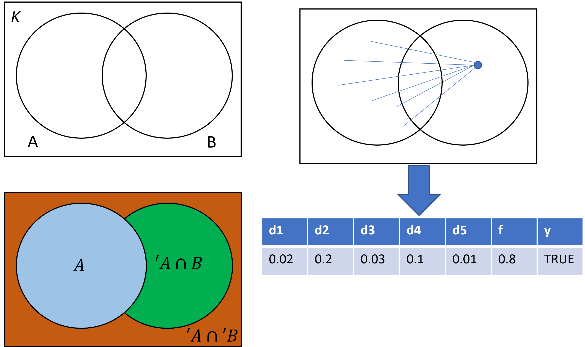
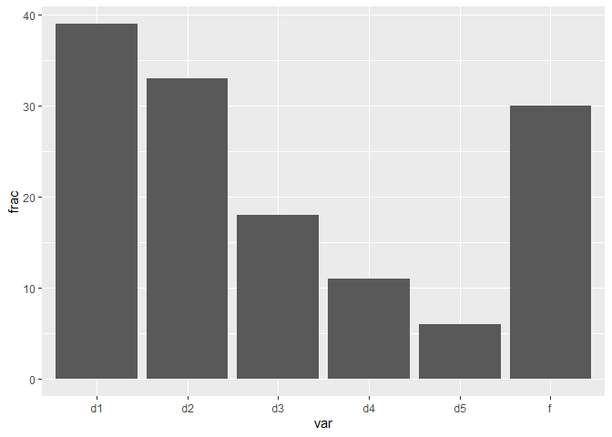
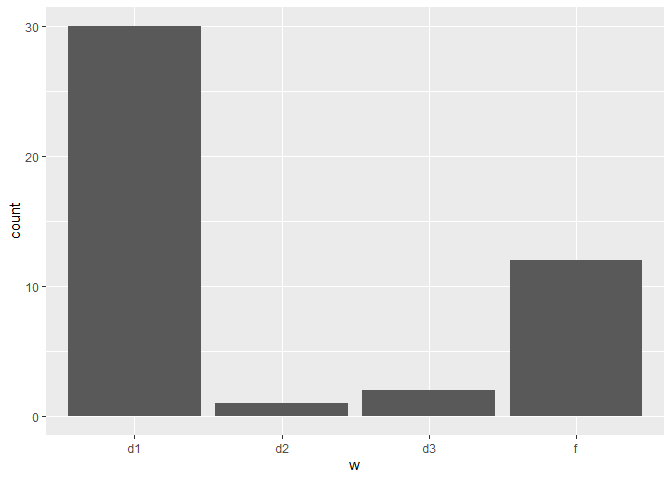

``` r
source("utils/ALFA-K.R")
```

    ## Warning: package 'lhs' was built under R version 4.1.3

    ## Warning: package 'fields' was built under R version 4.1.3

    ## Loading required package: spam

    ## Warning: package 'spam' was built under R version 4.1.3

    ## Spam version 2.9-1 (2022-08-07) is loaded.
    ## Type 'help( Spam)' or 'demo( spam)' for a short introduction 
    ## and overview of this package.
    ## Help for individual functions is also obtained by adding the
    ## suffix '.spam' to the function name, e.g. 'help( chol.spam)'.

    ## 
    ## Attaching package: 'spam'

    ## The following objects are masked from 'package:base':
    ## 
    ##     backsolve, forwardsolve

    ## Loading required package: viridis

    ## Warning: package 'viridis' was built under R version 4.1.2

    ## Loading required package: viridisLite

    ## 
    ## Try help(fields) to get started.

``` r
library(ggplot2)
```

    ## Warning: package 'ggplot2' was built under R version 4.1.3

``` r
source("utils/comparison_functions.R")
library(deSolve)
```

    ## Warning: package 'deSolve' was built under R version 4.1.3

``` r
library(Matrix)
```

    ## 
    ## Attaching package: 'Matrix'

    ## The following object is masked from 'package:spam':
    ## 
    ##     det

``` r
library(igraph)
```

    ## Warning: package 'igraph' was built under R version 4.1.3

    ## 
    ## Attaching package: 'igraph'

    ## The following objects are masked from 'package:stats':
    ## 
    ##     decompose, spectrum

    ## The following object is masked from 'package:base':
    ## 
    ##     union

``` r
library(caret)
```

    ## Warning: package 'caret' was built under R version 4.1.3

    ## Loading required package: lattice

    ## 
    ## Attaching package: 'caret'

    ## The following objects are masked _by_ '.GlobalEnv':
    ## 
    ##     R2, RMSE

We asked whether ALFA-K can help predict the emergence of novel
karyotypes. Denote K the set of karyotypes with fitness estimates from
ALFA-K, A the subset of K observed in a given longitudinal sample. Then
we would like to predict B (the subset of K that will be present in a
future sample). In particular we wish to predict $’A B
, *w**h**i**c**h**a**r**e**t**h**e* \* *n**o**v**e**l* \* *k**a**r**y**o**t**y**p**e**s*.*T**h**e**p**r**o**b**a**b**i**l**i**t**y**o**f**a**n**y**n**o**v**e**l**k**a**r**y**o**t**y**p**e*(’A$)
actually emerging presumably depends both on its fitness and its number
of neighbours in the preceding generation. Therefore for each member of
′*A* we computed the fraction of karyotypes in *A* that were between 1-5
missegregations distant. These were used as variables which, together
with the fitness estimate, were used to preduct whether the karyotype
would emerge. For prediction we used binomial logistic regression, then
assessed whether each predictor variable was significantly correlated
with the response variable.



``` r
source("figures/salehi_predictions/multireg.R")
```

Across 45 tests, the fraction of ′*A* that were distance-1 neighbours
(d1) was the most significant predictor of novel karyotype emergence. We
found that in 39/45 tests d1 had a significant (P\<0.01) positive
predictor of novel karyotype emergence, and in 30/45 tests d1 was the
most significant predictor. The fitness estimate was also a strong
predictor, significant in 30/45 tests and most significant in 12/45
tests. These results indicate that ALFA-K fitness estimates can help
predict emergence of new karyotypes.

``` r
df <- readRDS("figures/salehi_predictions/multireg_landscape.Rds")
df$rep <- ceiling((1:nrow(df))/7)
w <- split(df,f=df$rep)

w <- do.call(rbind,lapply(w,function(wi){
  wi <- wi[-1,]
  wi <- wi[wi$Estimate>0,]
  data.frame(rep=wi$rep[1],w=wi$ids[which.min(wi$Pr...z..)])
}))
z <- split(df,f=df$ids)

z <- do.call(rbind,lapply(z,function(zi){
  data.frame(var=zi$ids[1],frac=sum(zi$Estimate>0 & zi$Pr...z..<0.01))
}))

p <- ggplot(z[!z$var=="(Intercept)",],aes(x=var,y=frac))+
  geom_col()
p
```



``` r
p <- ggplot(w,aes(x=w))+
  geom_histogram(stat="count")
```

    ## Warning: Ignoring unknown parameters: binwidth, bins, pad

``` r
p
```


