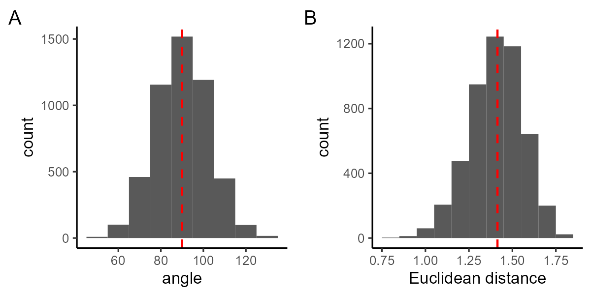

\section*{Abstract} 

Aneuploidy is prevalent in most solid tumors and can significantly alter cellular phenotype and fitness. Despite its critical role in tumor evolution, a detailed quantitative understanding of the evolutionary dynamics of aneuploidy remains elusive. To bridge this gap, we developed a novel method to infer the fitness landscape of chromosome-level karyotypes. This method utilizes longitudinal single-cell karyotype data from evolving cell populations to estimate the fitness of thousands of karyotypes proximal to the observed data in karyotype space. We validated the predictive capability of our approach using both synthetic data from an agent-based model and empirical data from in vitro and in vivo passaged cell lines. Our analysis of the fitted landscapes suggests several key insights: (1) Whole genome doubling promotes aneuploidy by increasing the spectrum of potentially beneficial copy number alterations; (2) Cisplatin treatment alters the fitness impact of these alterations; (3) The fitness consequences of a copy number alteration (CNA) vary depending on the parental karyotype; (4) The rate of chromosome missegregation can dictate the predominant karyotypes in an evolving population.

 

\section*{Introduction} 

Losses and gains of entire chromosomes or large sections thereof, known as aneuploidy, are a defining feature of solid tumors\cite{Bakhoum2018-ai, Santaguida2015-bx}. Affecting more of the cancer genome than any other genetic alteration \cite{Ben-David2020-xy}, aneuploidy is present in an estimated 90% of solid tumors and modifies the copy number of many genes, thereby altering cellular phenotype through correlated changes in RNA expression and protein production\cite{Pavelka2010-oh, Torres2007-ln}. Aneuploidy provides a substrate for tumor evolution\cite{Bakhoum2018-ai, Chen2012-kk, Shih2023-xy}, often enriching chromosomes with oncogenes while deleting those with tumor suppressor genes\cite{Davoli2013-kp}.

The factors which explain aneuploidy patterns in cancers are not limited to the density of driver or suppressor genes on a particular chromosome. Aneuploidy is usually detrimental to cell fitness \cite{Torres2008-te}, in the first instance due to proteins such as P53 which cause apoptosis or cell cycle arrest in response to chromosome mis-segregations \cite{Tang2013-ki}. According to the \textit{gene doseage} hypothesis, aneuploidy can also reduce fitness by upsetting the balance of protein levels within cells: leading to negative effects such as impaired formation of stoichiometry dependent protein complexes, or protein aggregates that overwhelm protein quality-control mechanisms \cite{Torres2008-te,Tang2013-ki}. Environmental context plays a role in sculpting karyotype \cite{Ben-David2020-xy}, since the specific pressures of an environment will determine whether the fitness advantages of a particular CNA outweigh the costs. Evidence for the role of environment in determining karyotype includes the selective advantage of particular karyotypes under stressful conditions in yeast \cite{Pavelka2010-oh} and distinct patterns of aneuploidies between cancer types \cite{ICGCTCGA_Pan-Cancer_Analysis_of_Whole_Genomes_Consortium2020-hw, Nguyen2022-dg, Drews2022-sk}. Genomic context also plays a role in sculpting karyotype because a given CNA may only be favorable if other mutations or CNAs are already present within the cell. Evidence for the importance of genomic context includes observations that CNAs which are not independently significant predict survival when co-occurring \cite{Shukla2020-qi}, and defined temporal ordering of CNAs observed in a patient derived xenograft model \cite{Karlsson2022-rq, Baslan2022-ah}.

Aneuploidy remains difficult to study, for reasons which include the difficulty of experimentally inducing aneuploidy and the difficulty of distinguishing the effects of aneuploidy from those of chromosomal instability, the process which causes aneuploidy \cite{Ben-David2020-xy}. \textit{In silico} models will be an important tool to further our knowledge of aneuploidy. Gusev and colleagues developed the first model describing whole-chromosome mis-segregations \cite{Gusev2000-bj, Gusev2001-qc}. This model laid the mathematical foundations for describing segregation errors and explained patterns of aneuploidy in experimental data as a consequence of variable chromosome mis-segregation rate. A limitation of this model was that a fitness landscape defining the effect of aneuploidy on cell fitness was not considered, beyond a constraint that cells losing all copies  of any chromosome were not considered viable. This limitation was later addressed by others who assumed that the fitness effect of changing the copy number of a particular chromosome was dependent on the number of oncogenes or tumor suppressor genes expressed on that chromosome \cite{Elizalde2018-de,Laughney2015-qk}. In these models cell fitness could be increased by gaining additional copies of chromosomes with many oncogenes, or losing copies of chromosomes with many tumor suppressor genes. These models predicted an optimal mis-segregation rate (in the sense of minimising total cell death) that matched experimental observations, and resulted in a near-triploid karyotype that is frequently observed in tumour cells. All these previous models of aneuploidy share the limitation that they ignore the context dependency of the mapping between karyotype and fitness. This is perhaps unsurprising, since the vast number of possible karyotypes is challenging enough to map even without the additional variability introduced by context. However, the burgeoning quantity of single cell copy number data \cite{Salehi2021-kw,Karlsson2023-nu} now permits tracking of subclonal evolution at unprecedented resolution, giving the potential to refine our understanding of the relationships between karyotype and cellular fitness. 

Here, we introduce ALFA-K, a method to directly estimate fitness landscapes from single-cell copy number data. After training and validating ALFA-K with synthetic data from an agent-based model, we further confirmed its efficacy with empirical data from P53-deficient cell lines showing extensive subclonal evolution. Our analysis suggests several key insights, including the potential roles of whole genome doubling, cisplatin treatment, and the rate of chromosome missegregation in shaping the evolutionary trajectory of tumor cells. 

\section*{Methods} 

\subsection*{Fitness landscape inference}

Our landscape inference method consists of three steps, followed by a final validation procedure as outlined below. The input for the inference method is a matrix $Y$, with elements $y_{it}$ which represent the number of times the $i^{th}$ karyotype appears in the longitudinal sample at time $t$. It will also be useful to also define here the matrix $U$ as the normalized version of $Y$ where each column is divided by its sum. 

\subsubsection*{Frequent karyotypes}

"Frequent karyotypes" are operationally defined throughout the manuscript as those observed in at least N cells across all sampled time points, where N is a user supplied hyperparameter. We consider that $Y$ is generated via sampling from a latent population growing exponentially such that:

\begin{equation} \label{frequent_underlying}
v_{it} = v_0e^{f_it}, 
\end{equation}

where $v_{it}$ is the number of cells in the latent population with karyotype $i$ at time $t$, and $f_i$ is their fitness. These are normalized to form our prediction matrix $\hat{U}$, with elements:

\begin{equation} \label{frequent_estimate}
 \hat{u}_{it} = v_{it}/ \sum_i v_i. 
\end{equation}

If $\hat{U}$ is sampled according to a binomial process to generate $Y$, then the probability of generating each $y_{it}$ is:

\begin{equation} \label{logl1}
 l_{it} = P(y_{it};\hat{u}_{it},\sum_i y_{it}).
\end{equation}

Defining $S$ the set of indices belonging to frequent karyotypes, we find values of $f_{i \in S}$ and $v_0$ which maximise $\sum_{i \in S} \sum_t  log~l_{it}$, i.e. the log likelihood, using a multi-start procedure and standard gradient descent methods.

\subsubsection*{Nearest neighbours}

This step of the inference pipeline estimates the fitness of all the Von Neumann neighbours of the frequent clones estimated in the prior step. The growth of these neigbhbour karyotypes is governed by:

\begin{equation} \label{neighbour_freq}
    \frac{dv_i}{dt} = f_iv_i + \sum_j P(\alpha_i|\alpha_j)f_jv_j,  
\end{equation}

where the second term represents influx due to missegregations from the frequent karyotypes. $P(\alpha_i|\alpha_j)$ is the probability that the karyotype $\alpha_j$ missegregates to generate a cell with karyotype $\alpha_i$ (see \cite{Kimmel2023-th,Gusev2001-qc} for details). \ref{neighbour_freq} is solved numerically for the sampled timepoints, then normalized to find $\hat{u}_{it}$. The likelihood is computed similarly to the frequent clones, using:

\begin{equation} \label{logl2}
 l_{it} = P(y_{it};\hat{u}_{it},\sum_i y_{it}) + \sum_j Q(f_i-f_j),
\end{equation}

where $Q(f_i-f_j)$ is a prior distribution for the fitness gradient between karyotypes (taken to be normal). The parameters of the prior are estimated from the previously estimated frequent karyotyopes. Thus we find values of $f_{i \notin S}$ and $v_0$ which maximise $\sum_{i \notin S} \sum_t  log~l_{it}$.

\subsubsection*{All other karyotypes}

Kriging (gaussian process regression) was used to infer fitness of all other karyotypes. Kriging was implemented using the Krig function in the R package fields. Karyotypes of all frequent clones and their Von Neumann neighbours were used as the input matrix of independent variables and their accompanying fitness estimates were used as the vector of dependent variables. The model was fit with no drift component (function parameter m=1), otherwise all arguments to the Krig function were set to their defaults. 

\subsubsection*{Cross validation procedure}.

We developed a leave-one-out cross validation procedure as a metric to judge the performance of our inference pipeline. For this procedure the fitness of the frequent karyotypes is estimated as normal. Since these fitness estimates $f_{i\in S}$ are relatively robust we treat them as a ground truth for the cross validation procedure. Then, steps 2 and 3 of the pipeline are repeatedly applied while leaving out each of the frequent karyotypes in turn. Each pipeline trained on the reduced data set is then used to predict the fitness of the omitted clone, resulting in a second set of fitness estimates for the frequent karyotypes $g_{i\in S}$. Finally the $R^2$ value between $f_{i\in S}$ and $g_{i\in S}$ is calculated and used as the metric to evaluate the inference pipeline performance.

\subsection*{Agent Based Model}

We developed a stochastic, agent-based model of karyotype evolution. The model treats cells as individual agents with their own karyotype and fitness value. The model advances in fixed time steps $\Delta t$. At each timestep, cells may divide at a rate determined by their karyotype specific fitness value (which is treated directly as division rate). Dividing cells may mis-segregate, with the probability of each chromosome of a dividing cell mis-segregating to a specified as specified previously \cite{Kimmel2023-th,Gusev2001-qc}. The ABM features exponential growth and no cell death. To maintain a finite size population, we implemented a `bottleneck' procedure. We measured population size at each timestep and if the population size exceeded a fixed threshold, we would select a fixed fraction of cells at random (typically 90\%) and immediately remove them from the simulation. This mimics cell growth in culture conditions, where cells grow exponentially in ideal conditions then are passaged to remove a majority of cells before confluence is reached. The model was developed in C++ using standard library headers.

\subsection*{Gaussian random fields}

Gaussian random fields (GRF) were used to generate artificial fitness landscapes of varying complexity. Each GRF is a continuous field resulting from mapping each point in $K$ dimensional karyotype space to a fitness value. GRF are defined here by a matrix $R$ with rows $r_i$ corresponding to points in the  $K$ dimensional space. Each $r_i$ acts as a point source for a wave of wavelength $\lambda$, the interference pattern of which creates the GRF. Thus for a karyotype $\alpha$ in the $K$ dimensional space, fitness is evaluated according to:

\begin{equation} \label{grf}
     \sum_i sin(\frac{||r_i - \alpha||}{ \lambda}).  
\end{equation}

\section*{Results} 

\subsection*{Clonal evolution on random fitness landscapes}  

![Figure 1: Clonal evolution on random fitness landscapes. A) Schematic flowchart of steps in ALFA-K pipeline. B) 2D example of GRF generation via summation of multiple spherical waves. The interference patterns generated by the waves result in complex unpredictable landscapes. C) Increasing the wavelength ($\lambda$) results in GRF with decreasing complexity. D-E) Example simulation output for ABM cell populations evolving on GRF fitness landscape with D) $\lambda=0.2$ or E) $\lambda=1.6$. Each coloured line represents the longitudinal frequency of a different karyotype.  ](../figures/alfak_ABM_tests/figs/fig1.png)

The ALFA-K methodology predicts single-cell karyotype evolution using longitudinal data as input. Sequencing data from individual cells is used to identify temporal changes in karyotype frequency. The method estimates the fitness of common karyotypes from changes in their observed frequencies and extends these estimates to rarer ones, constructing a local fitness landscape via Gaussian process regression (Fig. 1A). To test the ability of ALFA-K to infer fitness landscapes, we developed ABM simulations of karyotype diversification and selection on randomly generated fitness landscapes. We used Gaussian random fields (GRF) as fitness landscapes, which were generated via summation of multiple spherical waves (Fig. 1B). Varying the wavelength parameter ($\lambda$) allows control of the complexity of the resulting landscape (Fig. 1C). ABM simulations of cell populations evolving on the GRF landscapes are characterized by expansion and contraction of karyotype-defined subclones (Fig. 1D,E) as fitter clones are generated and the fitness of the population increases (Fig. 2A). In these test simulations, populations on landscapes with low $\lambda$ (Fig.1D) tended to experience punctuated evolution, whereas populations evolving on landscapes with high $\lambda$ exhibited gradual increases in fitness over time (Fig.1E).

\subsection*{Validating ALFA-K against output of ABM simulations}

 Data from the first 200 days of each simulated population was used to train ALFA-K. We trained ALFA-K varying both the number of longitudinal samples and the hyperparameter N, then evaluated the results using a cross validation procedure (Fig.2B) which tests the ability of ALFA-K to infer the fitness of karyotypes withheld from the input data (see Methods and Supplemental Text). ALFA-K performance was not sensitive to the value of the hyperparameter N within the tested range. It was however sensitive to landscape complexity ($\lambda$) and the number of longitudinal samples in the input, with at least 4 samples needed to obtain satisfactory results. We next tested the ability of ALFA-K to predict population evolution for the time period from 200-300 days that was withheld from the training data. We used the angle metric (SX Fig.) to evaluate predictive performance, in which values below 90 degrees are taken as good predictions. Landscapes with positive cross-validation scores ($R^2>0$) predicted future population evolution much better than those with negative scores (Fig. 2C). The results from the forward prediction tests agreed with the cross validation test in terms of sensitivity to landscape complexity, number of sampled timepoints, and the value of the hyperparameter N (Fig. 2D). Finally, we evaluated the robustness of ALFA-K to different values of missegregation rate (Fig. 2E). The procedure was robust to a wide range of missegregation rates up to a threshold value, which occurred when karyotype became too unstable to estimate the fitness of subpopulations across multiple longitudinal timepoints. Up to this threshold however, increasing missegregation rate benefits ALFA-K by allowing a larger region of the fitness landscape to be charted. 

![Figure 2: Validation of ALFA-K against synthetic data.  A) Mean fitness of ABM cell populations evolving on artificial fitness landscapes of varying complexity (as determined by $\lambda$). Data from the first 200 days of each simulation (as demarcated by the dashed vertical lines) was used to train ALFA-K. B) Cross validation results of ALFA-K for varying numbers of input longitudinal samples and values of the hyperparameter N. c) Evolutionary prediction results of ALFA-K aggregated across all landscapes at various times in the validation period. Results are grouped by performance on the cross validation test and summarized by the angle metric. D) Evolutionary prediction results of ALFA-K for varying numbers of input longitudinal samples and values of the hyperparameter N. Prediction results are summarized by the angle metric. E) ALFA-K was trained on output from simulations with various missegregation rates. Performance was judged based on the Pearson correlation between ground truth and ALFA-K estimated fitness. Each point represents a single fitted landscape.](../figures/alfak_ABM_tests/figs/fig2.png)

\subsection*{Fitting ALFA-K model to passaging data}

ALFA-K was fit to all lineages of data from passaging experiments by Salehi et al. A lineage was defined as two or more successive samples from the same cell line. Thus e.g. for SA532 there are 7 2-sample lineages, 6 3-sample lineages etc. Fig. 3A shows the relationship between samples for all 5 cell lines. Points are colored according to the $R^2$ metric score obtained after fitting ALFA-K to the longest lineage terminating at that point. We were not able to obtain good fits to SA532 or SA906 lineage B. Examining $R^2$ metric scores for all lineages obtained from the data,  we found in agreement with our ABM results that longer lineages result in better fits (Fig. 3B). We next applied ALFA-K to lineages with descendants, simulated population evolution, then compared the simulated populations to the withheld samples from subsequent passages using the angle metric(Fig. 3C). We were able to obtain good predictions for the next passage, although predictions were worse for lineages that changed cisplatin treatment status during the interval across which predictions were made. We also examined angle metric scores for sample population pairs within the experimental data, at one passage following lineage splitting (Fig. 3D). Population changes were more similar when both lineages shared the same cisplatin treatment status, in agreement with the ABM/ALFA-K predictions. The distribution of angle metrics were similar to the ABM/ALFA-K (Comparing between Figs 3C-D), indicating that our predictions were accurate within the level variability observed in the data. 

![Figure 3. Fits to cell passaging data A) Maps showing the relationship cell passages that were sequenced and used as inputs to ALFA-K. Each filled circle represents a sequenced sample. Lines connect parental passages to children, with line type indicating the presence or absence of cisplatin treatment in the intervening period. Circles are colored according to the $R^2$ metric value for fitted landscapes including that sample and all its ancestors.  B) $R^2$ metric scores for all sublineages in the dataset, grouped according to the number of samples used in the fitting. C) Cumulative distribution of angle metric scores between ALFA-K/ABM predicted populations and cultured cell populations. Distributions are grouped according to whether the cisplatin treatment status of the cultured population changed during the prediction interval. ALFA-K landscapes with negative $R^2$ metric score were excluded. D) Cumulative distribution of angle metric scores between cultured populations after lineage branching points. Distributions are grouped according to whether the cisplatin treatment status of lineage pairs differed. ](../figures/salehi_data_fitting/figures/figure.png)

\subsection*{Predicting novel karyotypes}

It was previously shown \ref{Salehi} using the same dataset that the evolution of karyotype-defined subpopulations could be predicted. The previous prediction extrapolated the dynamics of previously observed karyotypes, but was not designed to predict the fitness or emergence of novel karyotypes not yet observed in the data. We asked whether ALFA-K can help predict the emergence of such novel karyotypes. Denote $\Theta$ the set of karyotypes with fitness estimates from ALFA-K, $\zeta$ the subset of $\Theta$ observed in a given longitudinal sample. Then we would like to predict $\Psi$ (the subset of $\Theta$ that will be present in a future sample) (Fig. 4A). In particular we wish to predict which new karyotypes will emerge in the next sample,  $'\zeta \cap \Psi$ (Fig. 4B). The probability of any novel karyotype  actually emerging presumably depends both on its fitness and its number of neighbours in the preceding generation. Therefore for each member of $'\zeta$ we computed the fraction of karyotypes in $\zeta$ that were between 1-5 missegregations distant (Fig. 4C). These were used as variables which, together with the fitness estimate, were used to preduct whether the karyotype would emerge. For prediction we used binomial logistic regression, then assessed whether each predictor variable was significantly correlated with the response variable. As expected, the fraction of $\zeta$ that were distance-1 neighbours ($d_1$) was a very signficicant predictor of novel karyotype emergence (Figs. 4D-E). The fitness estimates from ALFA-K also contributed significantly to the prediction, being significant in 30/45 tests (Fig. 4D) and th most significant predictor in 12/45 tests (Fig. 4E). These results indicate that ALFA-K fitness estimates can help predict emergence of new karyotypes.   

![Figure 4 Predicting novel karyotypes. A) Venn diagram representing all karyotypes in the fitted landscape ($\Theta$), the subset observed in the latest sample ($\zeta$), and the subset that will be present in a future sample ($\Psi$). B) $\Theta$ is separated into 3 disjoint subsets. The aim is to predict $'\zeta \cap \Psi$. C) Distance feature vector assigned for two example karyotypes. $d_i$ is the fraction of karyotypes in $\zeta$ that are *i* missegregations away from the karyotype. D) Fraction of fitted lineages in which each variable was significant (P>0.01) E) Fraction of fitted lineages in which each variable was most significant. Significance (D-E) was determined by the P-value of the test statistic for each fitted parameter.](../figures/salehi_predictions/figure.png)

\subsection*{Whole genome doubling is associated with faster evolution}

It has been hypothesized that WGD facilitates aneuploidy tolerance \cite{XX}. We explored this using landscapes fit to the SA906 lineages, which were unique among the cell lines in our dataset in that a WGD+ subpopulation emerged during the experiment. In both lineages, fitness increased with distance from a euploid state (Fig. XXA)(note that ALFA-K does not chart fitness landscape regions that are not explored by the cells, so this result does not preclude the existence of low fitness karyotypes). Interestingly, at around 5 missegregations distant from the diploid state aneuploidy associated fitness increases for the WGD- subpopulations appeared to plataeu, indicating that no easily accessible karyotype states would yield a fitness benefit. There was no evidence of such a plataeu for WGD+ cells. This result was supported by a comparison of the estimated fitness effects of karyotype changes for the frequently observed subclones in the experimental data (Fig. XXb). These effects different significantly for WGD+ cells (KS test: $P<10^{-8}$), with more beneficial karyotype changes available than their WGD- counterparts. Overall these results support the notion that WGD faciliates aneuploidy by increasing the number of advantageous karyotype states. 

\subsection*{Karyotypic background determines fitness effects of CNAs}

We sought to compare fitness landscapes derived from the various in vitro and PDX datasets. For individual karyotypes within these landscapes, we computed copy number alteration profiles (CNAPs) i.e., the fitness deltas ($\Delta f$) resulting from each possible CNA (Fig.5A). To assess whether there were any broad changes in CNAPs across experimental conditions, we aggregated the $\Delta f$ for karyotypes per condition. We observed larger $\Delta f$ in PDX vs. in vitro landscapes (Fig.5B). In PDX landscapes, cisplatin-treated lineages showed greater fitness deltas ($\Delta f$) than those untreated (Fig.5B). This indicates the strongest selection pressure is in cisplatin-treated PDX landscapes, followed by untreated PDX, and is least within the in vitro landscapes. Overall, the results indicate that ALFA-K fitted landscapes could be used to compare the stringency of selection various contexts. 

We then explored how a CNA's impact on fitness varies with the karyotypic context using our model landscapes. We compared pairs of karyotypes within the same landscape and analyzed the correlation between their CNAPs. The correlation strength was inversely proportional to the manhattan distance between the copy number profiles of the karyotype pair (Fig.5C). These results indicate that within a fixed biological context, similar karyotypes will experience similar fitness effects from a given CNA. However, if the karyotypes are not similar the fitness effects of a particular CNA are unlikely to correlate. We asked whether CNAPs from similar karyotypes derived from different fitness landscapes would correlate. We first used landscapes fitted to data from different PDX cell lines (Fig.5D). We saw a small but significant positive correlation, of comparable magnitude to karyotype pairs taken from identical landscapes. Unfortunately however, there were no karyotypes separated by a manhattan distance less than 5, so we could not assess whether the higher correlations observed for very similar karyotypes were also present across cell lines. We also checked whether CNAPs from landscapes fit to independent lineages within a single cell line would correlate. For the SA609 cell line we had three independent lineages which passed quality control, two untreated and one treated (Fig. 5E). CNAPs across the two untreated lineages exhibited much more evidence of correlation than CNAPS compared between either untreated lineage and the cisplatin treated lineage (Fig.5F). For SA535 we had available two lineages, one untreated and the other cisplatin treated(Fig. 5E). CNAPs exhibited significant correlation across these two lineages (Fig.5G). Finally we used the angle metric to compare the similarity of the evolutionary paths taken by karyotype populations from the previously analysed lineages (i.e. Figs 5F-G). For SA609, low angle metrics between the untreated lineages indicate similar evolutionary paths whilst high angle metrics around 90 degrees indicated a different evolutionary path for the untreated lineage (Fig.5H).  For SA535, the low angle metric values indicate similar evolutionary paths between untreated and cisplatin treated lineages (Fig. 5I).  Overall, our findings strongly suggest that a CNA's fitness effects rely on the parent cell's karyotype. Our results also give some indication that karyotypic fitness is dependent on cellular context. However, more data from populations with similar karyotypes in varying biological contexts would be needed to fully address this question.

![Figure 5. Comparison of fitted landscapes. A) CNAPs for karyotypes taken from a single fitness landscape. Each column in the image represents a CNAP. Karyotypes are clustered based on the manhattan distance between their copy number profiles. B) ($\Delta f$) comparison between in vitro (cultured) untreated PDX karyotypes, and PDX with cisplatin (PDX+C). C) Correlation between CNAPs within the same landscape. Each point represents the pearson correlation coefficient between two CNAPs, presented according to the manhattan distance between the two karyotypes in karyotype space. D) Correlation between CNAPs across cell lines. E) Independent, non-overlapping lineages analyzed in F-I are highlighted. F) correlation of CNAPS across independent lineages of SA609. Untreated lineages are da and bb, cisplatin treated lineage is aaa. G) correlation of CNAPS across independent lineages of SA535. P-value (F-G) from T test with null hypothesis mean=0. Only fitted landscapes with metric values $R^2>0.3$  were included in the analysis (C-D,F-G). H-I) Angle metrics indicate similarity of evolutionary paths in the empirical data for SA609 lineages (H) and SA535(I).](../figures/salehi_landscape_similarity/figs/figure.png)

\subsection*{Missegregation rate influences karyotype dominance}

In most circumstances the fittest karyotype is expected to eventually become dominant within a population. We asked whether this status quo could be altered simply by changing the missegregation rate. We envisage two ways this could occur (Fig.6A): 1) karyotypes with more high-fitness neighbors should have an advantage when missegregation rate is high, since their numbers are bolstered by a continuous (albeit small) influx from their neighbors. 2) Low ploidy cells should have an advantange when missegregation rate is high, since their reduced total number of chromosomes mean a reduced per-cell risk of missegregation, so their populations should be more stable. Overall if the fittest karyotype has few neighbors or has high ploidy, it may not be dominant when the missegregation rate is high.  

To identify possible missegregation dependendent switches in karyotype distribution, we generated approximate transisition matrices connecting all karyotypes in the charted region of each ALFA-K fitted landscape. We then determined the dominant eigenvectors of these transition matrices at varying missegregation rates to find the steady state karyotype distributions. For a subset of fitted landscapes we indeed found a missegregation rate dependentent switch in karyotype distribution (Fig.6 B), where karyotypes that were fitter (Fig. 6 C,D) were dominant at lower missegregation rates but were displaced by less fit karyotypes at increasing missegregation rates. For SA906 the fitter group had significantly higher ploidy (Fig. 6E) but similar sized fitness peak to the less fit group (Fig. 6F), indicating that this was an example of a ploidy dependent frequency shift. For SA535 both groups had similar ploidy (Fig. 6E) but the fitter group had less members (Fig. 6F), indicating that this was an example of peak size dependent freuqency shift. Finally, we simulated population evolution in our ABM as a validation of our transition matrix based approximation (Fig. 6G). For SA535 we saw a shift in clonal dominance as predicted. For SA906, the karyotype population was unable to remain within the charted region of thie fitness landscape (Fig. 6H), although the karyotypes predicted to dominate at higher missegregation rates disappeared more slowly than the high fitness karyotypes which dominated when the missegregation rate was low. Overall, these results identify two ways which missegregation rate can interact with fitness to determine clonal dominance and found evidence of their occurence in cultured cell lines.  

![Figure 6 Influence of missegregation rate on karyotype selection. A) Simple hyothetical example fitness landscapes where karyotype frequency dependends on missegregation rate. Karyotype frequency (point size) shifts from high to low ploidy (top row) or broader to narrower peaks (bottom row) as missegregation rate changes. (B) UMAPs showing the relative frequency of karyotypes representing at least 2% of the predicted steady-state population for SA906_x57_a and SA535_X7_bb at different missegregation rates. (C,D) ALFA-K estimated fitness of karyotypes shown in B-C  for SA906_x57_a (C) and SA535_X7_bb (D). E) ploidy and F) fitness distributions for the top 2% most frequent clones. G) ABM simulation of karyotype evolution on fitted landscapes for SA906_x57_a and SA535_X7_b. H) Fraction of the population remaining on charted regions of the fitness landscape during ABM simulations.   ](../figures/misseg_landscape_exploration/figure.png)

\section*{Discussion}

We and others have previously modeled karyotypic evolution through the process of missegregation, employing various assumptions about the fitness associated with specific karyotypes. These assumptions range from considering all karyotypes equally fit\cite{Gusev2001-qc}, associating fitness with the density of driver or suppressor genes on each chromosome\cite{Elizalde2018-de,Laughney2015-qk}, to correlating fitness negatively with deviations from a euploid state\cite{Kimmel2023-th}. These models, however, have typically neglected the context in which karyotypic fitness is embedded—factors such as genetic background, tumor microenvironment, and immune interactions profoundly shape the fitness landscape. The vast number of possible karyotypes further complicates the reconstruction of fitness landscapes. Our mathematical model introduces the flexibility needed to begin reconstructing adaptive fitness landscapes, allowing us to extrapolate the fitness of thousands of karyotypes based on the dynamics of just a few subclones.

Whilst the fitness landscapes reconstructed by ALFA-K are not mechanistic, they can be leveraged to provide mechanistic insights into the evolutionary dynamics of the underlying cell populations. It has been observed that cells undergoing whole genome doubling (WGD) exhibit a higher rate of chromosomal alterations than non-WGD cells\cite{Watson2024-zo}. The reasons behind this accelerated evolution remain unclear: it could be due to either an increased rate of CNA generation or a heightened tolerance to the deleterious effects of CNAs in WGD cells. We explored this question using an empirical dataset from a cell line that underwent WGD during passaging\cite{Salehi2021-kw}. Our analysis of the fitness landscape in this line suggests that WGD karyotypes display a broader spectrum of CNAs with positive fitness effects and fewer deleterious CNAs. This supports the notion that WGD may facilitate chromosomal evolution by enhancing cellular robustness to CNAs.

We also aimed to assess the extent to which CNAs would yield similar fitness effects in different karyotypes, under different treatment conditions, and across different cell lines. We found that CNA fitness effects were strongly contingent on parental karyotype, such that changing the parental karyotype by only a few missegregations was enough to completely change the set of favourable CNAs. This hampered our ability to test whether CNAs would yield similar karyotypes across cell lines, which were too far apart in karyotype space to produce a strong result. We found CNAs had similar fitness effects in parallel replicates from the same cell line. In agreement previous analysis \cite{Salehi2021-kw} we found that parallel replicates sharing cisplatin treatment status were more similar than those that did not. 

In a novel application of ALFA-K, we investigated the impact of CIN on chromosomal evolution by increasing CIN rates until populations were no longer sustainable on the highest fitness peaks of the landscape. This approach highlighted selection pressures against karyotype populations residing on narrow fitness peaks or in high ploidy regions of the landscape. These findings emerged at missegregation rates of 5-20\% per cell division, a range considered plausible for CIN cells\cite{Vargas-Rondon2017-ue}. Given that CIN is therapeutically modifiable, our results underscore the potential of using evolutionary principles to steer tumor evolution for long-term control\cite{Gatenby2009-qp}. The ploidy-dependent mechanism builds on prior models, which generally assume equal missegregation rates per chromosome, causing high ploidy karyotypes to missegregate more frequently overall. While this assumption aligns with observations that high ploidy cells missegregate more frequently\cite{Watson2024-zo, Gemble2022-le}, it warrants further scrutiny. Future models could benefit from integrating metrics such as interferon gamma as a measure of missegregation rate\cite{Kimmel2023-th}, helping to discern whether a permissive fitness landscape or a propensity to missegregate underlies the relationship between WGD and aneuploidy.

One notable limitation of our study is the scarcity of longitudinal data available for training and validating ALFA-K. To mitigate this, we relied heavily on synthetic data and developed metrics to assess the accuracy of the inferred landscapes. However, the absence of independent biological replicates restricted our ability to fully evaluate the quality of our model predictions, as the inherent variability in the system was not well characterized. Future studies with identical biological replicates are essential to further validate ALFA-K\cite{Karlsson2023-nu}. Additionally, data from evolving cell populations inherently focusses on high-fitness regions, making estimation of the fitness impact of deleterious CNAs challenging. ALFA-K attempts to estimate fitness for unobserved karyotypes, using their absence to infer upper fitness limits. However, our estimates for the fitness impacts of deleterious CNAs are likely biased upwards and should be interpreted with caution. Unbiased screens that can accurately estimate the fitness impact of deleterious CNAs would significantly enhance our understanding\cite{watson2024}. Moving forward, incorporating fitness estimates from individual samples\cite{Andor2020-ga, Lucas2024-os}, in addition to or instead of longitudinal data, could greatly expand the applicability of ALFA-K.

Future applications of this model will include more detailed studies of the fitness costs and benefits of high ploidy. In addition to expanding our characterisation of the relation between WGD and aneuploidy tolerance, our model will also help quantify the energetic requirements of high ploidy cells. Ultimately our model will be a powerful tool for studying karyotype evolution, revealing how selection acts upon coexisting karyotypes in various environments.

\bibliography{paperpile.bib}
\bibliographystyle{unsrt}

\section*{Supplementary Text}

We developed a number of metrics to evaluate the accuracy of fitness landscapes generated by ALFA-K. Metrics were developed using ALFA-K fits to data from simulations, so that ground truth fitnesses would be available from the GRF artificial landscapes. Across all fits we saw a Pearson correlation median 0.83 between predicted and true fitness. Accuracy was positively correlated with the number of sample timepoints (Fig. S1A) and with $\lambda$ (Fig. S1B), was negatively correlated with distance from frequent karyotypes (Fig. S1C), but had little correlating with the frequency threshold - a hyperparameter used in fitting (Fig. S1D). ALFA-K did fail to produce accurate fits in some cases (Fig. S1E). Our main concern was to design metrics to identify such instances, for applications where no ground truth fitness estimates will be available. 

   

   

We employed a leave-one-out cross validation procedure to test the ability of ALFA-K to estimate the fitness of karyotypes not present in the input data (Fig. S2). The fitness estimates from the first step of the ALFA-K pipeline (based on frequency changes of common karyotypes) are treated as "ground truth" and used as inputs for the cross validation test. 

  

The cross validation metric performed extremely well at filtering out poor fits, with almost no fits having a positive $R^2$ but negatively correlating with the ground truth. However, the metric was perhaps overzealous in the sense that many simulations scored poorly despite having predicted fitnesses that correlated extremely strongly with the ground truth (it would be nice to explain why this happens, but I can't figure out why). 

We also sought to identify metrics based on the combined ability of the ABM and ALFA-K to predict future karyotype population evolution. We developed and tested two metrics: the Wasserstein metric, and the angle metric. Suppose two initially indentical karyotype populations evolve independently across two fitness landscapes, which could be either identical, or different (as shown, Fig. S3A-B). Two vectors are computed connecting the centroid of the initial population to the centroids of each of the evolved populations (Fig. S3C). The angle metric is the angle between these two vectors. Alternatively the Wasserstein distance between the two evolved populations can be computed (Fig. S3D, $d_3$). If the populations are evolving slowly relative to the timescale of measurement, the distance $d_3$ will automatically be low. Therefore we normalise by the mean distance each population has travelled from the founder, giving the Wasserstein metric $M_w=2d_3(d1+d2)^{-1}$.

   

To aid intepretation of the Wasserstein and angle metrics, we generated pairs of vectors uniformly distributed on the surface of the 22-dimensional hypersphere and computed the values of the metrics for each vector pair (Fig. S4). The expected value of the angle metric was $90^{\circ}$ while the Wasserstein metric was $\sqrt{2}$. Therefore one can say that recovering values less than these thresholds indicates better agreement than random chance. 

  

  

We tested the ability of each metric to characterise whether an ALFA-K estimated landscape was accurate or not. We applied the $R^2$ metric to ALFA-K landscapes fit to data from our ABM test simulations. These fitted landscapes were also used as input to a second round of ABM simulations, to which we applied the angle and Wasserstein metrics. All three metrics were able to  discriminate between landscapes that correlated strongly with the ground truth and those that did not.     

 

 